# 【Java全栈开发 专项课程（上）】Board Infinity—中英字幕 p134 p62_03_accessing-dom-elements-with-javascript -BV1tAygYoEj5_p134-

Hi there in the previous video we learned Dom in JavaScript now in this video we will see how to access Dom using JavaScript。

 so let's get started。Accessing Dom elements with JavaScript is a key skill for web development。

As we know that， the document object model is a tree like structure that represents the HTML elements of a web page。

You can use JavaScript to access these elements in various ways。To get started。

 you will need to know how to select an element。Let's look at some commonly used dom selectors in JavaScript。

Firstces document dot get element by I。It returns the element with the specific ID。

 Let's see how we can use that。

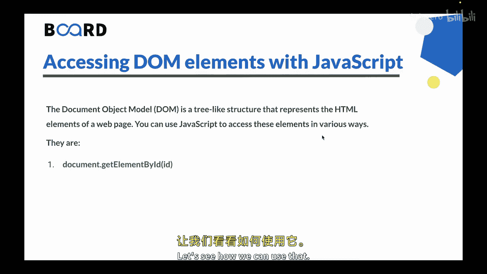

So let's go to the Vs code and here I have。Index or S will find， I can delete this one。

And let's create a very basic boiler platelate， using this。Shortcut。

 And you can see we have a title document。 Let's make it dom。And in the body， we can say each one of。

Doome selectors。So if I click on save。

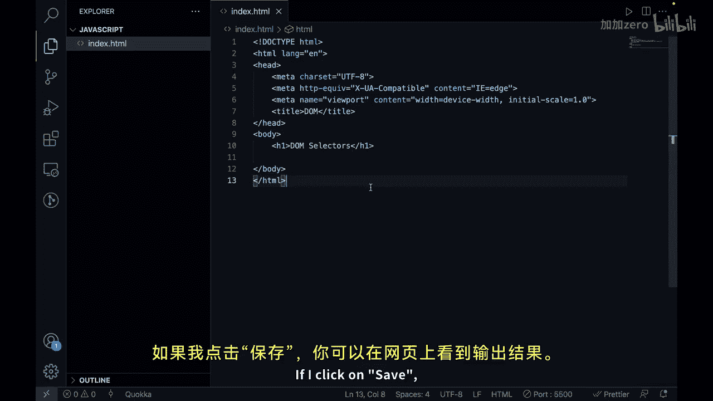

You can see that we have the output on the webage。

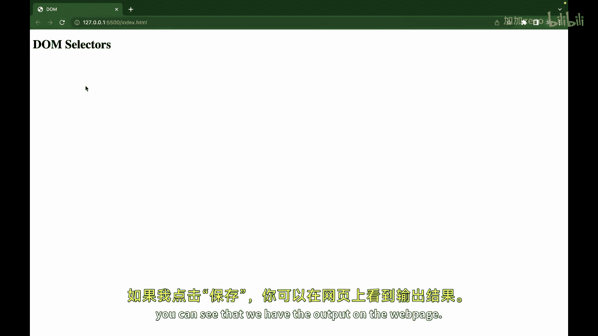

So we are talking about document dot get element by ID。

So here we can have a dev and let's say hello world。And what we can do is we can create one more dev。

 and we can just say hi there。So the first day， we will just give it an idea of， let's say hello。

We want to access this di out of all these elements， we want to access the first div of ID hello。

So here I will have our script tag。And I will say， document。我呢件事。干出。Dot lock。

Document taught get element by ID and we can pass the ID name here。So the ideas is， hello。

 we have to pass it in quotes。

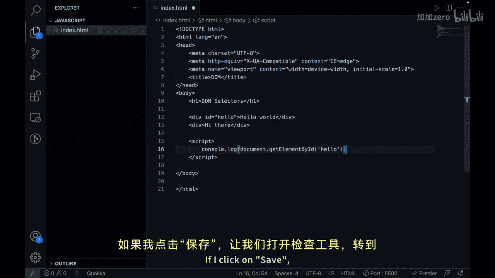

And now fight click conceive save。Let's go to inspect。

 let's go to console and you can see that we have got this step it's school right we have got this on the basis of I。

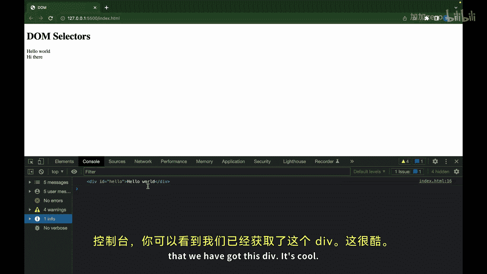

The next one is document dot cat elements by class name。

 The little difference you will see that it is cat elements Earl one was Cat element。

 We can only get one element out of it， but here we can get multiple elements by class name。😊。

So it returns a collection of all the elements with the specified class name。

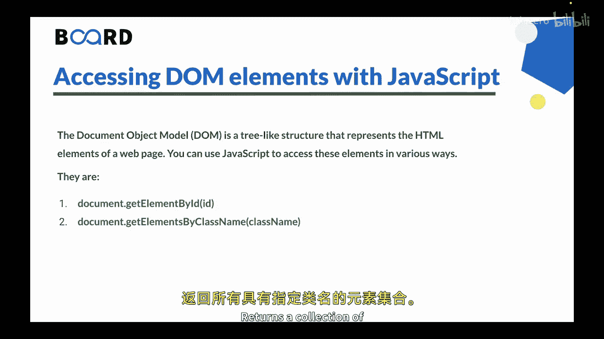

For example， if I create a unordered list。And inside that I have a ally of class， let's say green。

And we can say item1。And we can create one more re。Well， let's say， four allies。

Out of which only two has the glass of green so we can remove these options here。

So if I click on save and if I rather than doing this。What I can do is I can select select items。

 I can also put them in a variable。I can say document dot get elements by class name。

 and we can pass the class name as。Green。And then we can say console to log。Items。

So if I click on save， if I go here， if I refresh， you will see that we get an HTMLl collection。

 it is an a like structure and we get two La items that has the class of green color。

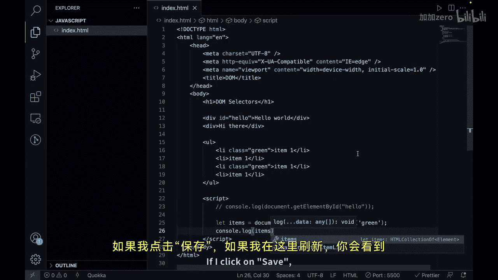

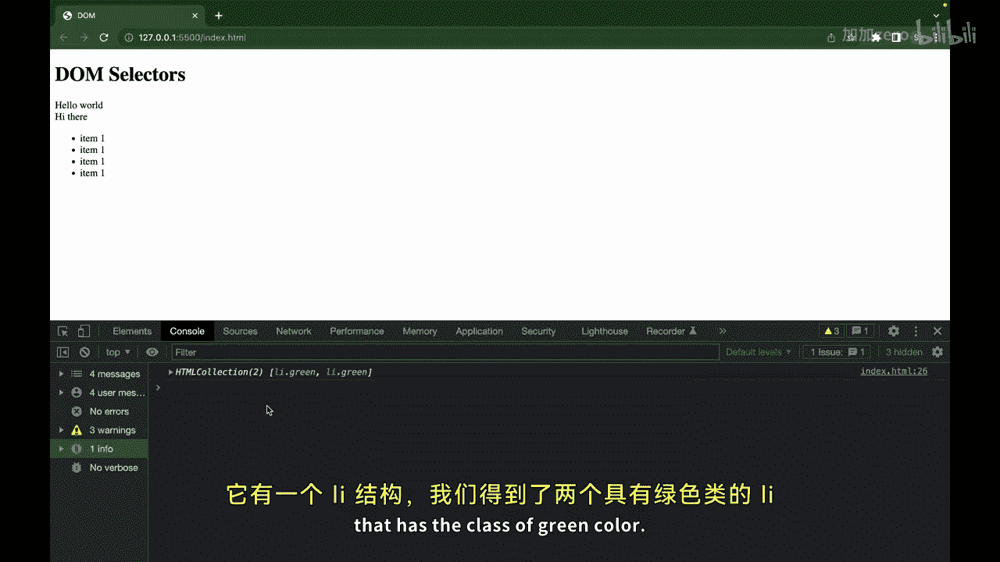

Let's go to the next one。 Next one is document do get elements by tag name。Here also。

 we can get multiple collections， or you can say it returns a collection of all the elements with the specified tag name。

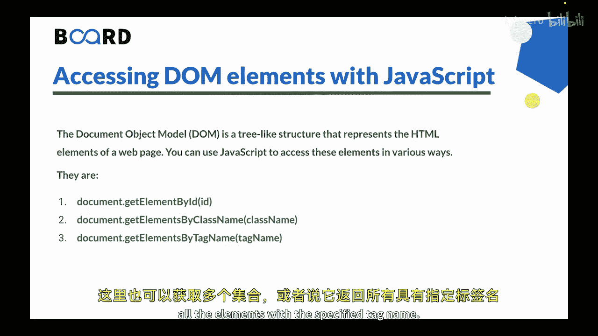

So we have multiple items， all items here。 So what we can do is。

Let's just copy paste this instead of document dot get elements by class name。

 we can say get elements by tag name。Here the tag name is L， we have to pass it like this。

AndNow if I click on save if I go here。

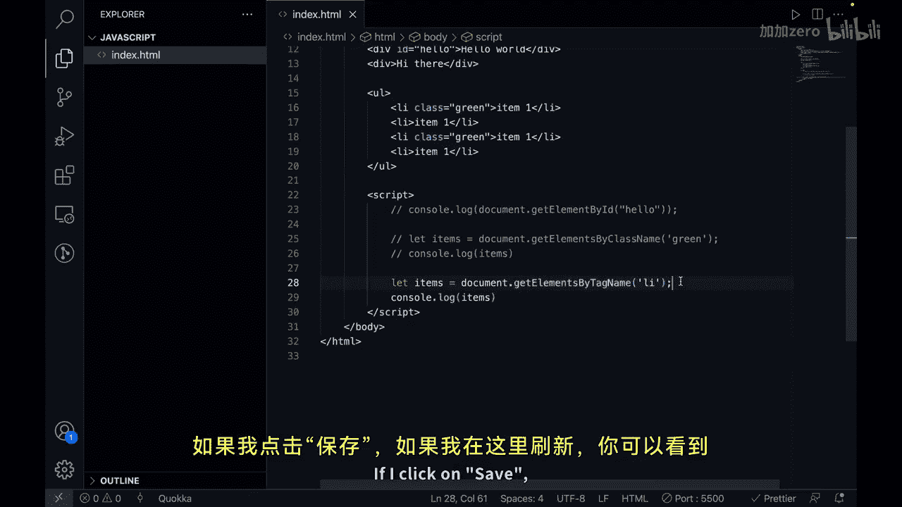

There's refresh。You can see that we are getting all the all items。

 so this is now a collection of four elements。

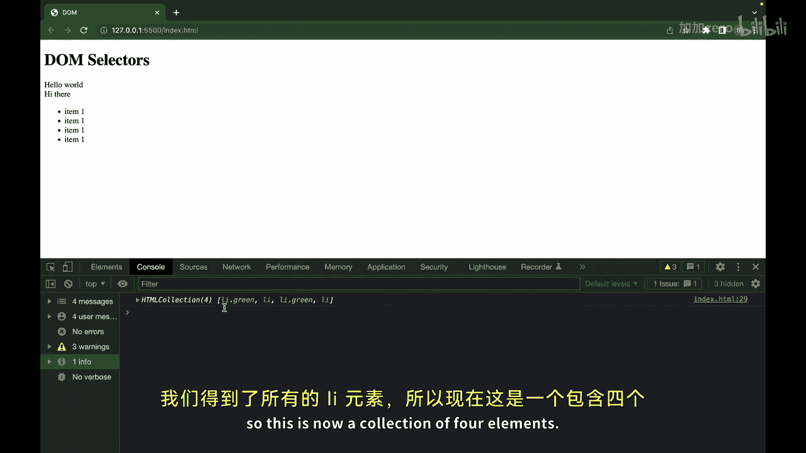

Next one is document dot query selector。So it returns the first element that matches the specified CSS selected for example。

 we have here ally and two class names are green。

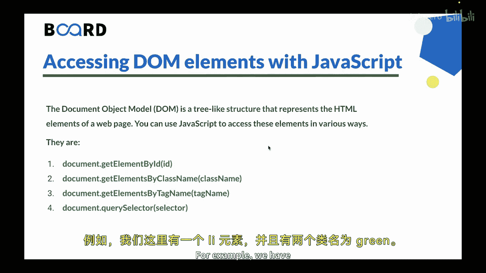

So what I will do is， I will say。Let item。Let's comment this out。And we will use query selector here。

And I will say I want to get the item that is a class of green。

 so we have to add a CSS selector as well that is dot for class。

Now you may notice that two of the LA classes have class green。And if I do console log log item。

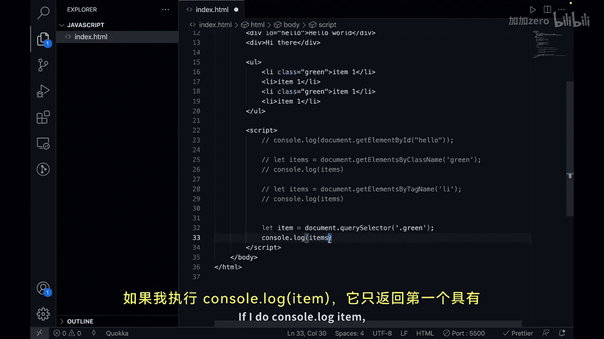

It returns only the first ally element that has a text of item 1。

So it always returns the first element that matches the specified CSS selector。

But then if you want to get all the classes or you can see all the all items that is a class of green。

 one way was to use get elements by class name， the other method is that is the last one that is document or query selector all。

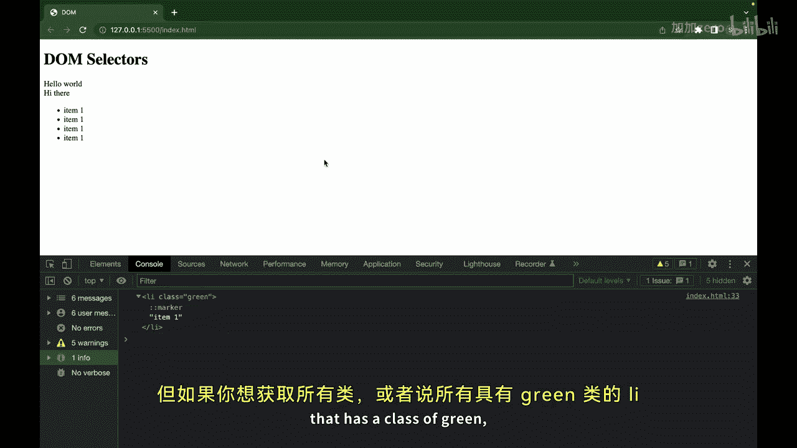

So here what we can do is we can say query selector all。And we are passing the same green class here。

 and now if I do items if I click on save， you will see that it returns a collection of all the items that match the specified CSS selector。

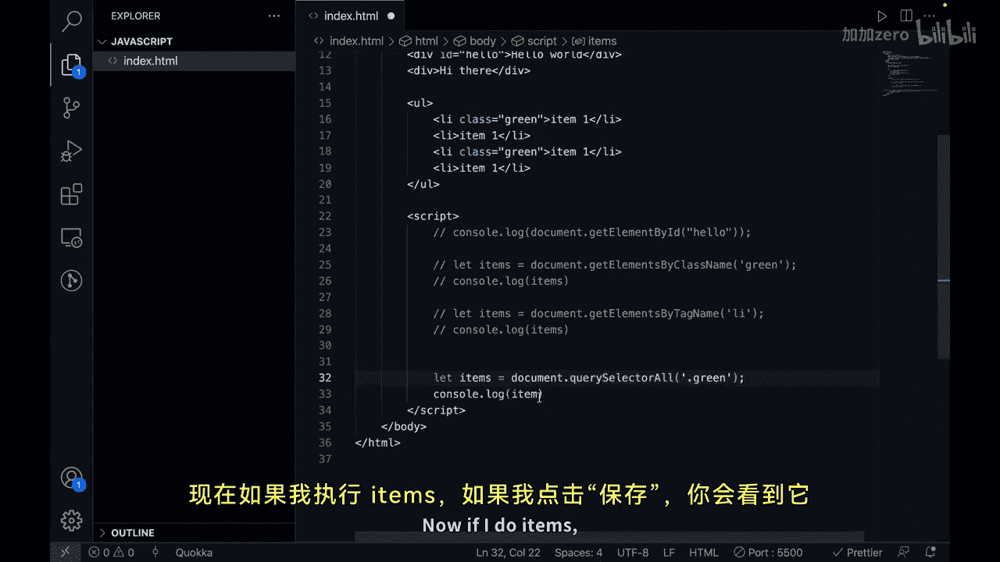

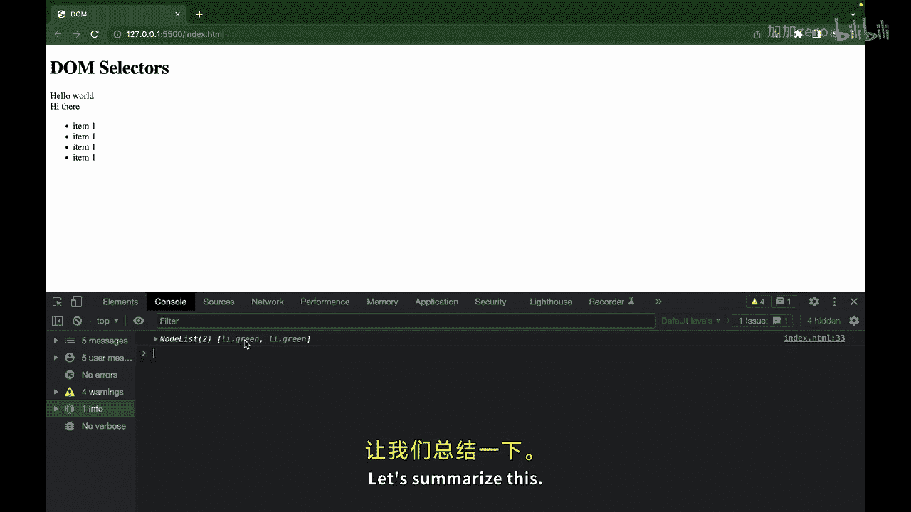

So let's summarize this。We know that the document object model is a pre like structure that represents the HTMLl elements of a web page。

Javascript provides various methods to access these elements such as get element by ID。

 get elements by class name， get elements by tag name，  queryz selector and Quey selector all。

Once you have a reference to an element， you can modify its attributes。

 content and style or create new elements using other methods that we would be looking at in a separate video with these tools you can create dynamic and interactive web pages that respond to user input and update in real time This is all for this video in the next video we will see how to manipulate Dom using ja。

😊，See you in the next video。 Thank you。

