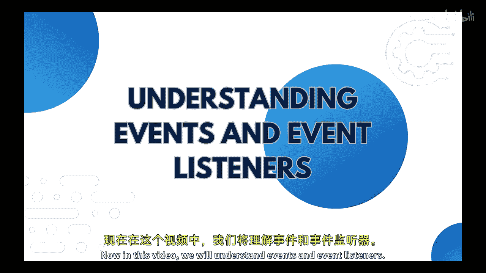
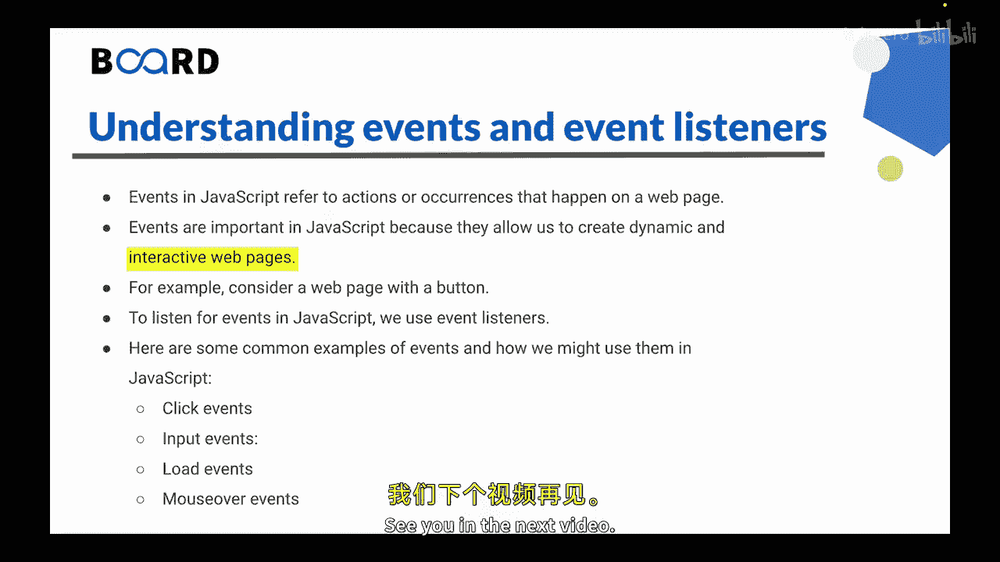

# 【Java全栈开发 专项课程（上）】Board Infinity—中英字幕 p137 p65_07_understanding-events-and-event-listeners -BV1tAygYoEj5_p137-

Hi there in the previous video， we learn how to modify styles and attributes with JavaScript。

Now in this video， we will understand events and event listeners。

So let's get started。Events in Javascript refers to actions or occurrences that happen on a web page。

 such as a mouse click， a keyboard press or a page load。

 Javavascript provides a way to listen for these events and respond to them through event listeners。

Events are important in JavaScript because they allow us to create dynamic and interactive web pages。

That means without events， web pages would be static and unresponsive。

Events provide a way for users to interact with a web page and for web pages to react to user input for example you can consider a web page with a button in that when a user clicks the button and even is JavaScript can listen for this event and respond by changing the text on the page or performing some other action。

Another example is when a user types something in an input field an event is triggered。

 Javascript can listen for this event and respond by validating the input of performing some other action。

To listen for events in Javascript， we use event listeners。

Even listeners are functions that are called when a particular event is triggered。

 we can attach even distance to the dom elements using add event listener method。

 When the event occurs， the event listener function is called。

 and we can perform some action in response to the event。

Let's look at some common examples of events and how we might use them in JavaScript。

First is click events。So these are triggered when the user clicks an element on the page such as a button or a link。

 we can use click events to perform actions like showing or hiring content。

 submitting a form or navigating to a different page。Input events。

These are triggered when the user types into an input field or makes a selection in a drop down menu。

 we can use input events to validate user input or update the page in real time。😊。

Then we have load events these are triggered when the page finishes loading we can use load events to perform actions that depend on the page content being fully loaded such as fetching data from an API or initializing a plugin。

Then we have mouse over events。 These are triggered when the user hovers over an element on the page。

 such as an image or a link。 we can use mouseover events to add visual effects like toolsteps or hover states。

😡，These are just a few examples of the many types of events we can use in JavaScript by using event listeners。

 we can make our web pages more interactive and responsive to user actions。So let's summarize this。

Events in jascript refer to actions or occurrences that happen on a web page， such as mouse clickick。

 a keyboard press or a page load。 Events are important in jascript because they allows us to create dynamic and interactive web pages to listen for events in jascript。

 we use Even listeners Even listeners are functions that are called when a particular event is triggered We can attach event listeners to do elements using the add event listener method。

 Overall， Even are fundamental part of creating interactive web pages with jascript that allows us to create dynamic and responsive web experience for the user。

 This is all for this video in the next video。 we will understand how to respond to a user input such as click or key presses events。

 See you in the next video。 Thank you。😊。

。

