# JavaScript 事件处理：第08章：响应用户输入（点击与按键）🎯

在本节课中，我们将学习如何使用 JavaScript 来响应用户的输入，例如鼠标点击和键盘按键。这是构建交互式应用和网站的核心技能。

上一节我们介绍了 JavaScript 中的事件和事件监听器。本节中，我们来看看如何具体响应两种常见的用户输入：点击事件和按键事件。

## 响应用户输入概述

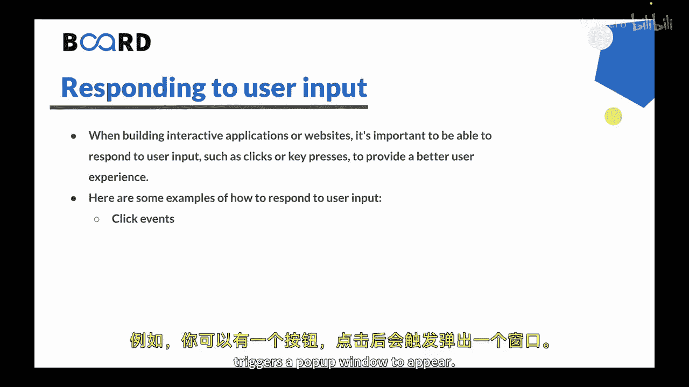

构建交互式应用或网站时，响应用户输入（如点击或按键）至关重要，它能提供更好的用户体验。这需要使用事件监听器来检测用户何时与应用交互，并执行特定代码来响应这些事件。

以下是两种主要的用户输入响应方式。

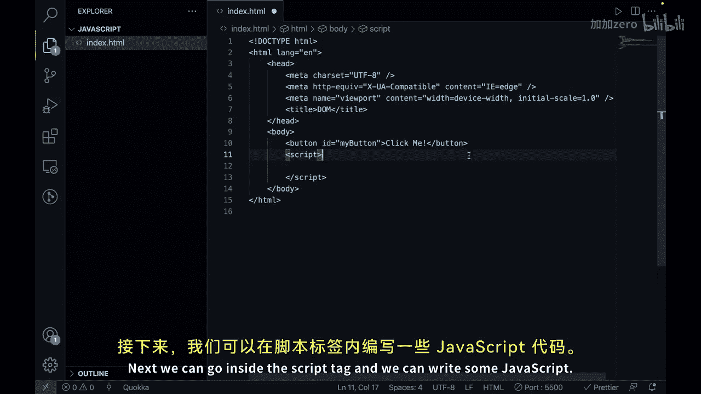

### 1. 点击事件响应 🖱️

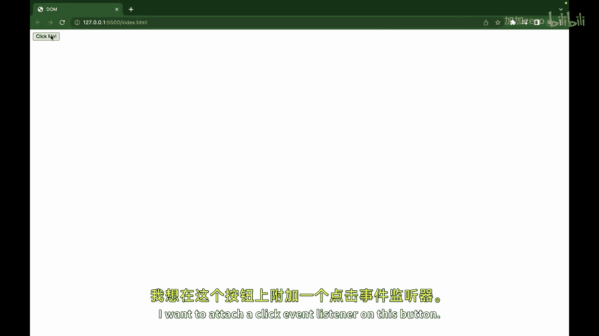

你可以使用 JavaScript 为 HTML 元素添加事件监听器，以检测它们何时被点击。例如，可以创建一个按钮，当点击时触发一个弹出窗口。

以下是一个在 VS Code 中创建点击事件响应的示例。

首先，创建一个带有最小化 HTML 模板的 `index.html` 页面，其中包含一个脚本标签。

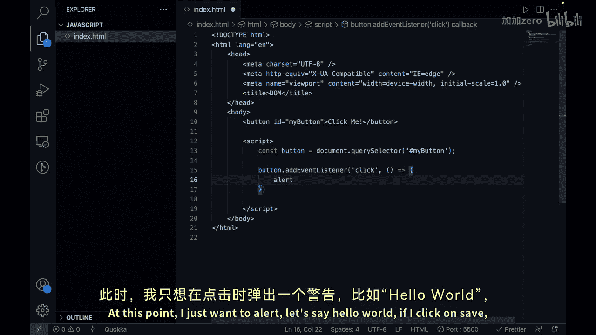

```html
<button id="myButton">点击我</button>
```

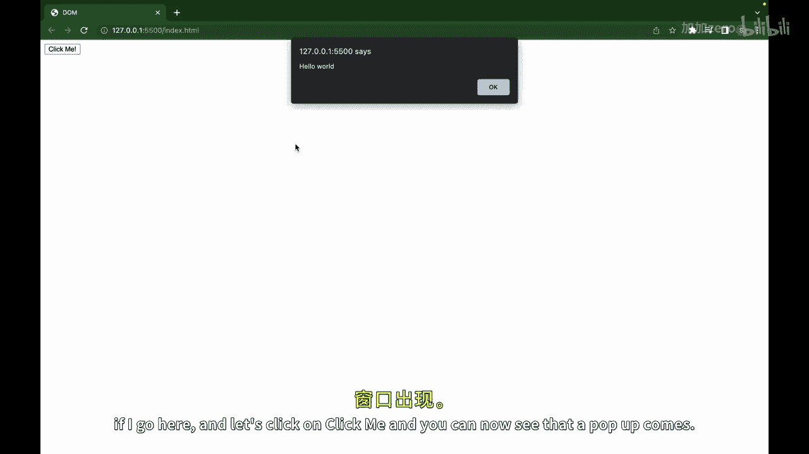

接下来，在脚本标签内编写 JavaScript 代码。

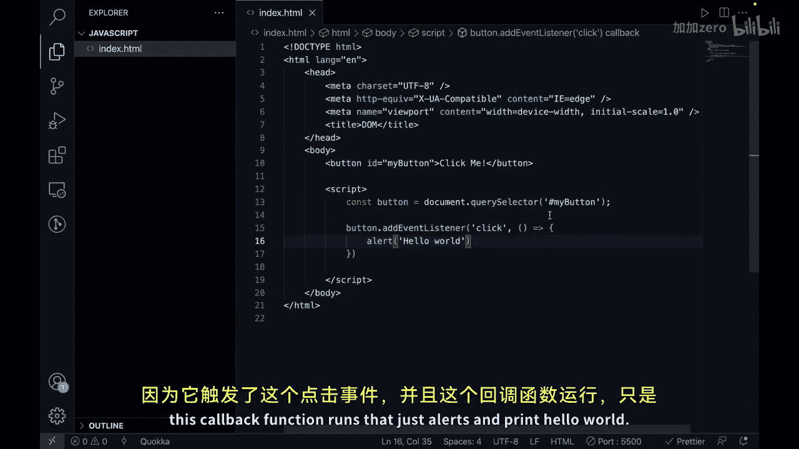

```javascript
const button = document.querySelector('#myButton');
button.addEventListener('click', function() {
    alert('Hello World!');
});
```

在这个例子中，我们使用 `addEventListener` 函数为按钮附加了一个点击事件监听器。当事件被触发时，传入的回调函数就会执行，弹出一个显示“Hello World!”的警告框。

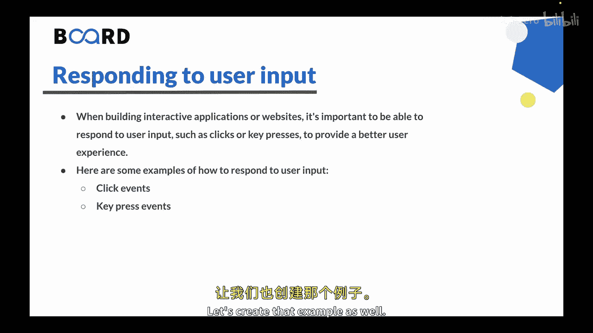

### 2. 按键事件响应 ⌨️

你也可以检测用户何时在键盘上按下按键，并执行代码作为响应。例如，可以创建一个搜索框，在用户输入时自动更新搜索结果。

以下是如何实现按键事件响应的示例。

首先，在 HTML 中创建一个输入框。

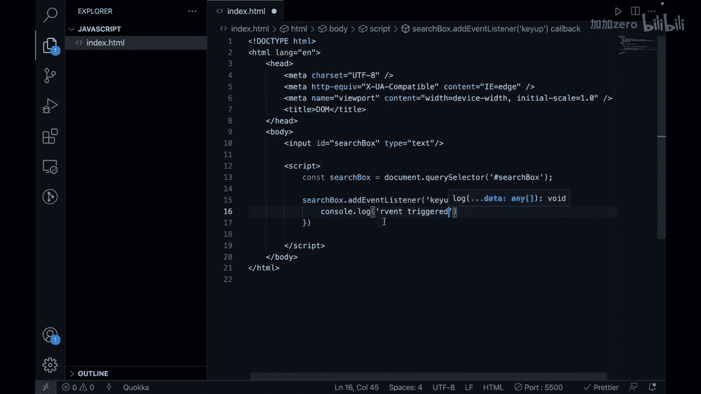

```html
<input id="searchBox" type="text">
```

然后，在脚本标签内编写 JavaScript 代码。

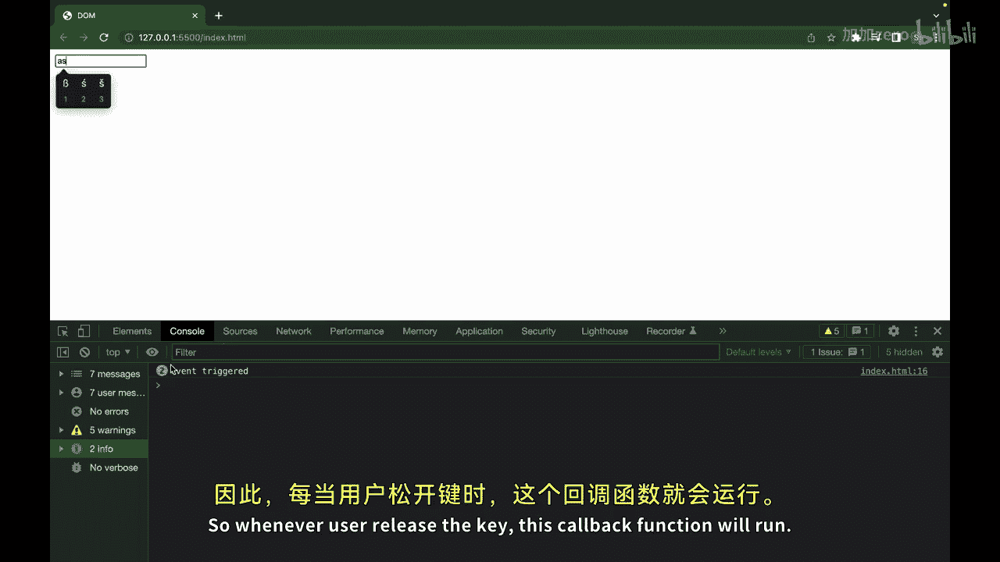

```javascript
const searchBox = document.querySelector('#searchBox');
searchBox.addEventListener('keyup', function(event) {
    console.log(event);
    // 此处可以添加更新搜索结果的代码
});
```

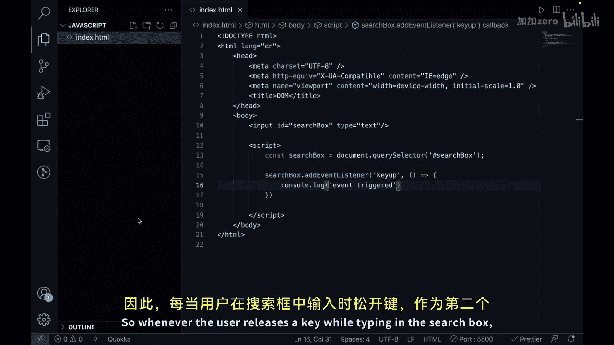

在这个例子中，`addEventListener` 函数为搜索框输入元素附加了一个 `keyup` 事件监听器。每当用户在搜索框中输入并释放一个按键时，传入的匿名函数就会执行。函数内部的代码可以用于更新搜索结果，目前我们只是将事件对象打印到控制台。

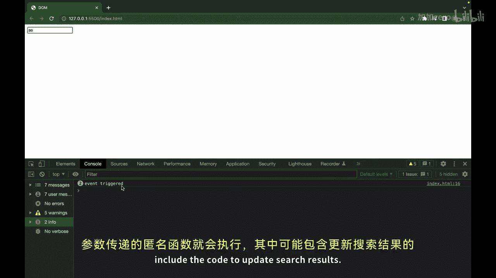

## 总结

本节课中我们一起学习了如何响应用户输入，如点击和按键，这是构建交互式应用或网站的重要组成部分。这涉及使用事件监听器来检测用户交互，并执行特定代码来响应这些事件。

我们通过两个示例演示了如何响应用户输入：
*   使用点击事件来触发弹出窗口。
*   使用按键事件来在用户输入时更新搜索结果。

要实现这些功能，需要使用 HTML 元素来触发事件，并使用 JavaScript 代码来附加事件监听器并执行所需的功能。


在下一节视频中，我们将使用事件来创建交互式用户界面。下节课见！