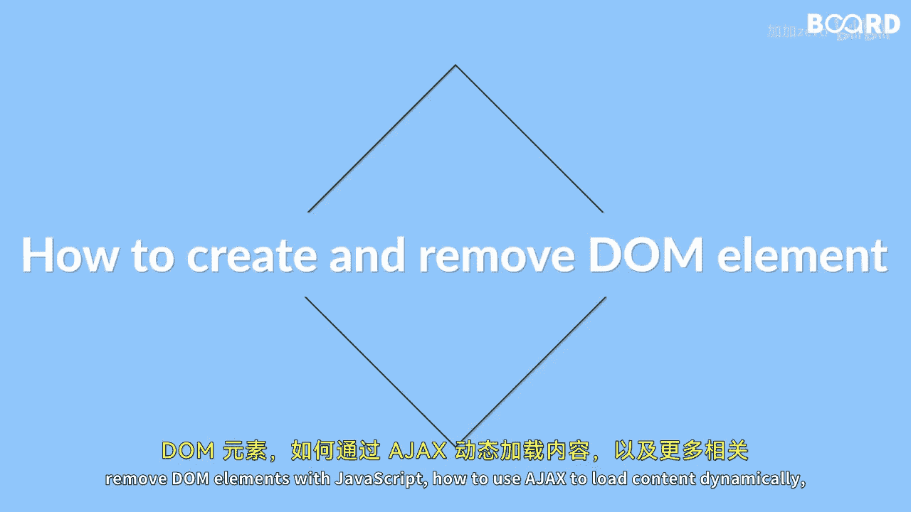

# 【Java全栈开发 专项课程（上）】Board Infinity—中英字幕 p140 p68_01_what-you-will-learn-in-this-lesson -BV1tAygYoEj5_p140-

Hi there In this lesson you will learn about how to create and remove dom elements with JavaScript。

 how to use AX to load content dynamically and much more。😊。

🎼By the end of this lesson you will have gained an understanding of how to create and remove Dom elements with JavaScript allowing you to dynamically modify the structure of your web page you will also have learned how to use AXX to load content dynamically enabling you to fetch data from a server and update the page without requiring a full page reload。

