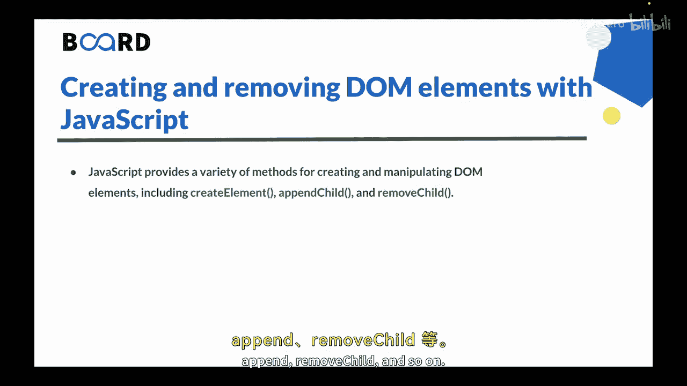
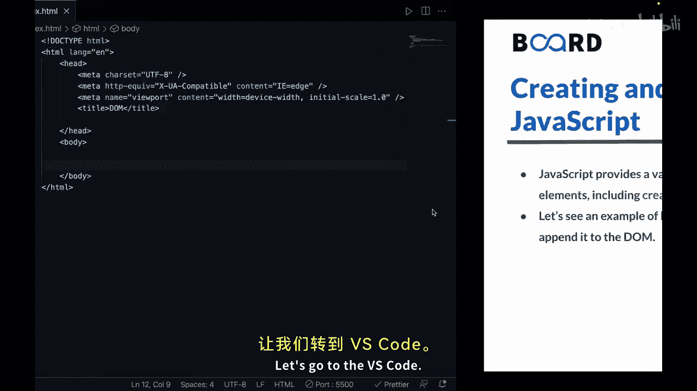
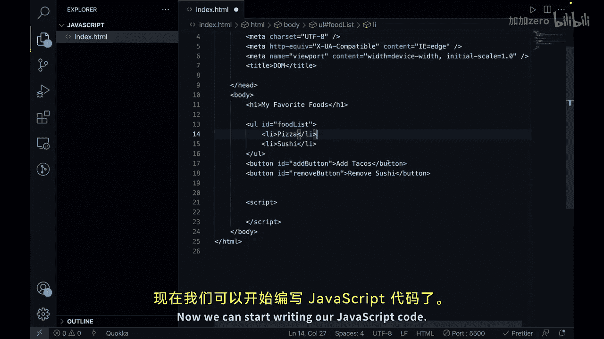
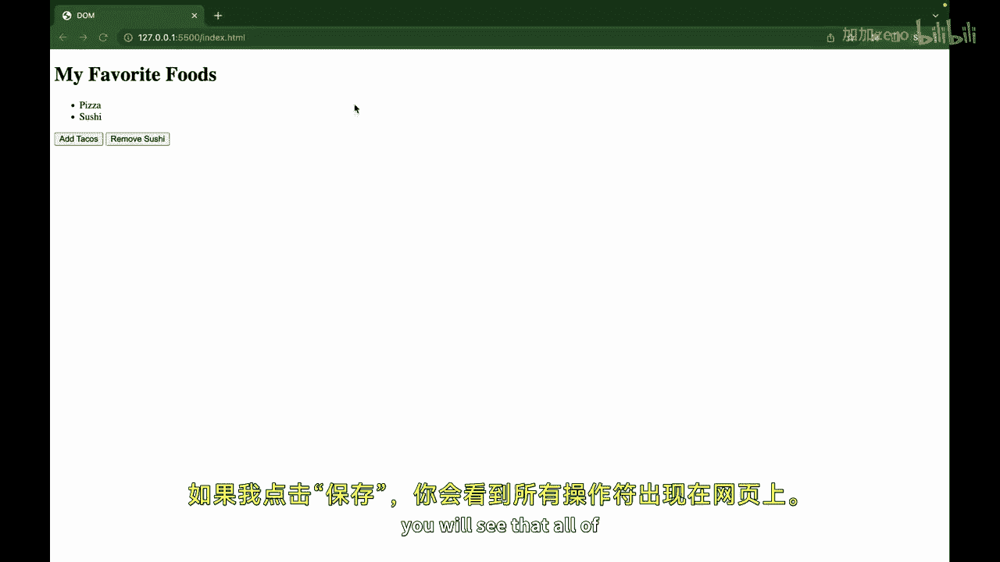
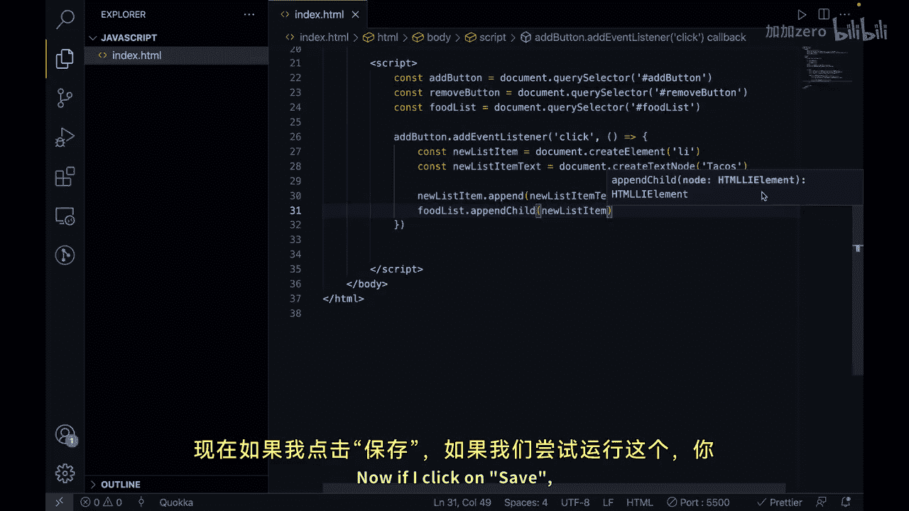
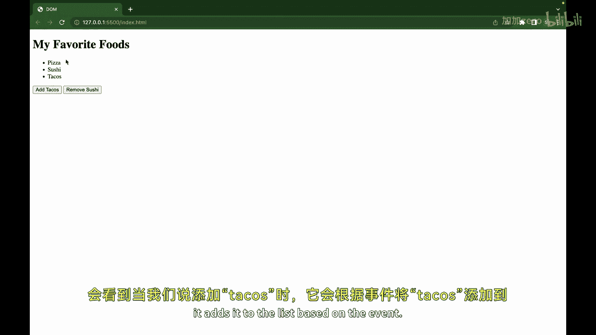
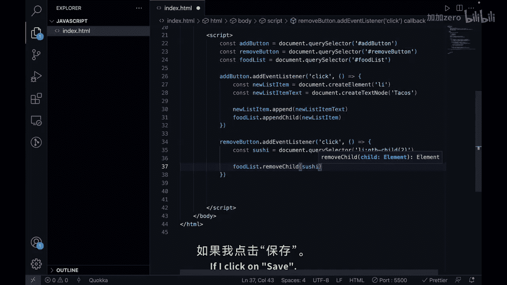
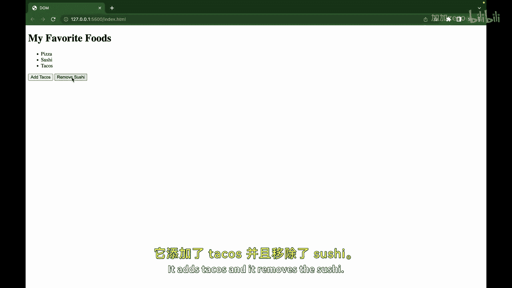
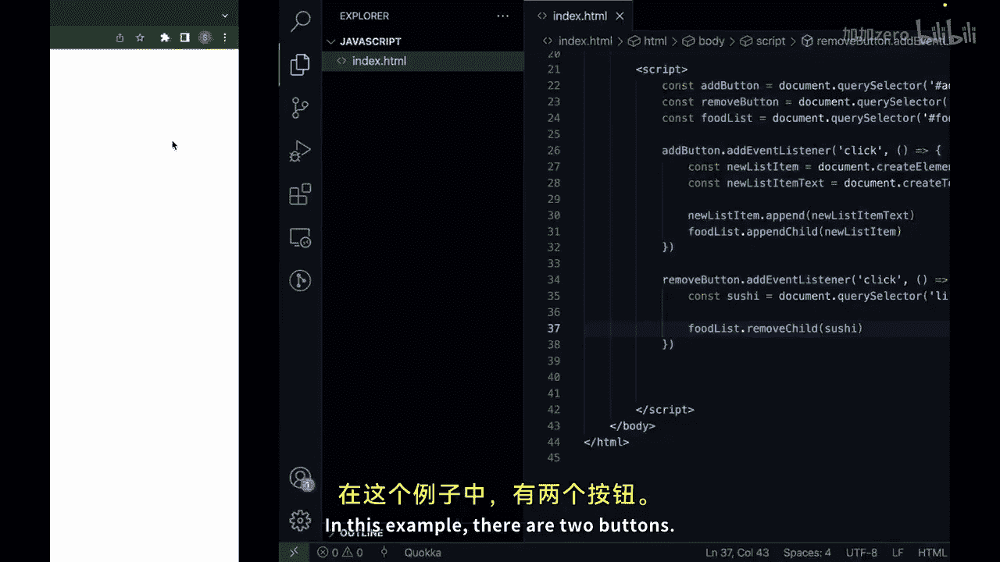
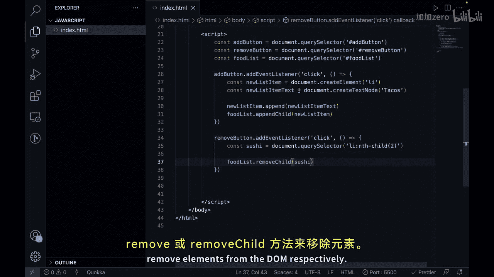

# 【Java全栈开发 专项课程（上）】Board Infinity—中英字幕 p141 p69_02_creating-and-removing-dom-elements-with-javascript -BV1tAygYoEj5_p141-

Hi there in this video， we will learn how to create and remove dom elements with JavaScript in detail。

So let's get started。Creating and removing Dom elements with JavaScript is a fundamental technique used in web development to dynamically modify the content of web pages。

😊，Javascript provides a variety of methods for creating and manipulating dom elements。

 including create element， append child， append， remove， remove child， and so on。

Let's understand this using an example。So let's go to the VS code and here I have a basic HTML template ready。

We would also need to have a script tag so that we can write a JavaScript code。

And let's create a basic template first。So let's say we are creating an H1 and let's say we are listing some favorite foods。

S I say my。Favorite foods。Then we can have an unordered list and we can give here ID of food list。

And here we can have list items。Let's say， we have pizza。And we have。Let's say， sushi， as well。

Now what we will do is we will create two buttons。So let's give this an ID of add button。

So as the ID name suggests， we will add items to it so we can say add tacos。Similarly。

 we can create one more button。And we can see here， remove button。And as the name suggests。

 it removes so we can say at this point， remove。熟悉。Now we can start writing a JavaScript code。

If I click on save， you will see that all of the output is coming here on the web page and lets manipulate it。

Create and remove some items from it。So let's select the elements using dom selectors。

 so I'll say con。Add button。And we can make it equal to document dot query selector。

And we can just put here， Id。So ideas hash， Add button。Similarly。

 what we can do is we can target our remove button as well so we can just copy paste。At this point。

And similarly， we can target our food list。So， let's say con。Food list。And it would be again。

Equal to document dot query selector， and we can pass the Id here。Like this。Now。

 what we want to do is we want to attach even listener。So I can say add button。Tt add even listener。

 and let's have an event of type click， and then we can run a call back function。

Inside this function， we will say cons。New list item。And here we can say document dot create element。

 and we want to create a new ally element。Like this。Then， let's say， con。New list item text。

And you can create it using a method that is document taught create。And that is x node。

So we want to pass here， let's say， tacos。Then what we want to do is。After that。

 we can say new list item。Dot append。Aurricane is aend child and we want to say new list item text。

And then what we want to do is we want to say food list dot append child。This time。

 let's use this and you want to obtain new list item。Now， if I click on save if we try to run this。

 you will see that when we say add tacos， it adds it to the list based on the event。

Similarly， let's create it for。Remove button as well。

So let's put here remove button and it is again a type of click and you want to do something things here。

So， we can select cost。Sushi。To be document dot query selected。And we can say target ally。

That has a anch。Sa。😊，Of two。And then what we can do is we can either use remove child or remove。

 So let's use remove child at this point。 We can say remove。T， and you want to remove the sushi。

Now if I click on save， lets test both of them。 I will refresh it adds the tacos。

 and it removes the sushi。

So in this example， there are two buttons， one that adds the newest item containing the text tacos to the unordered list and one that removes the second item containing the text sushi from the unordered list。

The evil listeners for both patterns use query selector method to access the appropriate dom elements。

 and then we use append child or append or you can say remove or remove child method to create or remove elements from the dom respectively。

So let's summarize this。😊，In web development， creating and removing Dom elements with JavaScript is a fundamental technique used to dynamically modify the content of web pages。

By using the methods like create element Append child remove child web developers can create dynamic and responsive web pages that provide a rich and engaging user experience for their users。

 This is all for this video in the next video we will see how to use Ajax to load content dynamically。

See you in the next video。 Thank you。

