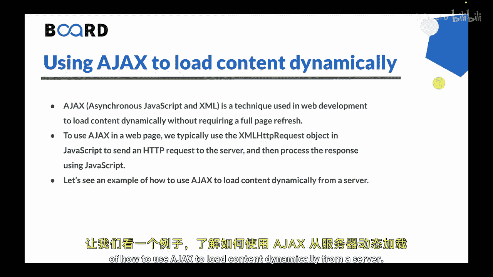
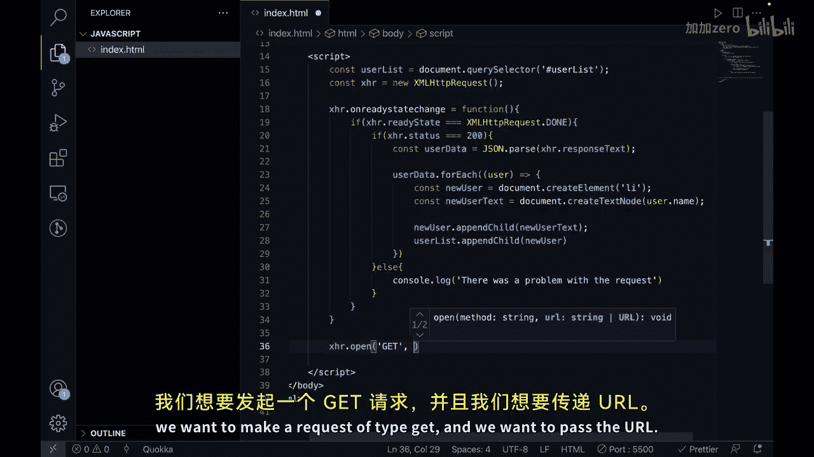
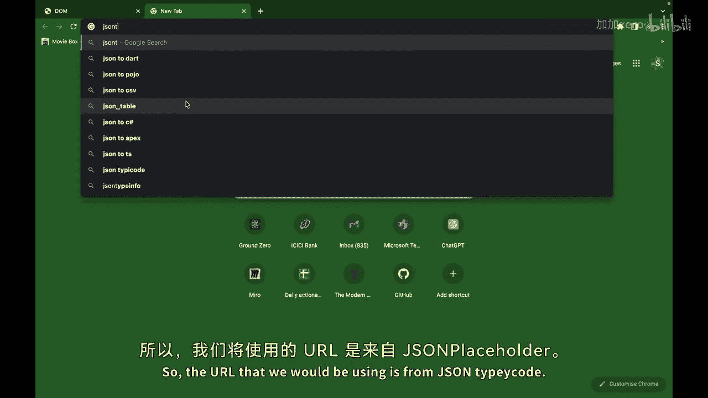
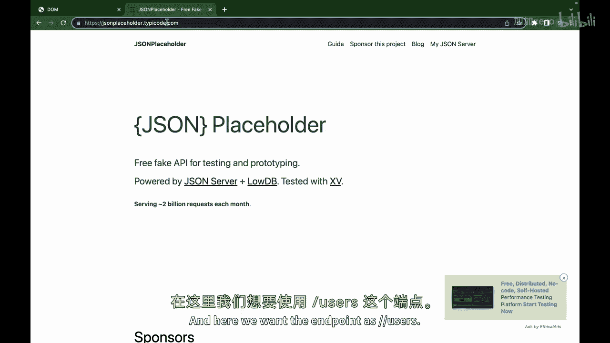
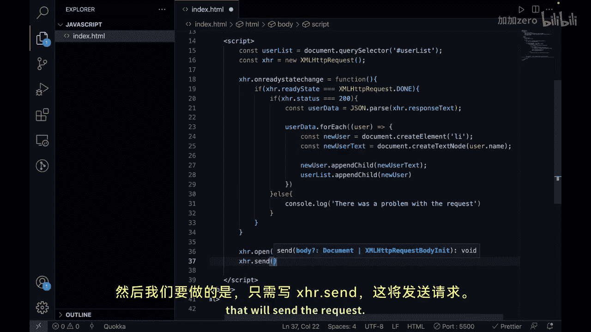
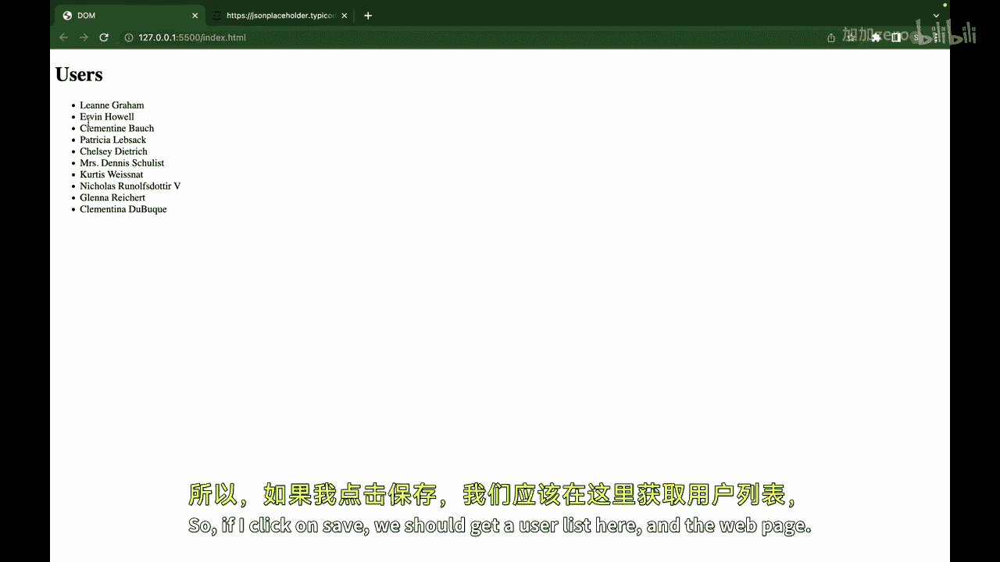
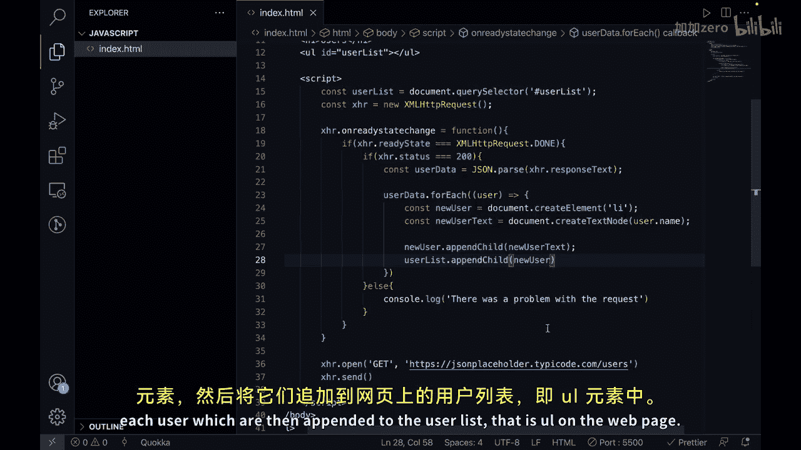

# Java全栈开发 专项课程（上）：p70_03：使用Ajax动态加载内容 🚀

在本节课中，我们将学习如何使用Ajax技术，在不刷新整个页面的情况下，动态地从服务器加载并显示内容。上一节我们介绍了如何使用JavaScript创建和移除DOM元素，本节中我们来看看如何通过Ajax实现数据的异步获取与动态展示。

Ajax（异步JavaScript和XML）是一种用于Web开发的技术，它允许网页在后台与服务器交换数据并更新部分页面内容，而无需打断用户当前的操作或重新加载整个页面。



在网页中使用Ajax，我们通常利用JavaScript中的 **`XMLHttpRequest`** 对象向服务器发送HTTP请求，然后使用JavaScript处理服务器的响应。通过这种方式，我们可以从服务器加载内容并将其显示在网页上，而无需重新加载整个页面。

让我们通过一个具体的例子，来看看如何使用Ajax从服务器动态加载内容。

## 构建示例：动态加载用户列表

以下是实现动态加载用户列表的步骤。

首先，我们需要创建一个基本的HTML文件结构。

```html
<!DOCTYPE html>
<html lang="en">
<head>
    <meta charset="UTF-8">
    <meta name="viewport" content="width=device-width, initial-scale=1.0">
    <title>Ajax 示例</title>
</head>
<body>
    <h1>用户列表</h1>
    <ul id="userList"></ul>

    <script>
        // JavaScript代码将写在这里
    </script>
</body>
</html>
```

接下来，我们将在 `<script>` 标签内编写JavaScript代码来实现Ajax请求。

以下是实现Ajax请求的核心代码逻辑：

```javascript
// 1. 获取用于显示用户列表的DOM元素
const userList = document.querySelector('#userList');



// 2. 创建新的 XMLHttpRequest 对象
const xhr = new XMLHttpRequest();





// 3. 定义当请求状态改变时的回调函数
xhr.onreadystatechange = function() {
    // 检查请求是否完成
    if (xhr.readyState === XMLHttpRequest.DONE) {
        // 检查HTTP状态码是否为200（成功）
        if (xhr.status === 200) {
            // 解析从服务器返回的JSON数据
            const userData = JSON.parse(xhr.responseText);
            
            // 遍历用户数据，为每个用户创建列表项
            userData.forEach(function(user) {
                // 创建新的 <li> 元素
                const newUser = document.createElement('li');
                // 创建包含用户姓名的文本节点
                const newUserText = document.createTextNode(user.name);
                // 将文本节点添加到 <li> 元素中
                newUser.appendChild(newUserText);
                // 将 <li> 元素添加到用户列表中
                userList.appendChild(newUser);
            });
        } else {
            // 如果请求失败，在控制台输出错误信息
            console.log('请求过程中出现问题。');
        }
    }
};





// 4. 初始化一个GET请求，目标URL为提供测试数据的API
xhr.open('GET', 'https://jsonplaceholder.typicode.com/users');
// 5. 发送请求
xhr.send();
```

在这个例子中，我们使用Ajax从JSONPlaceholder API加载了一个用户列表，并将其显示在网页上。我们首先使用 `XMLHttpRequest` 对象创建了一个新的HTTP请求，然后定义了一个回调函数来处理从服务器接收到的响应。当响应成功返回时，我们解析响应数据，遍历用户数组，并为每个用户动态创建 `<li>` 元素，最后将这些元素添加到页面的用户列表中。

## 总结



本节课中我们一起学习了如何使用Ajax动态加载内容。通过 **`XMLHttpRequest`** 对象，我们可以向服务器发送异步请求，获取数据并在不刷新页面的情况下更新网页的特定部分。这是一种强大的技术，能显著提升网页的用户体验，使其更加流畅和响应迅速。


在下一节视频中，我们将探讨如何在JavaScript中处理错误和异常。我们下节课再见。