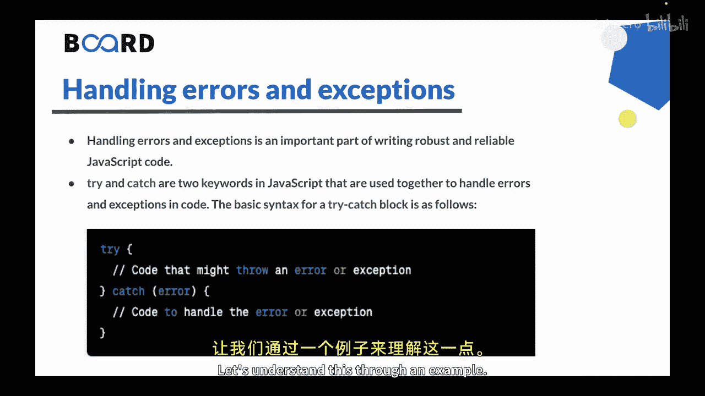
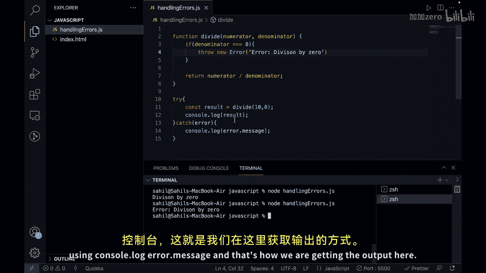

# Java全栈开发 专项课程（上）：04：处理错误与异常 🛡️

在本节课中，我们将学习如何在JavaScript中处理错误与异常。这是编写健壮、可靠代码的重要部分。

上一节我们介绍了如何使用Ajax动态加载内容。本节中，我们来看看如何通过`try...catch`语句来优雅地捕获和处理程序运行中可能出现的错误。

## 错误处理的基本语法



在JavaScript中，我们使用`try`和`catch`关键字来共同处理代码中的错误与异常。

以下是`try...catch`语句的基本语法：

```javascript
try {
  // 可能抛出错误的代码
} catch (error) {
  // 处理错误的代码
}
```

*   **`try`块**：包含可能抛出错误或异常的代码。
*   **`catch`块**：如果`try`块中发生错误，JavaScript会跳出`try`块并进入`catch`块。`catch`块包含用于处理错误的代码，例如记录错误信息或采取纠正措施。

在`catch`块中，你会注意到一个`error`变量。这个变量代表了被抛出的错误对象。你可以使用这个变量来访问关于错误的信息，例如它的**消息**、**堆栈跟踪**以及可能附加到它的任何其他数据。

## 通过示例理解

让我们通过一个具体的例子来理解这个概念。

我们将创建一个函数来执行除法运算，并处理除数为零的情况。

```javascript
// 定义一个除法函数
function divide(numerator, denominator) {
  // 检查分母是否为0
  if (denominator === 0) {
    // 如果为0，则抛出一个新的错误对象
    throw new Error('Division by 0');
  }
  // 否则，返回正常的除法结果
  return numerator / denominator;
}

// 使用 try...catch 来调用函数并处理潜在错误
try {
  const result = divide(10, 0); // 这里会触发错误
  console.log(result);
} catch (error) {
  // 捕获到错误，并打印错误信息
  console.log('Error:', error.message);
}
```

在这个例子中：
1.  我们定义了一个`divide`函数，它对两个数字（分子和分母）执行除法运算。
2.  在执行除法之前，我们检查分母是否不为0。如果是0，我们使用`throw new Error()`抛出一个带有自定义错误消息的新错误对象。
3.  然后，我们使用参数10和0调用`divide`函数，并将其包裹在`try`块中。
4.  由于分母为0，这将导致“除以零”错误。JavaScript会跳出`try`块并进入`catch`块。
5.  在`catch`块中，我们使用`console.log(error.message)`将错误消息记录到控制台，从而得到“Error: Division by 0”的输出。



## 总结

本节课中我们一起学习了JavaScript中错误处理的核心机制。

*   `try`和`catch`语句用于协同处理代码中的错误与异常。
*   `try`块包含可能抛出错误的代码。
*   `catch`块包含用于处理这些错误的代码。
*   `catch`块中的`error`变量代表了被抛出的错误对象，可用于获取错误的详细信息。


使用`try...catch`块可以帮助我们编写更可靠、更易维护的JavaScript代码，因为它能让我们优雅地处理错误和异常，防止程序意外崩溃。