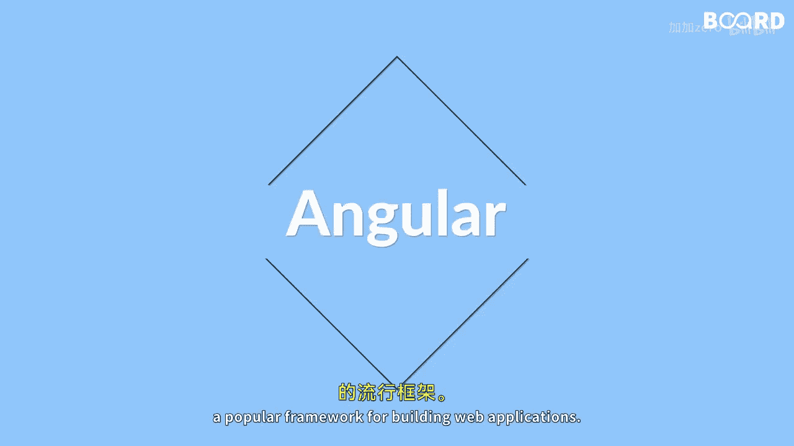

# 【Java全栈开发 专项课程（上）】Board Infinity—中英字幕 p144 p72_01_what-you-will-learn-in-this-lesson -BV1tAygYoEj5_p144-

🎼Hi there In this lesson， you will learn about Angular。

 a popular framework for building web applications。

🎼We will start with an introduction to Angular and then dive deep into the angular components and modules。

You will learn about the angular life cycle and how it works with components and modules。

🎼You will also learn about angular decorators， which are a set of functions that can be used to modify the behavior of angular components and modules。

🎼We will cover the different types of decorators and how they can be used to add functionality to your angular application。

🎼Finally we will discuss angular components and modules which are the building blocks of angular applications you will learn how to create components and modules and how they work together to create a complete angular application。

🎼We will cover topics like dependency injection， routing and template syntax。

🎼By the end of this lesson， you will have a solid understanding of angular components and modules and how they can be used to build powerful web applications see you in the next video。

