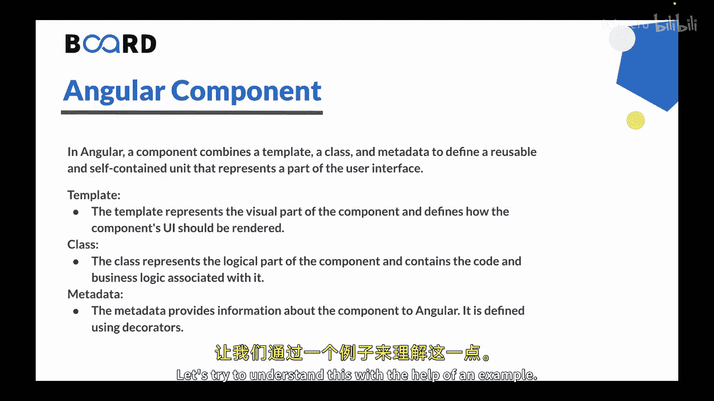
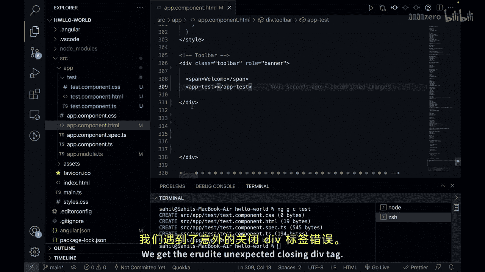
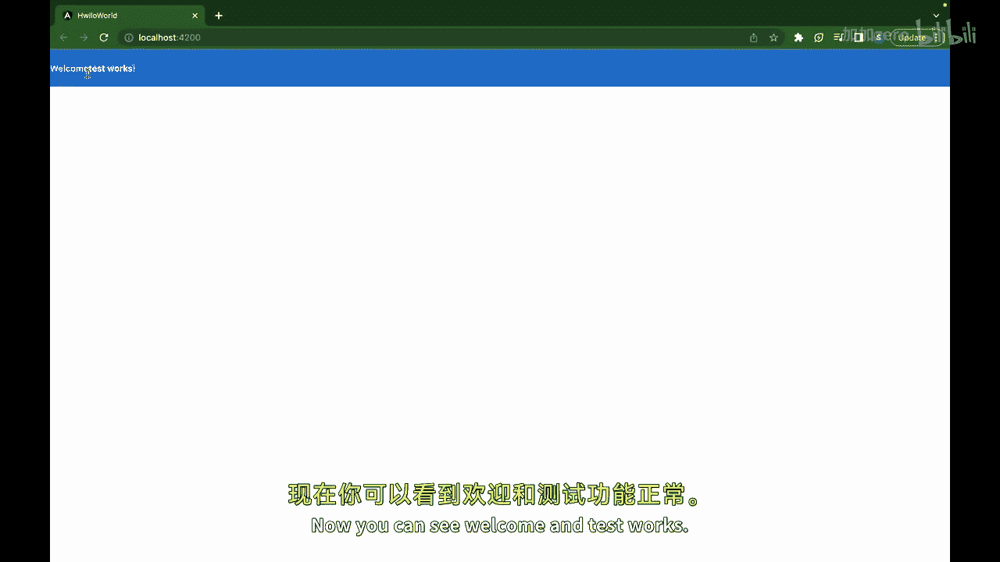
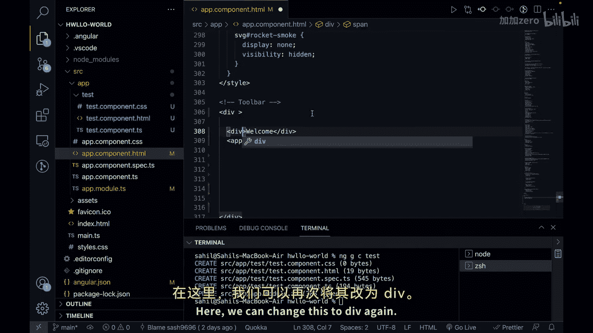
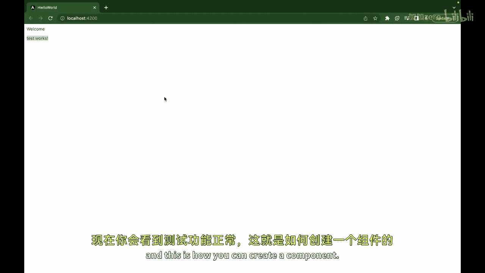
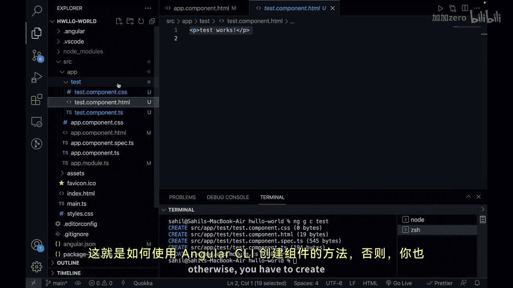

# Java全栈开发 专项课程（上）：04：Angular 组件 🧩

在本节课中，我们将要学习 Angular 框架中的一个核心概念：组件。组件是构建 Angular 应用的基础单元，它负责管理应用的一部分视图及其相关逻辑。

---

## 概述

在上一节中，我们学习了 Angular 的安装与项目初始化。本节中，我们将深入探讨 Angular 组件，了解其构成、作用以及如何创建和使用它。

Angular 组件是应用的基本构建块。它代表用户界面的一个特定部分，并封装了相关的逻辑、数据和 UI 模板。换句话说，一个组件将模板、类和元数据组合在一起，定义了一个可重用且自包含的单元。



---

## 组件的构成

一个 Angular 组件主要由以下三部分构成：

### 1. 模板
模板代表组件的视觉部分，定义了组件 UI 应如何渲染。它使用 HTML 标记和 Angular 模板语法定义。模板可以包含数据绑定、事件处理、指令和其他 Angular 特性，使其具有动态性和交互性。

### 2. 类
类代表组件的逻辑部分，包含与之相关的代码和业务逻辑。它使用 TypeScript 编写，通常遵循面向对象编程原则。类负责定义属性、方法以及处理组件特定的行为。

### 3. 元数据
元数据向 Angular 提供关于组件的信息。它通过装饰器定义。用于组件的主要装饰器是 `@Component` 装饰器。`@Component` 装饰器接收一个对象作为参数，并提供诸如选择器、模板、样式等元数据。

**代码示例：一个组件的基本结构**
```typescript
import { Component } from '@angular/core';

@Component({
  selector: 'app-example',
  templateUrl: './example.component.html',
  styleUrls: ['./example.component.css']
})
export class ExampleComponent {
  // 类的属性和方法定义在这里
}
```

---



## 创建组件实践





理解了理论之后，让我们通过一个实践例子来巩固知识。我们将使用 Angular CLI 工具创建一个新组件。



以下是创建并使用一个名为 `test` 的组件的步骤：

1.  **打开终端**：在 Angular 项目根目录下打开终端。
2.  **运行生成命令**：使用 Angular CLI 的 `generate`（或 `g`）命令来创建组件。
    ```bash
    ng generate component test
    ```
    或者使用简写：
    ```bash
    ng g c test
    ```
3.  **观察生成的文件**：CLI 会自动创建以下文件并更新根模块：
    - `test.component.ts`（组件类与元数据）
    - `test.component.html`（组件模板）
    - `test.component.css`（组件样式）
    - `test.component.spec.ts`（测试文件，可忽略）
4.  **在应用中使用组件**：生成组件后，我们需要在父组件的模板中通过其选择器来使用它。例如，在根组件 `AppComponent` 的模板 (`app.component.html`) 中插入：
    ```html
    <app-test></app-test>
    ```
5.  **查看结果**：运行应用 (`ng serve`)，你将在浏览器中看到新组件渲染的内容。

通过以上步骤，我们成功创建并集成了一个 Angular 组件。组件是可重用、模块化的，通过组合和嵌套它们，可以构建出复杂的 UI 结构。它们封装了自身的逻辑、数据和 UI，使得管理和维护应用代码库变得更加容易。

---



## 总结

本节课中，我们一起学习了 Angular 组件的核心概念。我们了解到组件是 Angular 应用的基石，由模板、类和元数据三部分组成。我们通过实践演示了如何使用 Angular CLI 快速生成组件，并将其集成到应用中。掌握组件的创建和使用，是构建 Angular 应用的第一步。


在下一节中，我们将探讨 Angular 的另一个重要概念：模块。我们下次见。