# Angular 数据绑定教程：01：Angular 数据绑定 - 单向与双向绑定 🎯

在本节课中，我们将学习 Angular 数据绑定的概念，并具体了解单向数据绑定和双向数据绑定的工作原理与实现方式。

Angular 数据绑定是一项在应用程序数据和用户界面之间建立连接的功能。它允许组件（TypeScript 代码）和视图（HTML 模板）之间的数据自动同步，确保一方的更改能即时反映在另一方。

## 数据绑定的类型

Angular 中的数据绑定主要分为两种类型。

### 单向数据绑定

在单向数据绑定中，数据仅沿单一方向流动。这意味着数据要么从组件流向视图，要么从视图流向组件。单向数据绑定又包含三种具体形式：

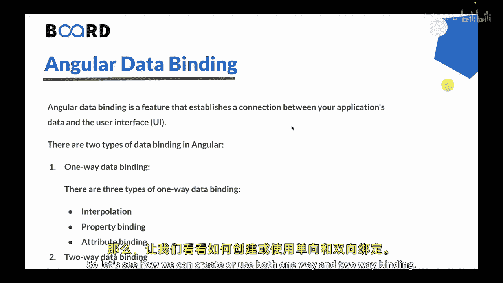

以下是单向数据绑定的三种形式：
*   **插值**：使用双花括号 `{{ }}` 将组件属性或变量直接绑定到模板中。
*   **属性绑定**：使用方括号 `[ ]`，根据组件属性的值来设置 HTML 元素的属性。
*   **属性绑定**：使用 `attr.` 前缀和方括号 `[ ]` 来设置 HTML 元素的属性值。

### 双向数据绑定

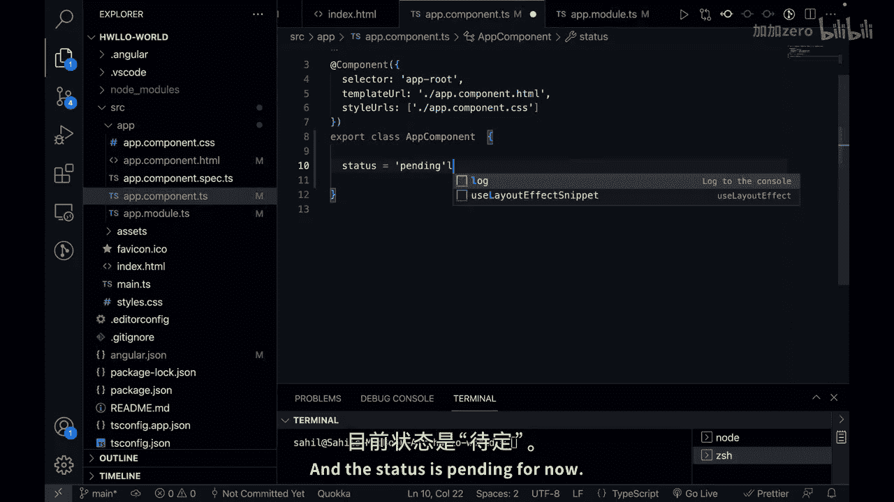

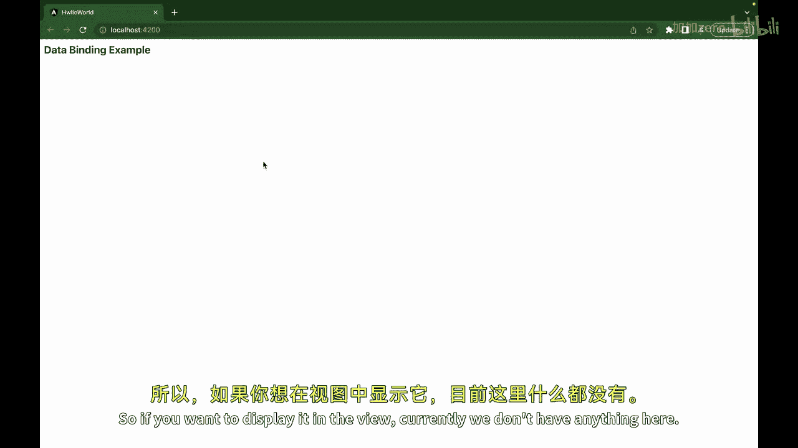

在双向数据绑定中，数据在组件和视图之间双向同步。它使用 `ngModel` 指令将输入元素的值绑定到组件属性上。

上一节我们介绍了数据绑定的基本类型，本节中我们来看看如何在项目中实际应用它们。

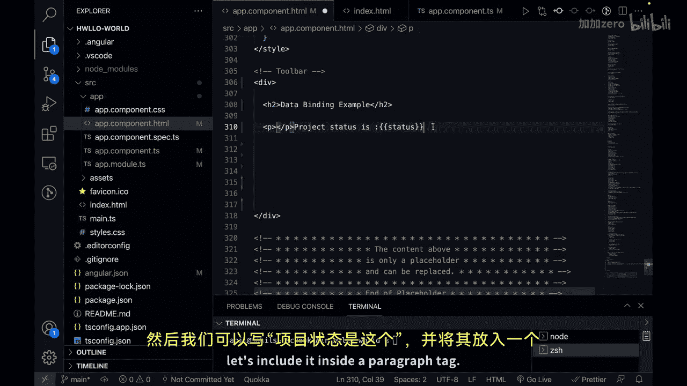

## 实践：单向数据绑定

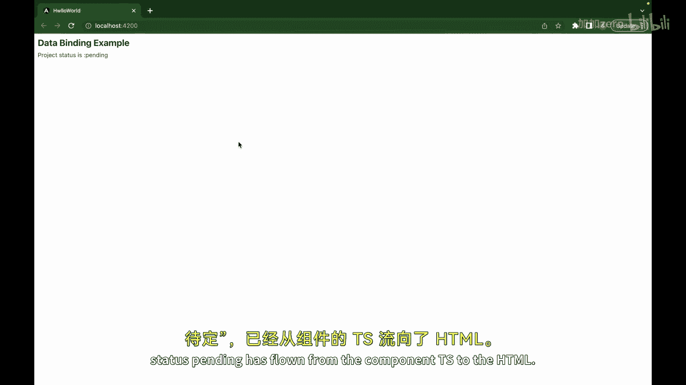

首先，我们聚焦于单向数据绑定。假设我们需要在页面上显示一个项目状态。

1.  在组件的 TypeScript 文件中（例如 `app.component.ts`），创建一个变量。

    ```typescript
    status = 'pending';
    ```

2.  在对应的 HTML 模板文件（例如 `app.component.html`）中，使用**插值**语法来显示这个变量。

    ```html
    <p>项目状态是：{{ status }}</p>
    ```

保存后，页面将显示“项目状态是：pending”。此时，数据从组件（TS）流向了视图（HTML），这就是单向数据绑定。

## 实践：双向数据绑定

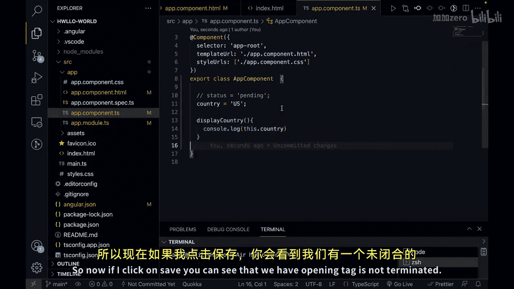

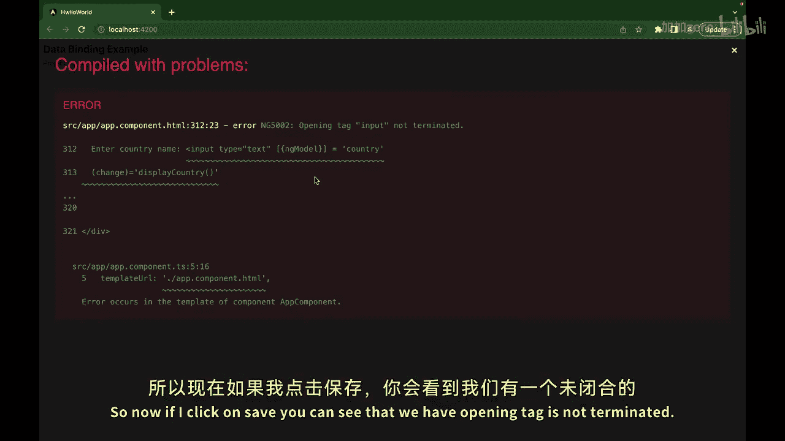

接下来，我们看看双向数据绑定。假设我们有一个输入框，允许用户输入国家名称，并且我们希望在用户输入时，组件中的变量能同步更新，同时触发一个函数。

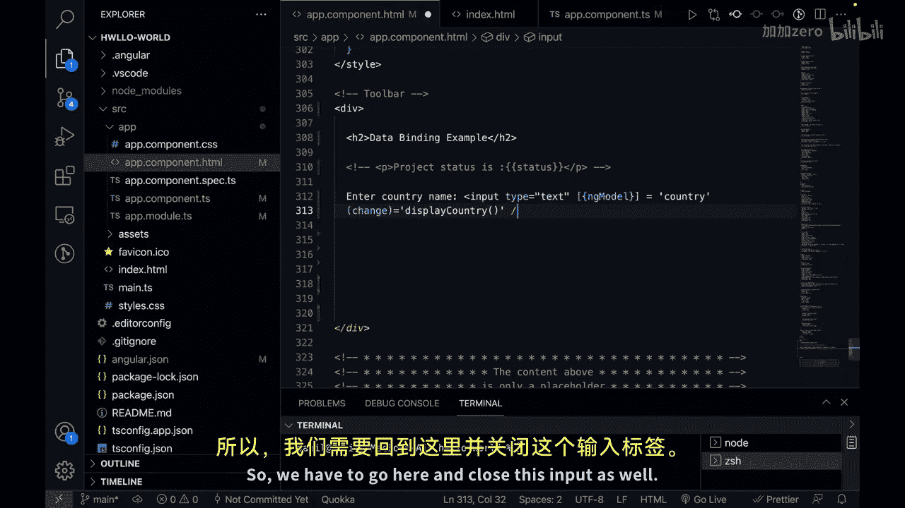

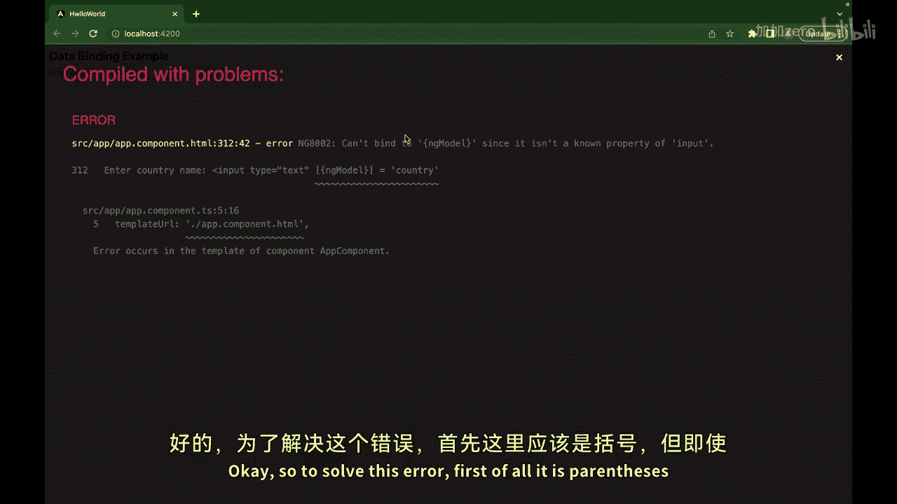

1.  首先，在组件的 TypeScript 文件中创建变量和函数。

    ```typescript
    country = 'US';

    displayCountry() {
      console.log(this.country);
    }
    ```

2.  在 HTML 模板中，使用 `ngModel` 指令实现双向绑定，并绑定 `(ngModelChange)` 事件来调用函数。

    ```html
    <input type="text" [(ngModel)]="country" (ngModelChange)="displayCountry()">
    ```

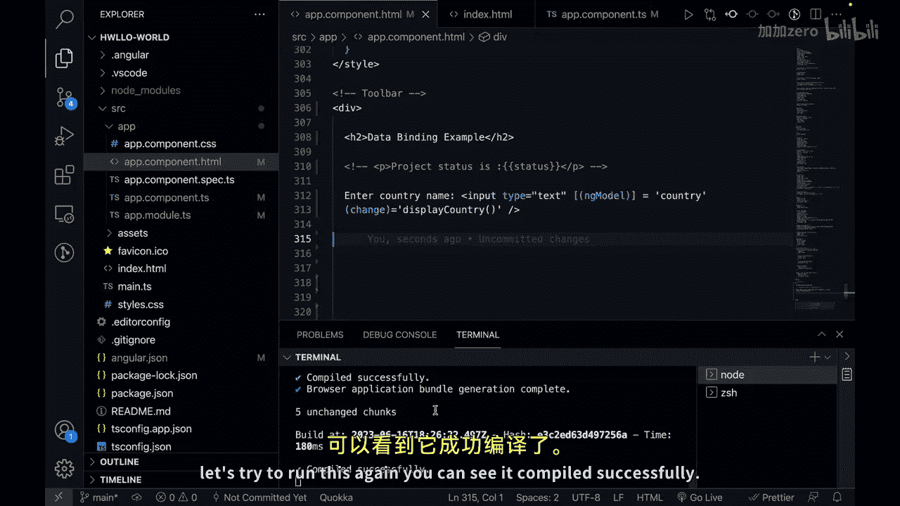

**重要提示**：要使用 `ngModel`，必须在 AppModule 中导入 `FormsModule`。

    ```typescript
    import { FormsModule } from '@angular/forms';

    @NgModule({
      imports: [
        // ... 其他模块
        FormsModule
      ],
      // ...
    })
    export class AppModule { }
    ```

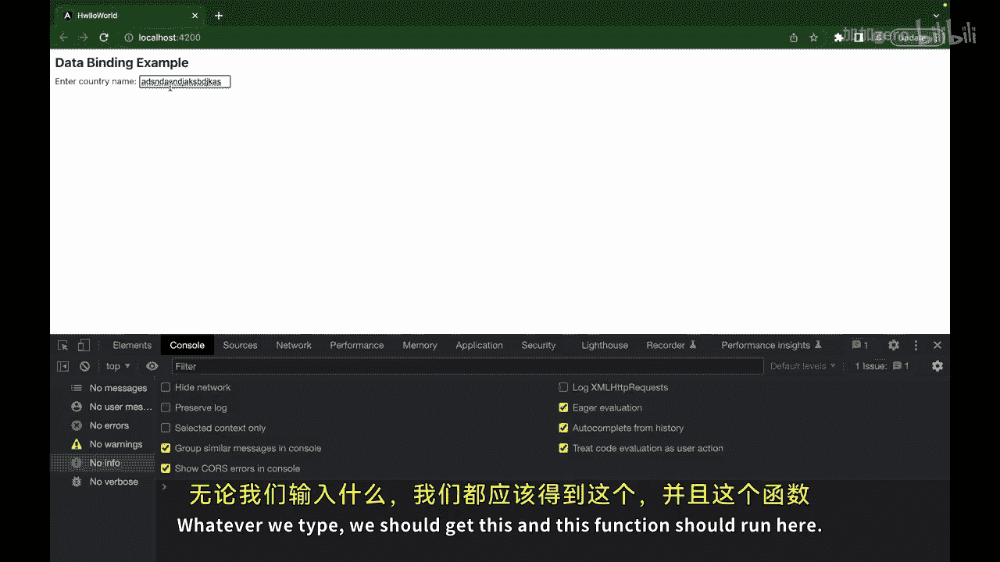

保存后，页面输入框会显示默认值“US”。当你在输入框中修改内容时，控制台会实时打印出当前的国家名。这演示了数据在视图（输入框）和组件（`country` 变量）之间的双向同步。

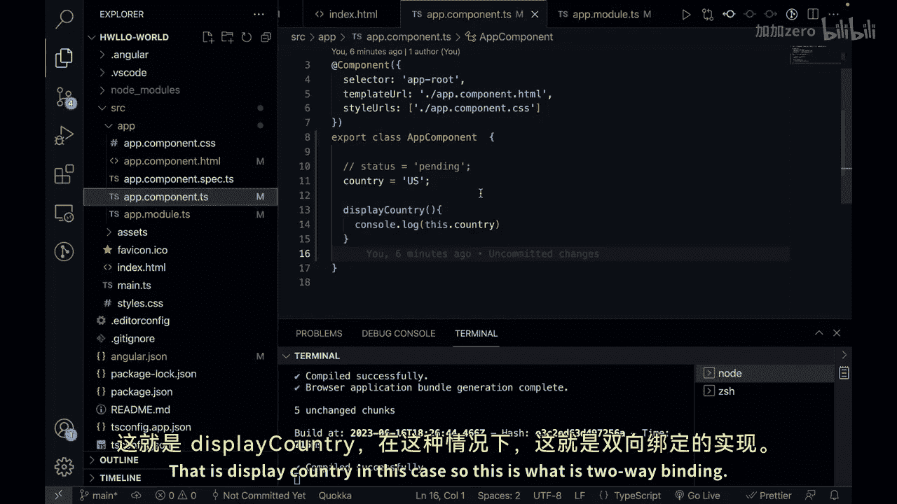

## 总结

本节课中我们一起学习了 Angular 数据绑定的核心概念。通过利用数据绑定，你可以轻松地在应用程序的 UI 中更新和反映数据的变化，反之亦然。这简化了动态和交互式应用程序的开发，使得在 Angular 应用中管理和操作数据变得更加容易。


我们了解了单向数据绑定（包括插值、属性绑定和属性绑定）以及使用 `ngModel` 实现的双向数据绑定。在接下来的课程中，我们将更深入地学习 Angular 插值。