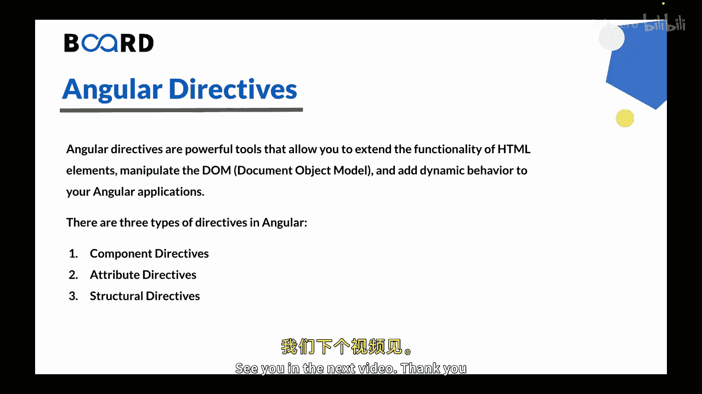

# 【Java全栈开发 专项课程（上）】Board Infinity—中英字幕 p156 p84_02_what-are-angular-directives -BV1tAygYoEj5_p156-

Hi there in this video we will learn about what are angular directives。So let's get started。

Angular directives are powerful tools that allow you to extend the functionality of Sl elements。

 manipulate the dom and add dynamic behavior to your angular application。

So directives are fundamental building block or angular and play a crucial role in creating reusable components and enhancing the user experience。

There are three types of directives in Angular， so let's discuss。About them。

So the first one is component directives。So components are the most common type of directive in angular。

They are used to create reusable UI components within their own template， styles and behavior。

Components are used of STml elements， CSS styles。And typescript code that defines the component。

 logic and appearance。They en capsulate their own data and functionality。

 making them contained and reusable throughout the application。😊。

So components are declared using the a component decorator in angular and can be reused by placing them in the HTML templates of other components or directly in the routing configuration。

Lets take an example， so imagine that you are building an e commercemerce application and you need to create a reusable component called product card component。

This component will display product information such as the product name。

 price and an add to card button。It will encapsulate its own styles and behavior。

 making it reusible throughout the application。You can then use this component in various parts of your application such as the product listing page。

 the shopping cart page， or even in a sidebar widget。Let's talk about attribute directives。

So attribute directives allows you to change the appearance or behavior of an element by manipulating its attributes or adding or removing elements。

Attribute directives are used by applying them to existing HTML elements as attributes。

They can modify the behavior or appearance of the element they are applied to。

So Angular provides some built in attribute directives such as Nng class， Nng style and Nng F。

That allows you to dynamically modify the class， style and visibility of elements based on component data or conditions。

Additionally， you can create your own custom attribute directives to meet specific application requirements。

Let's take an example。 S you want to highlight certain products in your product listing page based on their availability。

You can create a custom attribute directive called highlight directive that when applied to a product element changes its background color to indicate its availability status。

You can apply this directive dynamically based on the availability data of each product。

 making it visually stand out for the users。Now， let's talk about the third type that is structural directives。

So structural directives enable you to modify the structure of the dom by adding or removing elements based on certain conditions。

They are distinguished by an asterisk prefix in their syntax and provide a way to conditionally render or repeat elements in the top。

Let's take an example。So lets see that you want to display a list of products and their prices。

But you only want to show products with the price greater than a certain amount。

You can use the built in N4 structural directive to ittrate over the product list and conventionally render the elements using an Nngf directive。

This way， only products that meet the specified condition will be displayed in the do。😊。

Anglia provides several built structural directives such as Nng F。

 N4 and Nng switch that allows you to conditionally display or repeat elements in the dom based on the component data。

These directives can alter the dom structure dynamically to reflect changes in the application state。

So custom attribute and structural directives can also be created to extend angular functionality and cater to specific application needs。

 so directives are essential for building dynamic and interactive angular applications。

They allow you to manipulate the dom， apply conditional rendering， control element behavior。

 and encapsulate reusable components。This is all for this video。 In the next video。

 we will learn about angular structural directives。See you in the next video。 Thank you。

🎼。

