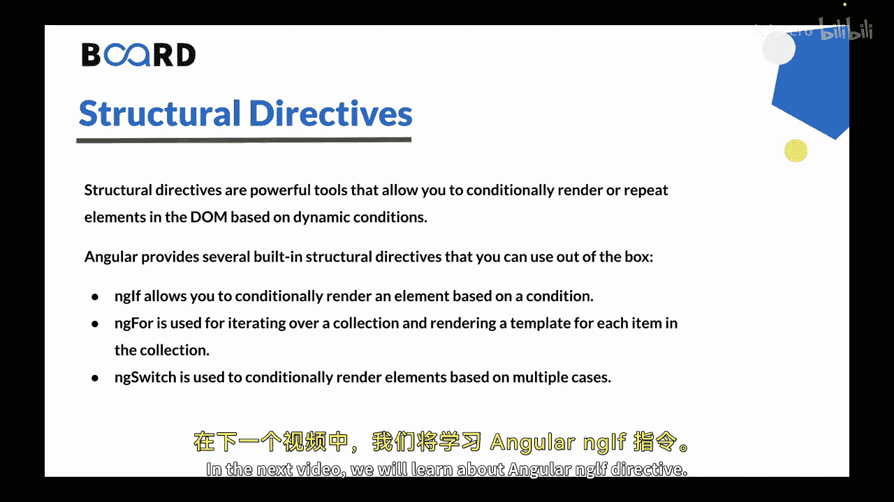
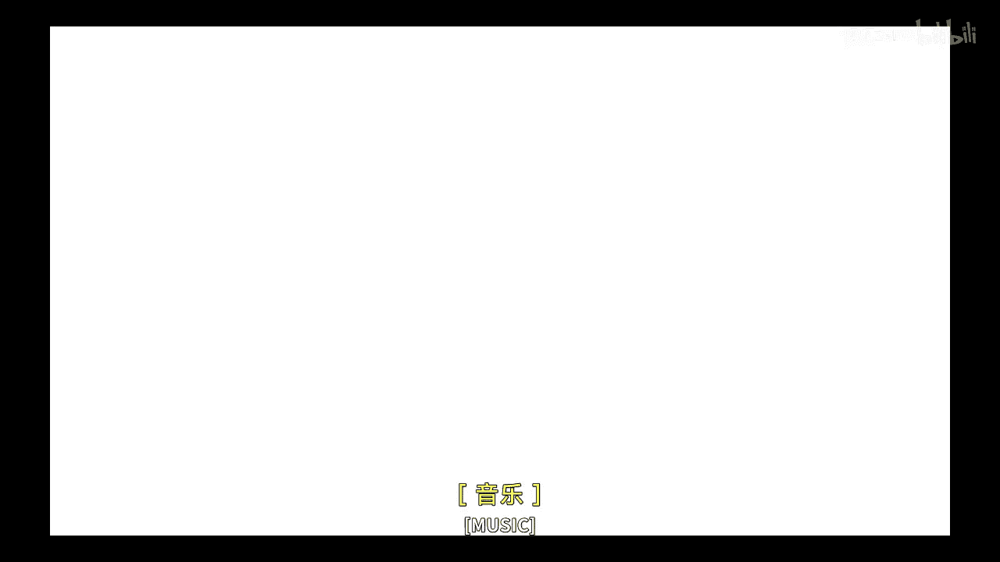

# Java全栈开发 专项课程（上）：157：Angular 结构型指令 🏗️


在本节课中，我们将要学习 Angular 中的结构型指令。结构型指令是 Angular 中用于动态修改 DOM 结构的重要工具，它们允许我们根据条件来显示、隐藏或重复元素。

上一节我们介绍了什么是 Angular 指令，本节中我们来看看结构型指令的具体内容。

## 什么是结构型指令？

Angular 中的结构型指令是一种允许你根据特定条件添加或移除元素，从而修改 DOM 结构的指令。它们是强大的工具，允许你基于动态条件有条件地渲染或重复 DOM 中的元素。它们在语法上以星号 `*` 为前缀，提供了一种有条件地渲染或重复 DOM 元素的方法。

## 内置的结构型指令

Angular 提供了几个内置的结构型指令，你可以直接使用。以下是其中一些核心指令的介绍。

### *ngIf 指令

`*ngIf` 指令用于根据条件有条件地渲染一个元素。它计算一个表达式，如果表达式为真，就在 DOM 中渲染该元素；如果表达式为假，则将该元素从 DOM 中移除。

**示例场景**：假设你的应用程序中有一个用户认证功能，你只想在用户登录时显示欢迎信息。你可以使用 `*ngIf` 指令，根据组件中 `isLoggedIn` 属性的值来有条件地渲染欢迎信息元素。

**代码示例**：
```html
<div *ngIf="isLoggedIn">欢迎回来！</div>
```

### *ngFor 指令

`*ngFor` 指令用于遍历一个集合，并为集合中的每个项目渲染一个模板。它会为每个项目创建模板的一个独立实例，并将项目的数据绑定到该模板上。

**示例场景**：假设你有一个产品数组，你想显示一个产品名称列表。你可以使用 `*ngFor` 指令遍历产品数组，并为每个产品名称生成对应的列表项元素。

**代码示例**：
```html
<ul>
  <li *ngFor="let product of products">{{ product.name }}</li>
</ul>
```

### *ngSwitch 指令

`*ngSwitch` 指令用于根据多个条件（情况）有条件地渲染元素。它计算一个表达式，并将其与一系列 `*ngSwitchCase` 语句进行比较。匹配的 `*ngSwitchCase` 内的模板会被渲染。

**示例场景**：假设你有一个带有不同颜色选项的下拉菜单，你想根据所选颜色显示特定的消息。你可以使用 `*ngSwitch` 指令来评估 `color` 属性，并使用 `*ngSwitchCase` 语句有条件地渲染不同的消息。

**代码示例**：
```html
<div [ngSwitch]="selectedColor">
  <p *ngSwitchCase="'red'">你选择了红色。</p>
  <p *ngSwitchCase="'blue'">你选择了蓝色。</p>
  <p *ngSwitchCase="'green'">你选择了绿色。</p>
  <p *ngSwitchDefault>请选择一个颜色。</p>
</div>
```

## 结构型指令的作用总结



结构型指令有助于创建动态模板，并在 Angular 应用程序中构建交互式用户界面。它们允许你控制 DOM 结构，有条件地渲染元素，并允许你根据数据或条件重复元素。通过利用这些结构型指令，你可以创建更灵活、响应更快的组件，这些组件能够适应不断变化的数据或用户交互，从而在你的 Angular 应用程序中提供动态和交互式的用户体验。




本节课中我们一起学习了 Angular 的三种核心结构型指令：`*ngIf`、`*ngFor` 和 `*ngSwitch`，了解了它们的基本概念和使用场景。在下一节视频中，我们将深入学习 Angular 的 `*ngIf` 指令。