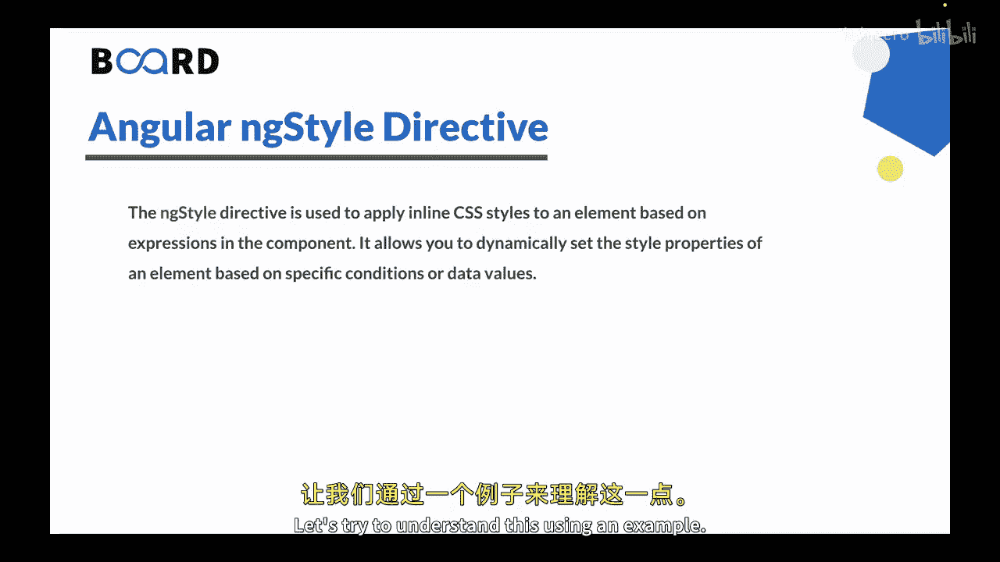
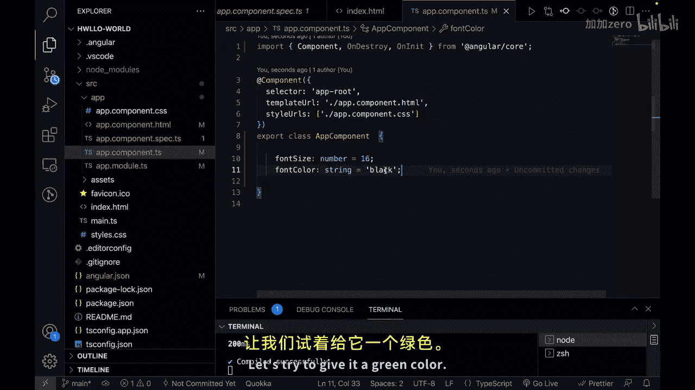
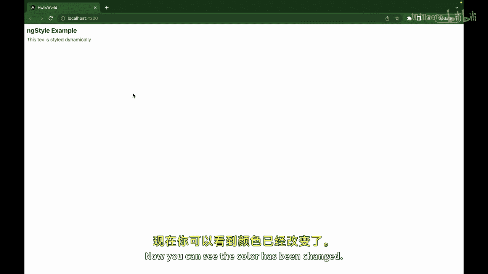
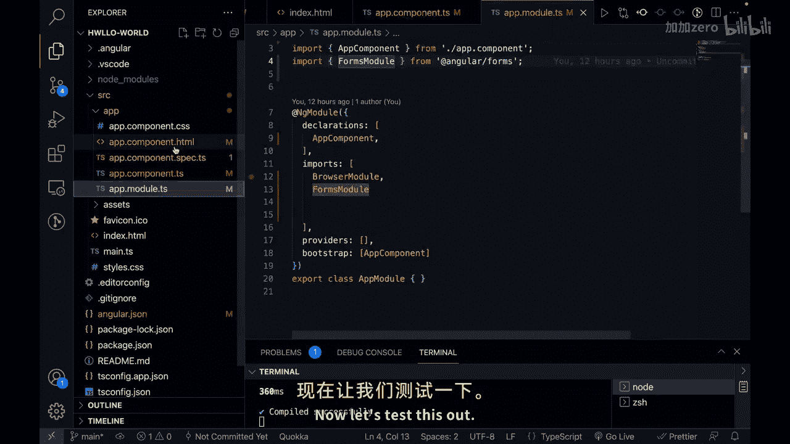
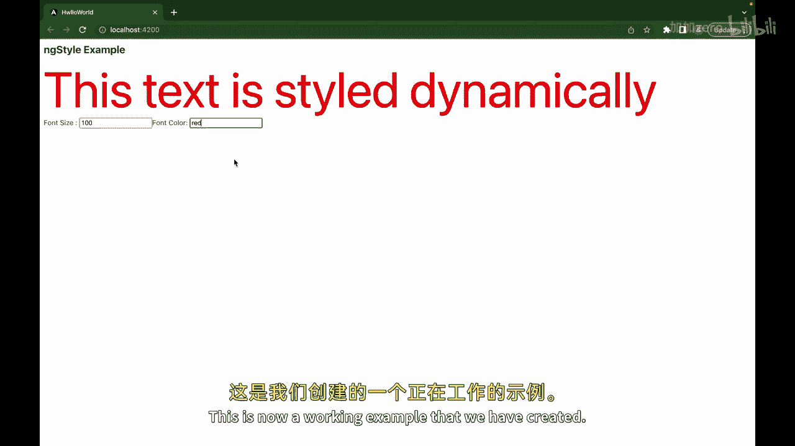
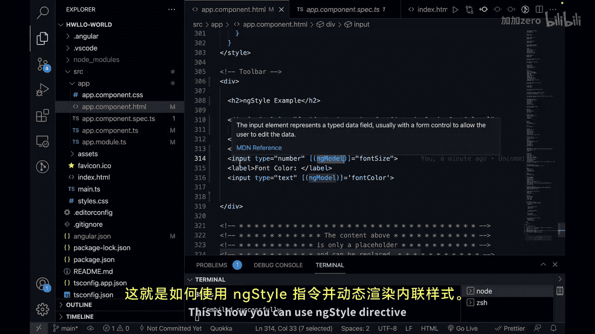

# Angular 入门教程：05：NgStyle 指令详解 🎨

在本节课中，我们将要学习 Angular 中的 `NgStyle` 指令。这个指令允许我们根据组件中的数据动态地为 HTML 元素应用内联 CSS 样式。



上一节我们介绍了 `NgIf` 指令，本节中我们来看看如何使用 `NgStyle` 来动态控制样式。

## NgStyle 指令简介

`NgStyle` 指令用于根据组件中的表达式，动态地将内联 CSS 样式应用到一个元素上。它允许你基于特定条件或数据值来设置元素的样式属性。

其基本语法是使用方括号将指令绑定到一个表达式，该表达式会计算出一个包含 CSS 样式属性的对象。

```html
<div [ngStyle]="{ 'font-size': fontSize + 'px', 'color': fontColor }">
  动态样式的文本
</div>
```

## 动手实践：创建一个动态样式示例

让我们通过一个具体的例子来理解它的工作原理。我们将创建一个可以实时调整字体大小和颜色的文本区域。

首先，在组件的 TypeScript 文件中定义控制样式的属性。

```typescript
// app.component.ts
export class AppComponent {
  fontSize: number = 16;
  fontColor: string = 'black';
}
```

接下来，在组件的 HTML 模板中，我们使用 `NgStyle` 指令将这些属性绑定到 `div` 元素的样式上。

```html
<!-- app.component.html -->
<div [ngStyle]="{ 'font-size': fontSize + 'px', 'color': fontColor }">
  这段文本的样式是动态的。
</div>
```



## 增强交互：添加输入控件



为了让用户能够动态调整样式，我们可以添加输入框。以下是实现步骤：

1.  为字体大小和颜色分别创建标签和输入框。
2.  使用 `NgModel` 指令实现输入框与组件属性的双向数据绑定。

确保你的 `AppModule` 中已经导入了 `FormsModule` 以支持 `NgModel`。

```typescript
// app.module.ts
import { FormsModule } from '@angular/forms';

@NgModule({
  imports: [
    // ... 其他模块
    FormsModule
  ],
})
export class AppModule { }
```



现在，在模板中添加输入控件：

```html
<!-- app.component.html -->
<label>字体大小：</label>
<input type="number" [(ngModel)]="fontSize">



<label>字体颜色：</label>
<input type="text" [(ngModel)]="fontColor">
```

当用户在“字体大小”输入框中输入数字，或在“字体颜色”输入框中输入有效的 CSS 颜色值（如 `red`, `#00ff00`, `rgb(0, 0, 255)`）时，上方 `div` 元素的样式会立即更新。

## 示例解析

在这个例子中：
*   `div` 元素通过 `[ngStyle]` 指令被动态地赋予样式。
*   字体大小和颜色样式由组件中的 `fontSize` 和 `fontColor` 属性决定。
*   两个输入字段允许用户实时修改这些属性值。
*   我们使用了 `NgModel` 指令来实现输入框与组件属性之间的双向数据绑定，确保用户输入能即时反馈到样式上。



## 总结


本节课中我们一起学习了 Angular 的 `NgStyle` 指令。我们了解到它如何通过绑定一个样式对象来动态控制元素的内联样式，并且通过结合 `NgModel` 指令，创建了一个允许用户实时交互、修改样式的生动示例。掌握 `NgStyle` 是构建动态、响应式用户界面的重要一步。