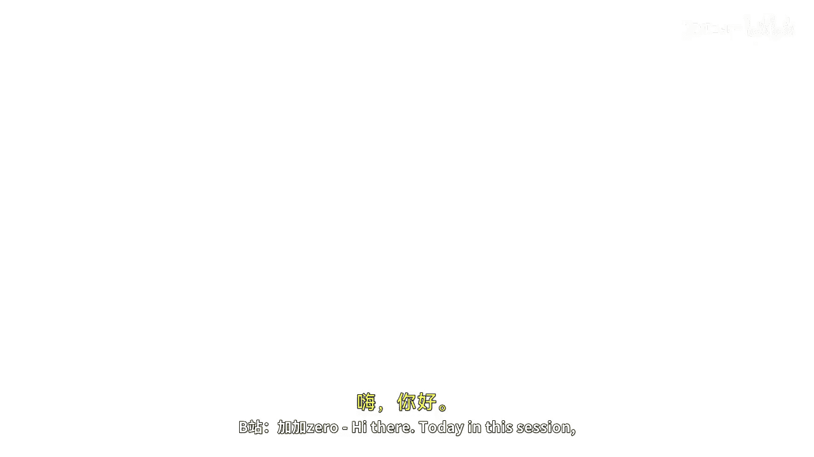
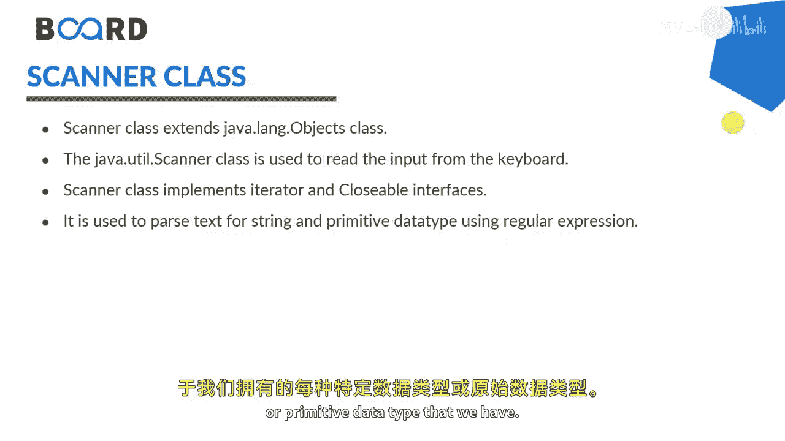
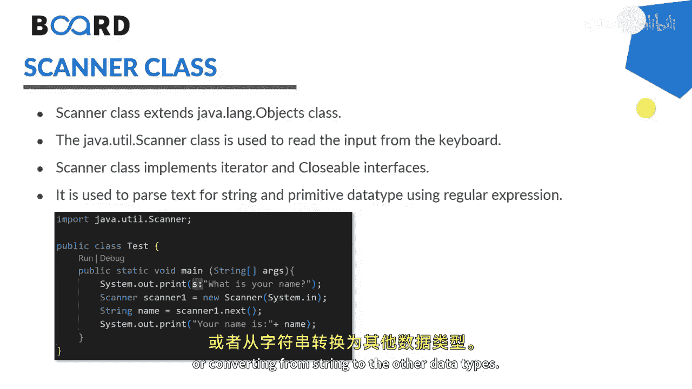
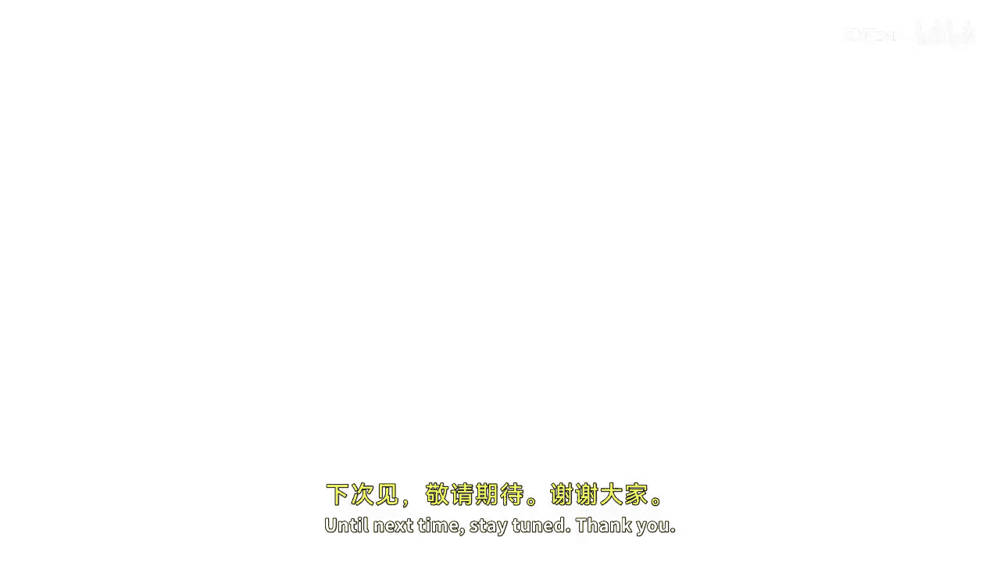

# 【Java全栈开发 专项课程（上）】Board Infinity—中英字幕 p16 p15_04_reading-input-from-user -BV1tAygYoEj5_p16-

Hi there。 Today In this session， I will discuss how to read input from user。

 Reading input from user is an integral part of any program。

 because until the user will not enter the input as per their own requirement they will not be able to fulfill their user demands。

 So provides all the necessary means required to take input of any form in Java。

 you can take input by three ways。 One is the buffer reader class。

 Another is a scanner class and third one is the console class。

 Here I will talk about the scanner class。 scanner class is the most widely used method for taking input in a Java program。

 scanner class extends the object class and available in the U package。

 This provides us with specific methods to pass the input given to the program using。😊。

Spific methodsWith each particular data type or primitive data type that we have scanner has their own specific methods to pass the data into the specific type by default scanner scans the inputent string type if you would like to convert this into the other type you need to do the par or converting from string to the other data types。

These are the couple of methods which I have enlisted Next will return the next token from the scanner。

 which is of string type。Next line reads the entire line as a string type with space， next white。

 next short， next integer， next float， next double next pulloleen， as I said。

 whatever primitive types you have scanner class has specific methods to pass the input given to the specific type。

 so let's get started practically to implement scanner class and reading the input from user in Java。

To read the input from user， I will first need to。Instiate the scan class from the U package。

Naming this as scanner equals to new scanner。The argument that needs to be passed is system dot in。

Because it helps in taking the input。So object should be in。Was that。I'm going to。

Give the message to the user。Enter your name。Here I am declaring a string type of value name equals to scanner dot next line。

 I expect the space also， so that's what I' am taking the input with next line。

And here I'm going to print what user has entered。Name is。

Whatever user has entered in the name variable。Now， I just need to run this。Here I entered the name。

 let's say King Kocher。Next， if I would like to take any other type， for example。

I'll just prompt a message。Enter your age。I'm going to declare in teacher age。

The moment I will write scanner dot next or next line， it will take the。

String value that needs to be converted into or pass into the integer type。

 but we will not do this scanner has a specific method as per their primitive type next integer。

And now you can see that sis out。Age is whatever user has。Enter。Here。

 I will also prompt out the message。User details。By this way， you can get more over details。

I just wanted to copy these to copy taste is really bad。 Let me just write it quickly。Here， I'll say。

 enter your gender。I'm just putting the。Option in the bracket， either M or F。

You should not write the complete M F， otherwise， because I wanted to tell you for the character。

Scanner dot next cap。I think next care is not available。 I need to take next line。

And character at index1 or 0。Next， I would like to take up。Let's see， anything。Bullion。

Or double let's say contact number enter your contact number。

 contact number should not be double although， but because it does not have the decimal value。

 but the double has a wider range and every contact number has a 10 desserts。

 Thats what I prefer to use double for the contact number scanner dot next double。That's it。

 I think you got the idea how you can use all the eight primitive types here with the same type。

Gender is whatever user has entered into the gender。And contact number is also needs to be printed。

Conduct。Number。And this is the contact。Now let's just execute this program and see the output。

I just sent her name。King coacher。23。You can see that I got some error。

 let me just read it up quickly。This is giving the error for gender， not a problem。

Out of bound for length 0。Shall I take it for next？King Coer， it is 23。If I even though enter mail。

 it will take M。Contact number is10 digital number。And that's how the details are getting printed。

 You can see that gender is just M out of this entire string。 M is be。

I hope the concept is pretty clear to all of you how to take user input with the help of scanner class。

 which is easy to implement。Better competitive with the smaller data types。

 And it generally best option for competitive coding。

Provides convenient method for passing the primitive data types which are easy to memorize regular expression can also be fine with the help of these types。

 as I told you Care at method。Thus， scanner class offers a much easier approach to reading records from the data file as well。

 I hope the concept is clear to all of you until next time， Stay tuned。 Thank you。🎼。

