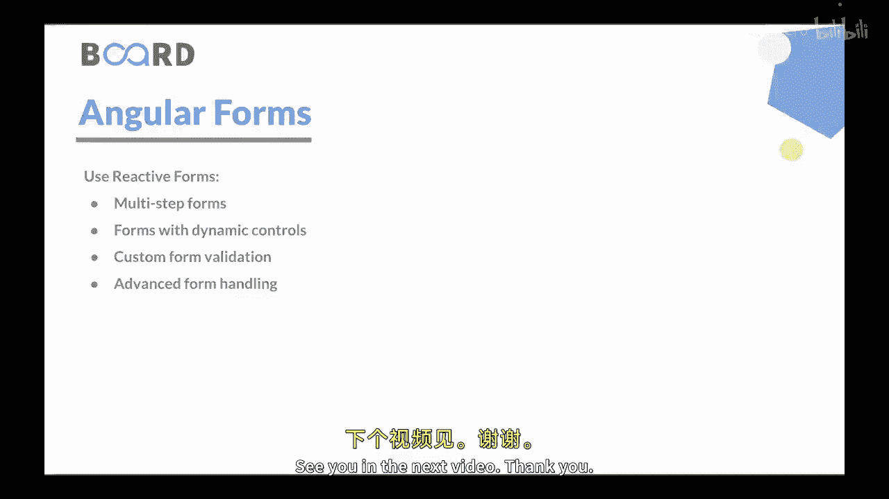

# Java全栈开发 专项课程（上）：03：Angular 表单 📝

在本节课中，我们将要学习 Angular 框架中处理表单的两种主要方式：模板驱动表单和响应式表单。表单是许多 Web 应用的核心组成部分，用于收集和提交用户数据。理解这两种方法的区别和适用场景，对于构建高效、可维护的应用至关重要。

---

上一节我们介绍了 Angular 管道，本节中我们来看看 Angular 表单。

表单是许多 Web 应用的重要组成部分，允许用户输入和提交数据。Angular 为处理表单提供了强大的支持，包括模板驱动表单和响应式表单。

接下来，让我们详细讨论它们。

## 模板驱动表单

模板驱动表单依赖于 HTML 模板中的指令来创建和管理表单。表单的结构直接在模板中定义。Angular 根据使用的指令（如 `ngModel` 用于双向数据绑定，`ngForm` 用于表单处理）来推断表单控件。

模板驱动表单语法更简单，与响应式表单相比需要更少的代码。它们非常适合具有基本验证需求的简单表单。表单逻辑主要在模板本身中定义，使其更具声明性。

模板驱动表单通常用于需要快速实现表单，或表单结构相对简单直接的场景，例如联系表单或登录表单。对于较小、不太复杂的表单，它们是一个不错的选择。

以下是模板驱动表单的核心概念：

*   **`ngModel`**：用于在表单控件和组件属性之间建立双向数据绑定。
*   **`ngForm`**：用于将 HTML `<form>` 元素包装成一个 Angular 表单对象。

## 响应式表单

响应式表单提供了一种更灵活、更程序化的方式来处理表单。它们是使用 Angular 表单模块提供的 `FormControl`、`FormGroup` 和 `FormArray` 类构建的。

在响应式表单中，表单结构是在组件代码中程序化定义的，而不是直接在模板中。这使您可以对表单结构和行为进行细粒度的控制。您可以动态添加或删除表单控件、应用复杂的验证规则并以编程方式处理表单提交。

响应式表单非常适合需要更高级功能的复杂表单，例如动态表单控件、条件验证、跨字段验证或具有复杂数据依赖关系的表单。对于大型表单或需要大量验证和自定义的表单，它们提供了更好的可扩展性和可维护性。

以下是响应式表单的核心概念：

*   **`FormControl`**：用于跟踪单个表单控件的值和验证状态。
*   **`FormGroup`**：用于跟踪一组 `FormControl` 实例的值和状态。
*   **`FormArray`**：用于跟踪一个表单控件数组的值和状态。

## 如何选择表单类型

重要的是要注意，模板驱动表单和响应式表单都提供了强大的功能，如表单验证、数据绑定和处理表单提交。

让我们讨论在哪些情况下使用哪种表单。

以下是适合使用模板驱动表单的场景：

*   **联系表单**：这些是具有基本验证要求的简单表单，例如姓名、电子邮件和消息字段。
*   **登录表单**：这些是具有标准登录凭据验证的表单，例如电子邮件和密码字段。
*   **快速数据录入表单**：这些是字段数量少、不需要复杂数据处理或验证的表单。

以下是适合使用响应式表单的场景：

*   **多步骤表单**：这些是具有多个步骤或部分、需要条件验证和复杂导航的表单。
*   **具有动态控件的表单**：这些表单中控件的数量或类型可能根据用户输入或数据条件而变化。
*   **自定义表单验证**：这些是具有自定义验证规则的表单，涉及多个字段或复杂的数据依赖关系。
*   **高级表单处理**：这些是需要以编程方式控制表单提交、处理表单事件或进行复杂数据处理的表单。

模板驱动表单和响应式表单之间的选择取决于表单的复杂性和自定义需求。模板驱动表单适用于较简单的表单，而响应式表单为复杂表单提供了更好的可扩展性、灵活性和控制力。

因此，在选择模板驱动表单和响应式表单时，您需要考虑表单的具体要求、应用程序的复杂性以及所需的控制和自定义级别。

---

本节课中我们一起学习了 Angular 的两种表单构建方法。模板驱动表单适合快速构建简单表单，而响应式表单则为复杂、动态的表单场景提供了强大的程序化控制能力。理解它们的特点将帮助您在实际项目中做出合适的技术选型。

在下一个视频中，我们将学习模板驱动表单的具体实现。下个视频见。谢谢。