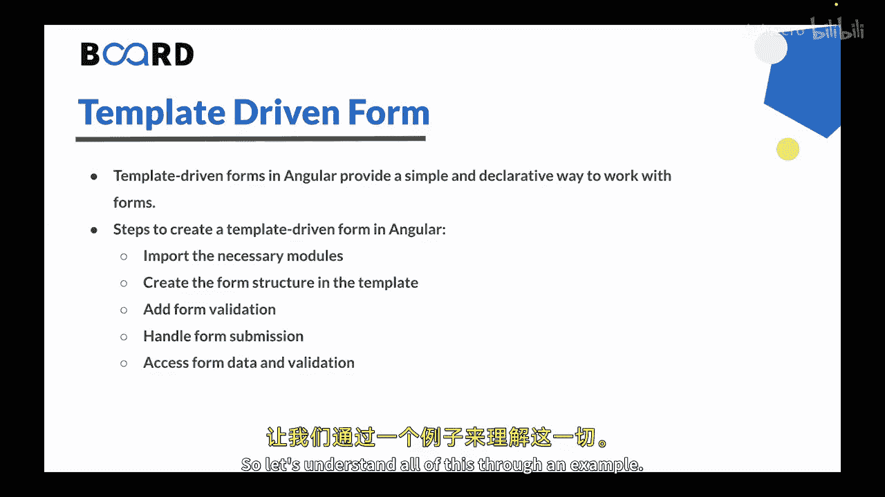
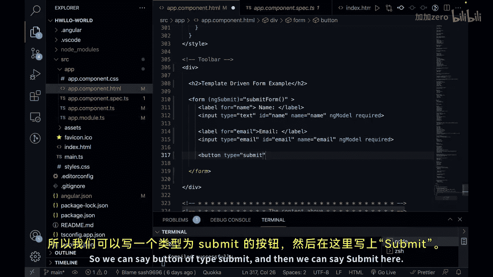
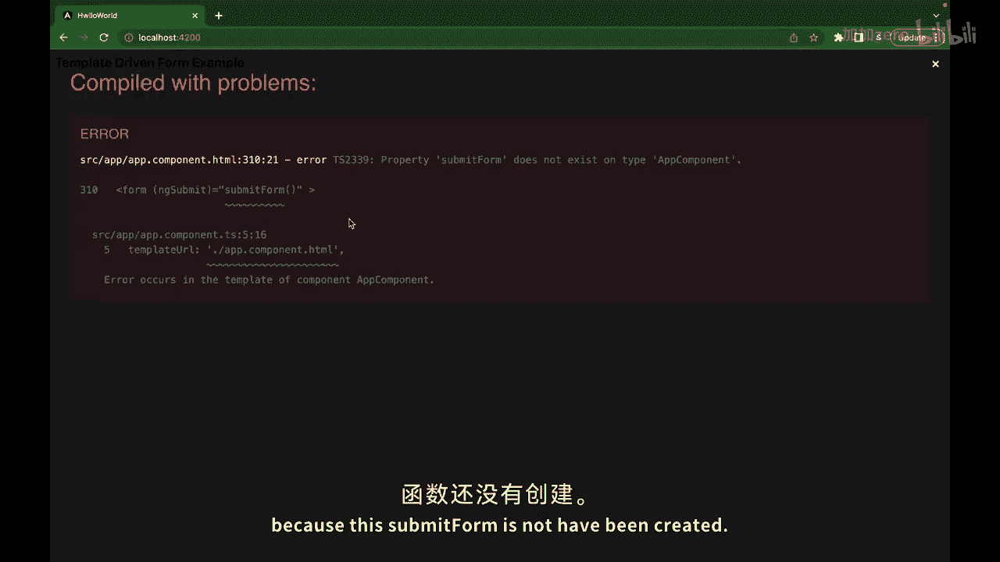
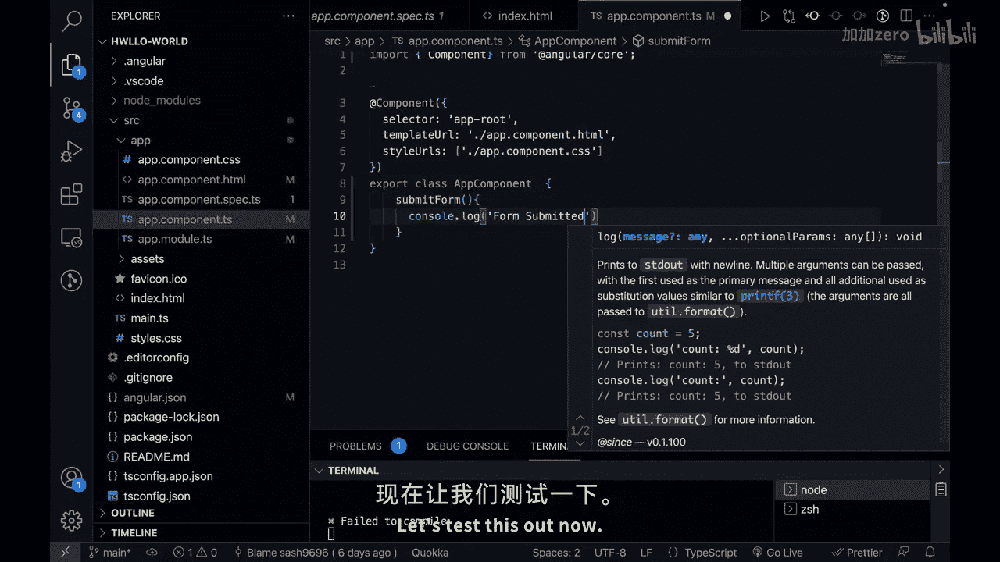
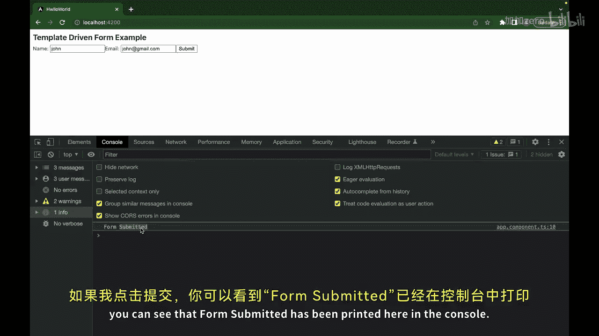
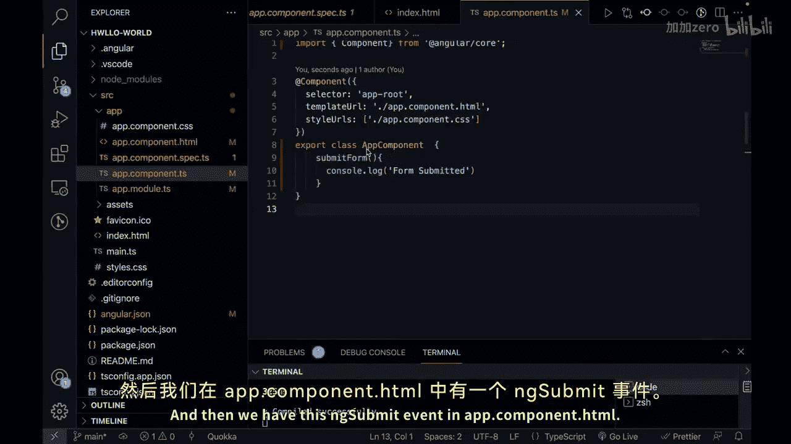

# 【Java全栈开发 专项课程（上）】Board Infinity—中英字幕 p163 p91_04_angular-template-driven-form -BV1tAygYoEj5_p163-

Hi there in the previous video we learned about angular formss。Now， in this video。

 we will understand template driven form。So let's get started。So。

 template driven forms in Angular provide a simple and declarative way to work with the forms。

They rely on directives within the HTML template to create and manage the form。

Let us see the steps in order to create a template1 form in Angular。

So the first step is to import the necessary modules。

That means you can import the forms module from angular forms in the module where your component resides。

Then you have to create the form structure in the template。

That means you can add the form element to enclose the form controls and you can use directives like Nng model to bind form controls to component properties。

You can also use HTML input elements for user input， such as input， select or text area。

You can also use angular directories。Like N model， N model group and N form。

To define form controls and handle form submission。You can also add form validation。

You can use HTML attributes like required minimum length。

 maximum length or pattern to define basic validation rules。

You can also use angular directives like anng model with required or custom validators to perform more complex validation。

Next step is to handle forms submission。You can。Buying the N submit event of the form element to a method in your component。

And the last， but not the least， the step is to access form data and validation。

You can use the N model directive to bind form controls to properties in your component。

 allowing you to access and manipulate the form data。

 So let's understand all of this through an example。

So let's go to the Vs code and here I have a basic project ready and currently Im in app dot component or Ts。

Let's go to the module and the very first thing that you have to do is import forms module here and then import it here as well。

Now， let's go to。The app dot component dot HTMLml and let's create our form。So first of all。

 let's have a form element。Inside this form element， we can just。Binine it with an Nng submitm event。

Like this。And on this event， whenever this event is triggered。

 we have to run a new function that we have to create， so lets call it as submit form。

Inside this form， let's create a label。And this label will have， let' us say。

 a four attribute of name。And we can just write here。 name like this。Next for this label。

 we can have a input。And let's give it a type of text。

And let's also give it a ID of name and a name of name to link the above label with this input and lets also give a validation like Nng model required。

Next， we can have one more label。And this label， lets give a form of email。

And let's put a text of email here。Next， we can say input。And then we can give it a type of email。

And an Id of email。And a name of email as well to link it with the above label。

And here also let's give the validation as Nng model required。

Next we can just have a button to submit the form so we can see button of type submit。

And then we can say submit here。Now if I click on save。You will see。

We have an error here because this submit form is not have been created。

 so for that we can go to our app dot component or Ts and we can declare the submit form method here so we can say submit form。

And here F should be capital and we can just say console or lock form has been submitted。

So let's say console lot log。Submit it。Let's test this out now。 if I click on save， if I go here。

 you can see we have the basic form。

And if I click on console。Let's put some data， let's say John。

 and email would be John at the emailmail do com。And if I click on submitm。

 you can see that form summit has been printed here in the console。

So in this example， we have a simple template driven form with two input fields that is name an email and then we have this Nng summit event in Abcompon or STml。

And this event of the form is bound to the submitm form method in the component which locks a message to the console upon form submission。

So， template driven forms are suitable for simpler forms with basic validation requirements。

They provide an easy and straightforward way to work with formss by leveraging directives in the HTML template。

This is all for this video In the next video， we will understand about angular reactactive fo。

See you in the next video。 Thank you。

