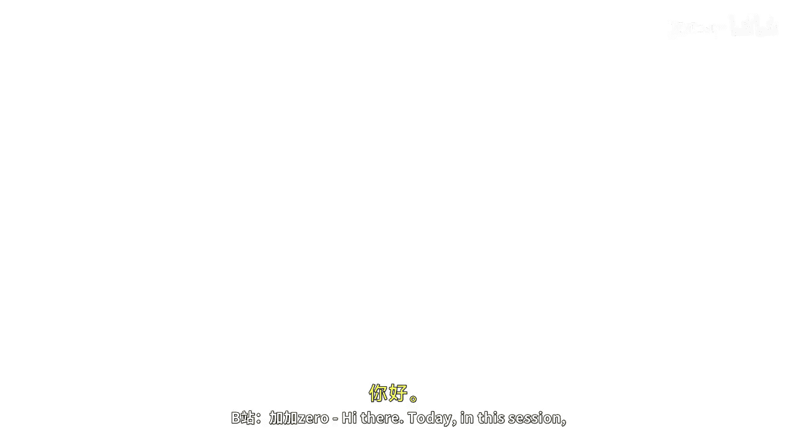
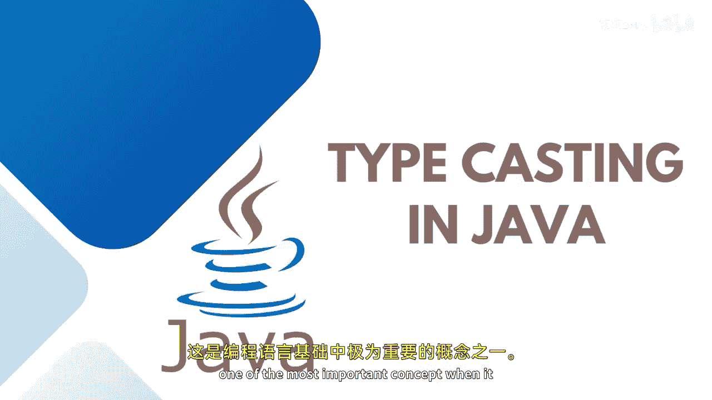

# Java全栈开发：05：Java中的类型转换






在本节课中，我们将学习Java编程语言中的一个基础且重要的概念——类型转换。类型转换是将一种数据类型转换为另一种数据类型的过程。在编写程序时，有时需要将特定类型的数据转换为另一种类型，这个概念就是类型转换。

## 类型转换的类型

类型转换主要分为两种：隐式类型转换和显式类型转换。

隐式类型转换也称为**拓宽转换**，由编译器自动完成。显式类型转换也称为**窄化转换**，需要程序员手动指定。

## 隐式类型转换（拓宽转换）

上一节我们介绍了类型转换的基本概念，本节中我们来看看隐式类型转换。当我们将一个较小范围数据类型的值赋给一个较大范围数据类型的变量时，Java编译器会自动进行类型转换，这被称为隐式类型转换。因为目标类型能容纳更多数据，所以没有数据丢失的风险。

以下是隐式类型转换的常见方向（箭头表示可自动转换的方向）：
*   `byte` -> `short`
*   `short` -> `int`
*   `int` -> `long`
*   `long` -> `float`
*   `float` -> `double`

让我们通过一个例子来理解。假设有一个整数值：
```java
int intValue = 100;
```
如果要将这个整数值存储到一个长整型变量中：
```java
long longValue = intValue; // 隐式类型转换：int -> long
```
这里，`int`类型的值在赋值给`long`变量前，被自动转换成了`long`类型。同样地，将这个`long`值赋给`double`变量：
```java
double doubleValue = longValue; // 隐式类型转换：long -> double
```
这个过程由编译器在内部自动完成，因此称为隐式类型转换。

## 显式类型转换（窄化转换）

上一节我们了解了自动完成的拓宽转换，本节中我们来看看需要手动指定的窄化转换。当我们将一个较大范围数据类型的值赋给一个较小范围数据类型的变量时，由于可能存在数据丢失的风险，编译器不会自动转换。此时，必须使用显式类型转换。

以下是需要显式类型转换的常见情况：
*   `double` -> `float`
*   `float` -> `long`
*   `long` -> `int`
*   `int` -> `short`
*   `short` -> `byte`

让我们看一个例子。假设有一个双精度浮点值：
```java
double doubleVal = 100.56;
```
如果尝试将其直接赋给一个整型变量，编译器会报错，因为整数类型无法存储小数部分，会导致数据丢失（0.56）。因此，必须手动进行类型转换：
```java
int intVal = (int) doubleVal; // 显式类型转换：double -> int
System.out.println("double值: " + doubleVal); // 输出: 100.56
System.out.println("int值: " + intVal); // 输出: 100
```
可以看到，小数部分 `.56` 在转换过程中丢失了。这就是数据丢失的风险。

另一个例子，将一个较大的整数值赋给`byte`类型：
```java
int largeInt = 200;
byte byteVal = (byte) largeInt; // 显式类型转换：int -> byte
System.out.println("byte值: " + byteVal); // 输出可能不是200，因为byte范围是-128到127
```
由于`byte`的范围远小于`int`，强制转换后得到的值可能与原值完全不同，这同样是数据丢失的体现。

## 总结

本节课中我们一起学习了Java中的类型转换。我们了解到类型转换分为两种：**隐式类型转换（拓宽转换）**和**显式类型转换（窄化转换）**。隐式转换在将小范围类型赋值给大范围类型时自动发生，安全且无数据丢失。显式转换在将大范围类型赋值给小范围类型时需要手动进行，使用`(目标类型)`的语法，但存在数据丢失的风险。理解这两种转换对于进行数值计算、比较和后续编程至关重要。


