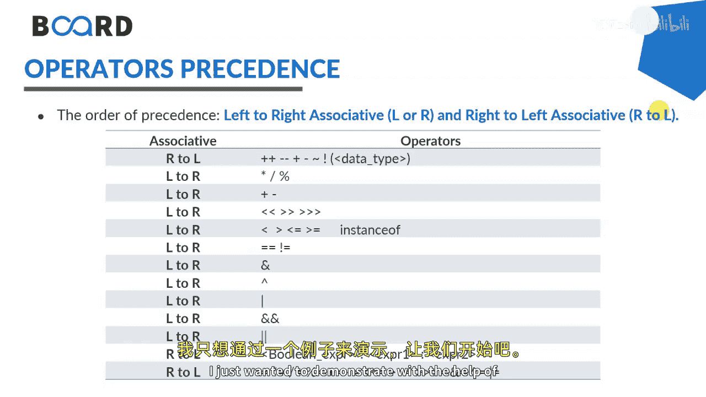
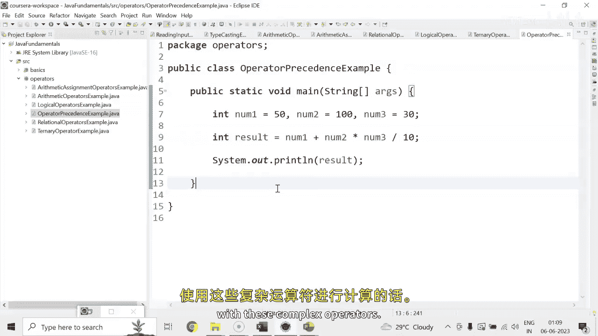

# 【Java全栈开发 专项课程（上）】Board Infinity—中英字幕 p25 p24_08_operator-precedence -BV1tAygYoEj5_p25-

Hi there。 Today In this session， I will discuss about operator pres Basically during our primary schooling。

 if you remember， we discuss about Boma's rule， which helps to determine or understand which operator to be solved first if many operator are there in the given problem。

 Similarlyly， we have operator proceeds to be solved in Java which is a set of rules that tell us the proceed of different operators and as per the rule operator with the higher proceeds is evaluated first。

😊。

So you can see that it is associated as r to L or L to r left to right associative or right to left associative when there are the unary operators as mentioned in the first line they are the right to left。

 then solves to the arithmetic operators in the second row it is left to right。

When it comes for the basic operation， which is plus n minus goes L2 R， shift operators goes L2 R。

Most of the operators goes L to R。 You can see that。

 but the conditional operators goes from R to L and the。

Shift and the arithmetic operators's combination goes from R to A。

So as much you will practice on this， you will be more clear， which。

Operator has a higher precisionsilience as compared to the other one。

I just wanted to demonstrate with the help of one example。 Let's get started。

Considering， I have three variables here。Indiia， number one。50。Number  two。Hundred。And number three。

Is。30。Here i see。And result equals 2。Number one plus number two， multiply by number。3 divided by 10。

And here we want to print the output， whatever we will have in the result。

 The proceed of multiply and divide is greater than that of plus。They will be evaluated accordingly。

 Also， multiply and divide are of the same precision。

 so they will be associated in left to right order。So， first of all， why into。First of all。

 number two which is second one and the number three gets multiplied as I said left to right and then that result would be divided by 10 and then whatever output will come that gets plus by my number one that is 50。

So hundred divided by 30 divide multiply by 30， that is。

Whatever result comes gets divided by 10 and then gets plus on with the 50。 So that's how it works。

Now， let me just run this and evaluate my output。So the output is 350 because 100 into 30 is 3000 divided by 10 is 300 plus 50 is 50 thats how you can evaluate your operators in the larger or real time application if any calculation has to be happen with these kind of complex operators see in the next session until next time stay tuned Thank you。

