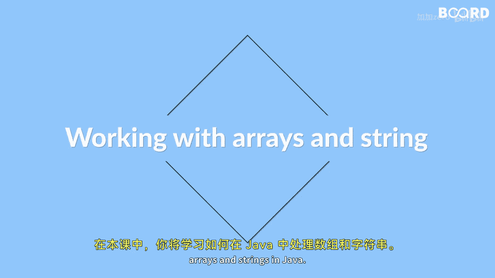

# 【Java全栈开发 专项课程（上）】Board Infinity—中英字幕 p26 p25_01_what-you-will-learn-in-this-lesson -BV1tAygYoEj5_p26-

Hi， there。😊，🎼In this lesson you will learn about working with arrays and strengths in Java。

 you will start with the basics of arrays and learn about single dimensional and multidimensional arrays。

😊。

🎼You will also learn about creating arrays and various operations that can be performed on them。😊。

🎼After that you will move on to the working with strengths in Java。

🎼You will learn about the different spring manipulation methods that Java offers and how to use them。

🎼You will also learn about string buffers and string builders which are used for efficient string manipulation。

🎼Lastly， you will learn about the spring pool in Java and its importance in memory management。

🎼By the end of this lesson， you will have a strong understanding of how to work with arrays and strength syndrome。

🎼And you will be able to use them in your own programming projects， so see you in the next video。

