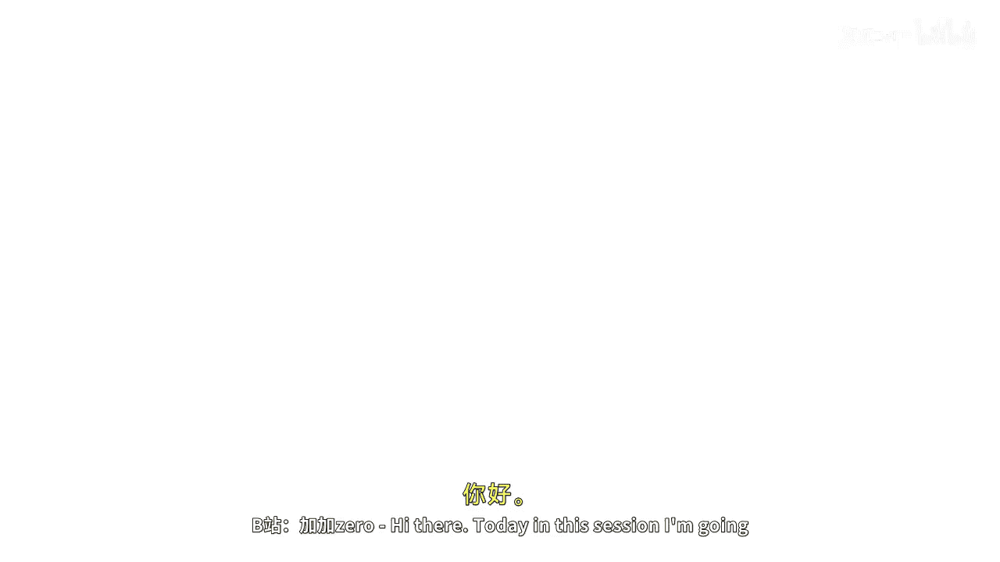
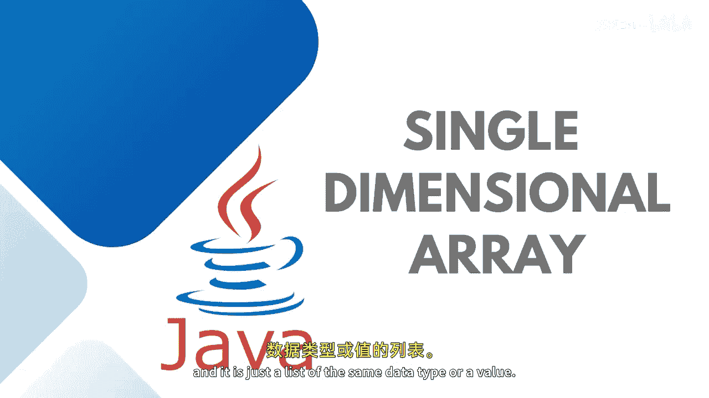
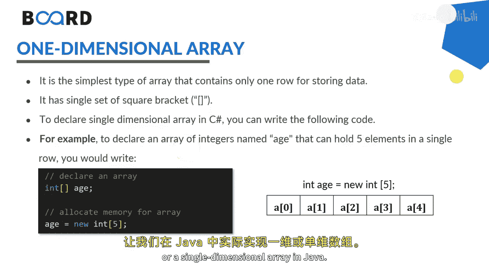

# Java全栈开发：1.3：一维数组 📚



在本节课中，我们将要学习Java编程中的一个基础且重要的数据结构：一维数组。我们将了解它的定义、声明方式、初始化方法以及如何遍历数组中的元素。

## 什么是数组？ 📦



上一节我们介绍了变量的概念，本节中我们来看看如何高效地管理一组相同类型的数据。数组是一种可以存储多个相同类型数据元素的数据结构。一个只包含一个下标或一个维度的数组，被称为一维数组。它本质上是一个相同数据类型或值的列表。

我们可以将一维数组（也称为单维数组）想象成：
*   具有一行和多列的结构。
*   或者具有多行和一列的结构。

例如，一名学生在五门科目中的成绩就可以用一个一维数组来表示。

## 如何声明与初始化数组？ 🛠️

我们使用方括号 `[]` 来指示数组的大小和维度。声明数组主要有两种方式。

### 方式一：先声明，后分配内存

首先声明数组变量，然后使用 `new` 关键字为其分配内存空间。具体选择哪种方式完全取决于你。

以下是声明数组的语法，先放置方括号，稍后通过指定大小（例如5）来分配空间：
```java
数据类型[] 数组名;
数组名 = new 数据类型[大小];
```
你也可以将这两个语句合并为一行：
```java
数据类型[] 数组名 = new 数据类型[大小];
```

### 方式二：声明的同时初始化



在声明数组的同时直接为其赋值，这被称为初始化数组。

如果你在声明时直接给出值，可以省略指定数组大小：
```java
数据类型[] 数组名 = new 数据类型[]{值1, 值2, 值3, ...};
// 或者更简洁的写法：
数据类型[] 数组名 = {值1, 值2, 值3, ...};
```

如果你想先声明数组并指定大小，然后再逐个赋值，可以这样做：
```java
数据类型[] 数组名 = new 数据类型[大小];
数组名[索引0] = 值1;
数组名[索引1] = 值2;
// ... 以此类推
```
正如之前所说，每个元素通过索引访问，索引从 `0` 开始，直到 `n-1`（其中 `n` 是数组大小）。对于一个大小为5的数组，有效索引是0到4。

## 实践：在Java中实现一维数组 💻

现在，让我们在Java中实际编写代码来使用一维数组。

### 1. 声明数组

假设我想声明一个名为 `marks` 的数组，并打算稍后分配内存：
```java
int[] marks;
marks = new int[5];
```
也可以合并成一行：
```java
int[] marks = new int[5];
```

### 2. 初始化数组

在声明数组的同时初始化值：
```java
int[] marks = new int[]{10, 20, 30, 40, 50};
// 或者
int[] marks = {10, 20, 30, 40, 50};
```
如果你分配了值，可以跳过指定大小。

如果你想先声明再逐个赋值：
```java
int[] marks = new int[5];
marks[0] = 100;
marks[1] = 60;
marks[2] = 78;
marks[3] = 80;
marks[4] = 98;
```
可以看到，索引从0开始，对于大小为5的数组，最后一个索引是4（即 `n-1`）。

## 如何遍历数组？ 🔄

现在，你可以遍历这个数组。有两种主要方法。

### 使用传统的 for 循环

使用传统的 `for` 循环，循环变量 `i` 通常从0开始（因为我们在处理数组索引），直到 `i < marks.length`。如果 `marks.length` 是5，循环将从0执行到4。
```java
for (int i = 0; i < marks.length; i++) {
    System.out.println(marks[i]);
}
```

### 使用 for-each 循环

你也可以使用 `for-each` 循环来打印数组元素。`for-each` 循环的语法更简洁。
```java
for (int value : marks) {
    System.out.println(value);
}
```
`for-each` 循环会从 `marks` 数组中依次取出每个值并赋值给变量 `value`，然后打印出来。两种循环方式都将执行五次，打印出数组中的所有值。

运行你的程序，它将打印两次成绩：一次借助传统循环，一次借助 `for-each` 循环。

## 总结 📝

本节课中我们一起学习了Java一维数组的核心知识。我们了解了数组是一个存储同类型数据的列表，掌握了声明数组（`int[] arr;`）、分配内存（`new int[5]`）以及初始化（`{1,2,3}`）的方法。关键点在于数组索引从0开始，通过 `数组名[索引]` 访问元素。我们还学习了使用传统 `for` 循环和 `for-each` 循环来遍历数组。数组是组织数据的强大工具，为学习更复杂的数据结构打下了基础。

请继续关注后续课程，我们将学习多维数组以及数组相关的各种方法。


下次课再见！🎬