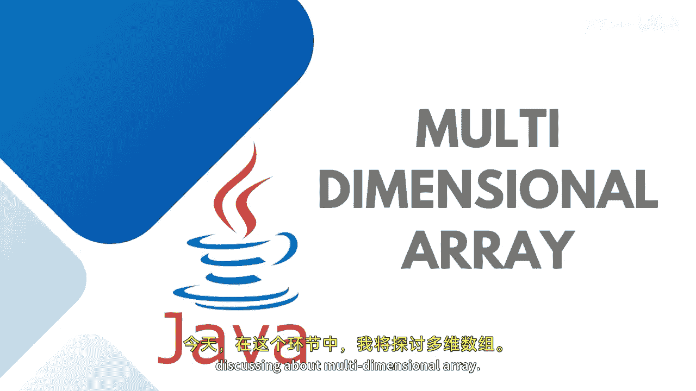

# Java全栈开发：专项课程（上）：29：多维数组




在本节课中，我们将要学习多维数组的概念、声明方式以及如何通过嵌套循环来访问和操作其中的元素。多维数组是处理表格、矩阵等结构化数据的有效工具。

---

上一节我们介绍了数组的基础知识，本节中我们来看看当数据需要以表格或矩阵形式存储时，我们该如何处理。

并非所有情况都使用一维数组。例如，当需要以表格、矩阵或向量的形式存储数据时，就需要用到多维数组。

多维数组至少包含两个维度。它看起来像一个矩形数组，因为每一行具有相同的长度，但列数可以不同。它可以是二维数组、三维数组或更多维度的数组。

我们使用逗号分隔多个维度来声明多维数组。为了存储和访问多维数组中的元素，需要使用嵌套循环，其中外层循环处理行，内层循环处理列。

以下是多维数组的声明方式：
```java
int[][] arrayName = new int[3][3];
```
你可以看到这里我定义了两个维度。第一个维度是行，有三行。第二个维度是列，在我的例子中，有三列。所以这是一个3行3列的数组。

在第一行中，行索引为0，列索引不断变化。在第二行中，行索引为1，列索引不断变化，依此类推。

---

接下来，让我们尝试实际实现一个多维数组。这里我想存储一个成绩数组。

我希望存储三个学生、每个学生五门科目的成绩。因此，我以这种方式创建多维数组。

我也可以在不预先分配内存的情况下，直接根据这些值分配数据，内存会自动分配。这里我创建了三行，每行有五门科目的成绩：`{67, 78, 87, 89, 98}`， `{76, 77, 56, 65, 90}`， `{67, 79, 92, 63, 55}`。

正如我所说，这将是3行5列。我需要一个嵌套的for循环。第一个for循环将遍历行，第二个for循环将遍历列。

以下是遍历数组的代码结构：
```java
for (int i = 0; i < 3; i++) {
    for (int j = 0; j < 5; j++) {
        System.out.print(marks[i][j] + "\t");
    }
    System.out.println();
}
```
外层循环变量`i`从0迭代到2，对应三行。内层循环变量`j`从0迭代到4，对应五列。通过打印`marks[i][j]`，可以访问每个元素。

如果不想以简单列表形式打印，而希望以表格格式打印，则不要在每打印一个元素后就换行。只有在行改变时才换行。我同时使用了制表符`\t`作为转义字符，以便在每个行的元素之间看到空格。

在表格格式中，所有五门科目的成绩都会被清晰地打印出来。

---

我希望多维数组的概念对你来说已经清晰，你已了解如何处理数组。除了基本类型数组，我们还有对象数组。在`java.util`包中有一个`Arrays`类，它包含许多预定义的方法，我们将在后续课程中讨论它们。


本节课中我们一起学习了多维数组的定义、声明、初始化以及如何使用嵌套循环进行遍历和格式化输出。掌握多维数组是处理复杂结构化数据的重要一步。我们下节课再见。