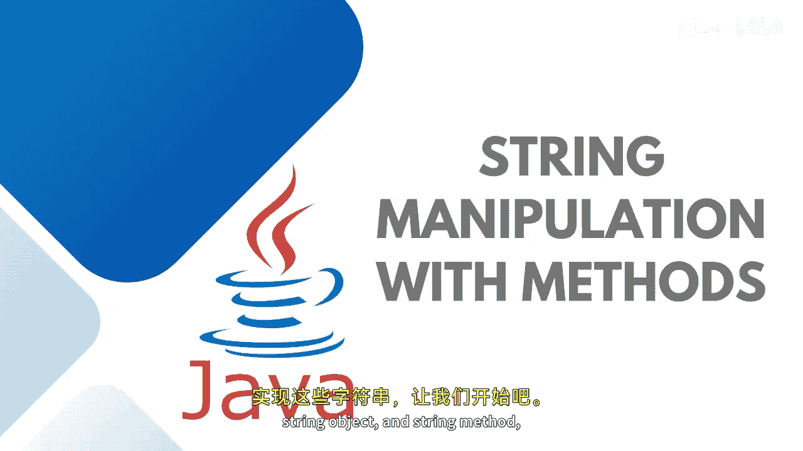
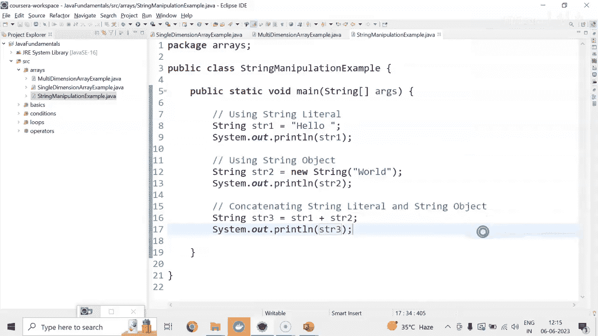
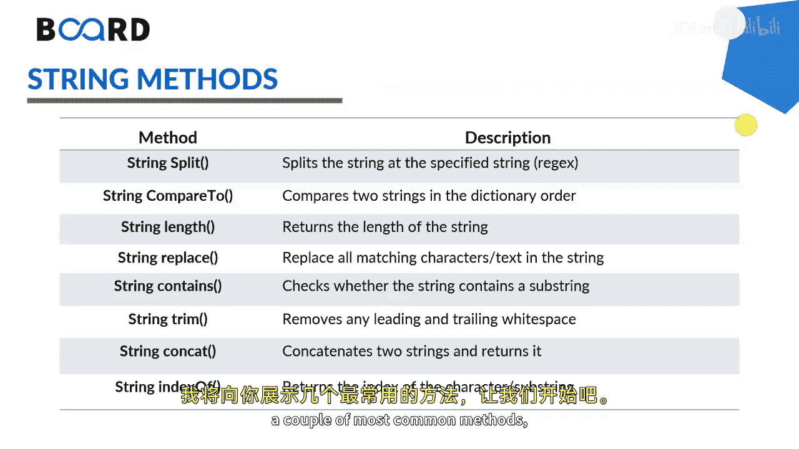

# Java全栈开发：专项课程（上）：06：字符串操作与方法 🧵


在本节课中，我们将学习Java中字符串的声明方式以及常用的字符串操作方法。我们将通过字符串字面量、字符串对象以及内置方法来创建和操作字符串。



---

## 字符串的声明

首先，我们来看看如何声明字符串。在Java中，主要有两种方式：使用字符串字面量和使用`new`关键字创建字符串对象。

以下是两种声明方式的示例：



```java
String str1 = "Hello"; // 字符串字面量
String str2 = new String("World"); // 字符串对象
```

你可以使用`System.out.println()`来打印这些字符串：

```java
System.out.println(str1);
System.out.println(str2);
```

此外，你还可以将字符串字面量和字符串对象连接起来：

```java
String str3 = str1 + str2;
System.out.println(str3);
```

运行上述代码，你将看到连接后的字符串输出。

---



## 常用的字符串方法

上一节我们介绍了如何声明字符串，本节中我们来看看Java提供的强大字符串方法。这些方法可以帮助我们执行各种操作，例如分割字符串、比较字符串、计算长度、替换字符等。

以下是几个最常用的字符串方法及其用途：

*   **`length()`**：计算字符串的长度（包括空格）。
*   **`charAt(index)`**：获取字符串中指定索引位置的字符。
*   **`concat(string)`**：连接两个字符串。
*   **`substring(startIndex, endIndex)`**：获取字符串的子串。
*   **`equals(string)`**：比较两个字符串是否相等。
*   **`contains(sequence)`**：检查字符串是否包含指定的字符序列。
*   **`toUpperCase()`** / **`toLowerCase()`**：将字符串转换为大写或小写。
*   **`trim()`**：去除字符串首尾的空白字符。

---

### 方法使用示例

让我们通过代码来演示这些方法的具体用法。假设我们有一个字符串`str3`，其值为`"HelloWorld"`。

```java
// 计算字符串长度
int length = str3.length(); // 结果为 10

// 获取特定索引的字符
char firstChar = str3.charAt(0); // 结果为 'H'

// 连接字符串 (与使用 + 号效果相同)
String concatenated = str1.concat(str2); // 结果为 "HelloWorld"

// 获取子串
String sub = str3.substring(0, 5); // 结果为 "Hello"

// 比较字符串是否相等
boolean isEqual = str1.equals(str2); // 结果为 false

// 检查是否包含特定字符序列
boolean containsHello = str3.contains("Hello"); // 结果为 true

// 转换大小写
String upperCase = str3.toUpperCase(); // 结果为 "HELLOWORLD"
String lowerCase = str3.toLowerCase(); // 结果为 "helloworld"

// 去除首尾空格
String stringWithSpaces = "  Hello  ";
String trimmed = stringWithSpaces.trim(); // 结果为 "Hello"
```

运行这些代码，你可以在控制台看到每个方法对应的输出结果，从而直观地理解它们的功能。


---


本节课中我们一起学习了Java中字符串的两种创建方式以及一系列核心的字符串操作方法。掌握这些基础方法是进行有效字符串处理的关键。在后续的课程中，我们将继续探索Java编程的其他重要概念。