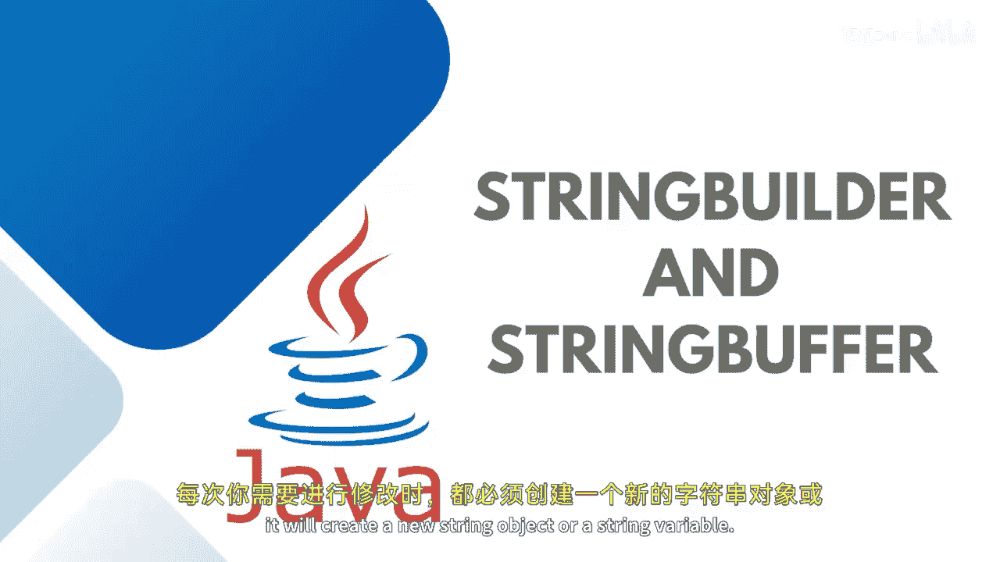

# 【Java全栈开发 专项课程（上）】Board Infinity—中英字幕 p32 p31_07_stringbuffer-and-stringbuilder-in-java -BV1tAygYoEj5_p32-

Hi there。 Today In this session， I will talk about Java string before class。😊。

Basically in the earlier session we discussed that strings and string methods where I told you a string is immutable。

 it cannot be changed or modified every time you need a modification you need to create or it will create a new string object or a string variable。

But string with buffer is a mutable， it means it is a modfiable。

 you can easily modify the string values inside it。

It provides us with a way to make the string mutable in Java and these strings are safe to be used by multiple threads simultaneously。

 and multiple threads can also modify it in order to give this advantage to the string buffer。

 the implementation is light， same with a different class That's a string builder class。😊。

It has the methods like upend insert， delete and reverse， as I told you。

 it allows the string to be modified。 So lets get practically implemented。

 So here what you need to do is you need to instantiate your string buffer。

That's available in Java dot L package。Assigning the halllo as a string。hello好。嗯嗯。

If in case I just assign Ho so that I can make aend。Buffer dot app。Hello， word。And here， I can print。

My string。She。You can also walk on。The capacity， if you will initialize your string buffer empty。

And you will see the initial size of this object。 You can just try printing buffer dot capacity。Yeah。

So we can see that the capacity is 2 byte， which is 16 bits。And the moment you add word。

 it will be printing and adding on to the capacity itself。So this is how the string buffer works。

 I will compare the string buffer with a string builder。 The next that we have is a string builder。

 String builder is also a class which provides us with the mutable things。

 but with a lack of thread safety， it cannot be used by multiple threads。 That's a major difference。

Let me just do the string builder implementation for you， string builder。

Buildder equals to new string builder。So guys， here I'm putting on this ho because I wanted to make a comparison to my boat strings。

Hello。And later I will I can also check the capacity here if this method is available。And here。

 builder。Dot a。No。And then later， I would like to just rent my string buildder。Bothth sides。

I can first make it run and then make a performance test。So you can see that both are working same。

 but as I told you， lack of performance issue is there。So what we are doing is。

 let's say we have a string buffer where we have hallo。Hello， what。Here， I'm going to。

Rather than putting it up and printing world and just comparing， I wanted to it my for loop。

That starts from index I equals to 0。Go till I less than。10000。I plus。

 plus this much of apps I wanted to do。 So I'll say buffer dot append the world。1000 times。

Then I'm going to print， S out。Time taken by string buffer。Is。System。Dat current。

Time in milliseconds， minus the start time。The start time， how it needs to be calculated。

Before starting the operation。Long。Start time equals to system dot current time in milliseconds。

Same thing I wanted to calculate for the string builder。

I'll just copy this loop for the string builder。是。And then just run and check the time taken by the string buffer in the string builder。

String buffer will take more time as compared to the string builder。

🎼Because string builder is although its unsafe to use for the multi threadreading。

 but it is a fastest amongst all the mutability and does not allow multiple threads operations at the same time。

 That's what it is faster as compared to this string buffer I hope it is clear to all of you。

 so see in the next session until next time stay tuned Thank you。😊。

