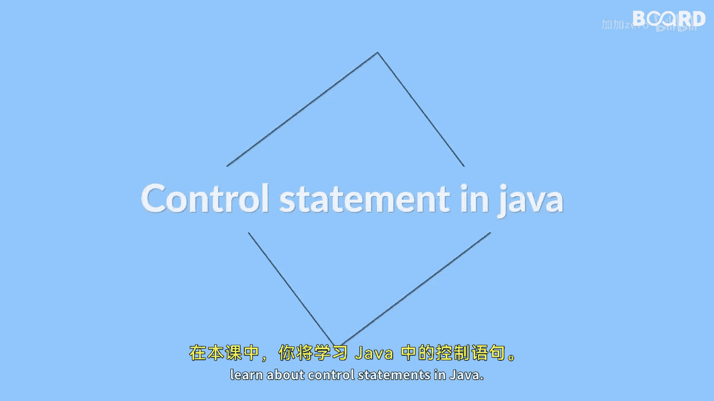

# Java全栈开发 专项课程（上）：第32课：控制语句入门指南

在本节课中，我们将学习Java中的控制语句。控制语句是编程的核心，它们允许程序根据不同的条件做出决策，或者重复执行某些任务。掌握它们对于编写高效、灵活的程序至关重要。

## 什么是控制语句？ 🤔

控制语句用于根据特定条件或循环来控制程序的执行流程。



简单来说，它们决定了代码“何时”以及“如何”运行。没有控制语句，程序只能从上到下顺序执行，无法处理复杂的逻辑。

## 你将学到什么 📚

上一节我们介绍了控制语句的基本概念，本节中我们来看看具体包含哪些内容。以下是本节课的核心知识点列表：

*   **条件结构**：学习如何使用 `if-else` 语句和 `switch-case` 语句，让程序能够根据不同情况执行不同的代码块。
*   **循环结构**：掌握 `for`、`while` 和 `do-while` 循环，使你能够重复执行代码，直到满足特定条件。
*   **流程控制关键字**：理解 `break` 和 `continue` 语句在循环和条件结构中的用法，以更精细地控制循环过程。
*   **增强型循环**：探索 `for-each` 循环在处理数组时的便捷应用。
*   **实践练习**：课程最后将通过一个名为“Fsbu”的趣味练习，帮助你巩固和应用所学概念。

## 核心概念详解 🔍

### 1. 条件结构

条件结构让程序具备判断能力。其核心思想是：**如果**某个条件成立，**就**执行A代码；**否则**，执行B代码。

*   **`if-else` 语句**：这是最基础的条件判断。
    ```java
    if (condition) {
        // 条件为真时执行的代码
    } else {
        // 条件为假时执行的代码
    }
    ```
*   **`switch-case` 语句**：适用于基于一个变量有多个确定值需要分支的情况。
    ```java
    switch (variable) {
        case value1:
            // 代码块1
            break;
        case value2:
            // 代码块2
            break;
        default:
            // 默认代码块
    }
    ```

### 2. 循环结构

循环用于自动化重复任务。想象一下，你需要打印数字1到100，手动写100行打印语句是不可行的，而循环只需几行代码。

*   **`for` 循环**：通常用于已知循环次数的场景。
    ```java
    for (初始化; 条件; 更新) {
        // 循环体
    }
    ```
*   **`while` 循环**：只要条件为真，就持续执行循环。可能一次都不执行。
    ```java
    while (condition) {
        // 循环体
    }
    ```
*   **`do-while` 循环**：先执行一次循环体，再检查条件。至少会执行一次。
    ```java
    do {
        // 循环体
    } while (condition);
    ```

### 3. 流程控制关键字 `break` 与 `continue`

在循环中，有时我们需要提前退出或跳过某次迭代。

*   **`break`**：立即终止整个循环。
*   **`continue`**：跳过当前循环的剩余语句，直接进入下一次迭代。

### 4. 增强型 `for-each` 循环

这是遍历数组或集合的一种简洁语法。你不需要管理索引，循环会自动处理每个元素。

```java
for (元素类型 变量名 : 数组或集合) {
    // 使用变量名操作当前元素
}
```

## 总结与展望 🎯

本节课中，我们一起学习了Java控制语句的核心内容。我们从控制程序流程的基本概念出发，详细探讨了实现条件判断的 `if-else` 和 `switch-case` 语句，以及实现重复执行的 `for`、`while` 和 `do-while` 循环。此外，我们还了解了用于精细控制循环的 `break` 和 `continue` 语句，以及遍历数组的便捷工具 `for-each` 循环。

通过理解这些控制语句，你将能够编写逻辑更复杂、效率更高的Java程序。接下来的“Fsbu”练习是检验学习成果的好机会，请务必动手实践。我们下个视频再见。