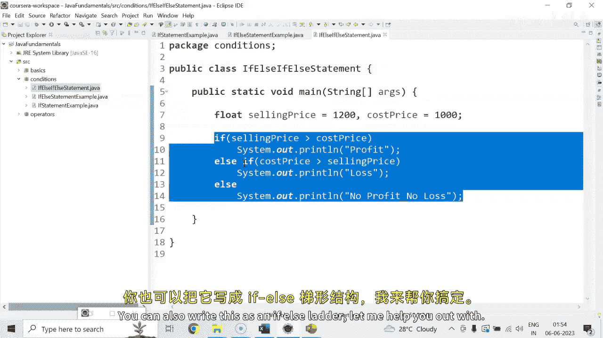

# 【Java全栈开发 专项课程（上）】Board Infinity—中英字幕 p35 p34_03_working-with-conditional-constructs -BV1tAygYoEj5_p35-

Hi， there。Today in this session， I will discuss about working with conditional constructs in Java with the practical exposures。

 So let's get started。

Considering， I have， as I discussed earlier。Buoleion variable is authenticated。

It stores either true or false。When it says true。If is authenticated is to。Then， it will print。

You are logged in。I just print logged in。Otherwise。If is authenticated is not true。

 you can say opposite of the condition。Then you can say， says out。And say， not locked in。

So this is a simple， if statement。So when you run this。

 it will check for the is authenticentated flag， whether it is true or false。

Same thing can be done with the help of F else because we have one condition and one alternative of doing it。

So let me just copy the code here and say。If is authenticated is true， then print logged in it is if。

Not true。 It means comes to the otherwise block or the else block and print not logged。

 So when you have one condition and one otherwise， you can go for。If ill statement。

Next is a F El statement。 Let me tell you something more about that。 Also。

 considering I have two float variables。 One is a selling price of an article。

 and one is the cost price of an article。 Let's say selling price of an article is 1200。

 and the cost price of that article is。1000。I check if。

The selling price of an article is greater than。Cost price。Then I would like to print a message。

Profit。If。Cost price is greater than selling price。Then， there is a loss。If。Selling price is。

Equals2 cost price。Then。There is no profit， no loss。

So you can see that here if the first condition is true， then it will print profit， then loss。

 otherwise no profit， no loss。 As of now， both all the conditions are if statements。

 so itration will happen perfectly， but it will affect the performance。

 because if statements says that in a program， whatever if statements are there。

 they are always evaluated， whether they are true or not。

 even though let's say if the selling price is greater than cost price profit will print。

 it will still check for the next， if statements， because it is a simple if statements。

 so unnecess if you have 50 statements， if statements all will be checked one by one， okay。

 I will tell you what we can do to improvise it。Firstst of all， I would like to。

Come out with a scenario。 If both the conditions are not true， the otherwise will always print。

 and I say it should print no profit， No loss。 So when I keep multiple。

 if statement and one else statement， see what happens。 So if the first condition is true。

It will print profit， as I told you all the if statements are evaluated。 so second。

 if statement will be also checked and else always works for its above immediate if that is what its printing profit and no profit no laws both。

That is what we keep， rather than normal。 if statement， we keep it as else statement。

 which is elses if statement。 It means if the first condition is not true。

 though only it will come to the elsesif。 Otherwise， if it is true。

 it will just skip this entire set of condition and will go out of the scope。 That's how， if else。

 if else work， you can just look at this example。How does it runs， So it simply prints profit。

 You can also write this as an F letter。 Let me help you out with。

You can just simply， you can see that its a nested f else， so you can keep it inside the L。block。

So this is the Fel。 and within the L， there is another Fel that is known as Fel leather or nested Fel。

 Both will give you the same output。I think there is an extra curdly brace。 I should remove that。

So we can see that both are printing profits here。So， this is how。Conditions works。

In the previous module， I have taught operators to all of you。

 let me help you out how operators and conditions works together。Considering， I have。

3 Boolean values is logged in。Which is true。Is email verified。Equals to false。And。😊，Card info。Valt。

 which is true。So guys， I just wanted to tell you one scenario I said if you are logged in your email is verified and your card information is valid。

If all the conditions are true， only you will be able to make a purchase。 Otherwise。

 we need to stop the purchase。 So what we can do is we can check this with two ways。😊，I said。

 if is logged in。Is true。And is email verified。Is also true and is card info validid is also true。

Then only you need to print a message。 you are。Aowed。To make a purchase。Otherwise。Sis out。

Simply print。You are not allowed。To make a veggies。

Or stop or purchase whatever message you wanted to print。Let me just run this up。

You are not allowed to make a purchase because you are logged in。 your card information is valid。

 but your email is not verified。 Sam thing you can do with。If fell s。If is loggedin is true。Then。

 come inside。The block。 And check。If is email。Very fight。

Then come inside the block and check if is card information is valid。Then come inside and check。

If all are satisfied and true。You are allowed to make a purchase。

You can write multiple else for each。If to print the message， you are not allowed to make a purchase。

 Obviously， first one is more iterative， So twice is yours depends how do you want to put on the logic。

So this is the basic one。 and this one is with operators。 First one is with operators。

So that's how conditions and operators works together also and how does this if statement。

 if else if else statement or ifL statement works in Java。

Stay tuned to learn more about programming aspects。See you in the next session until next time， Sta。

。

