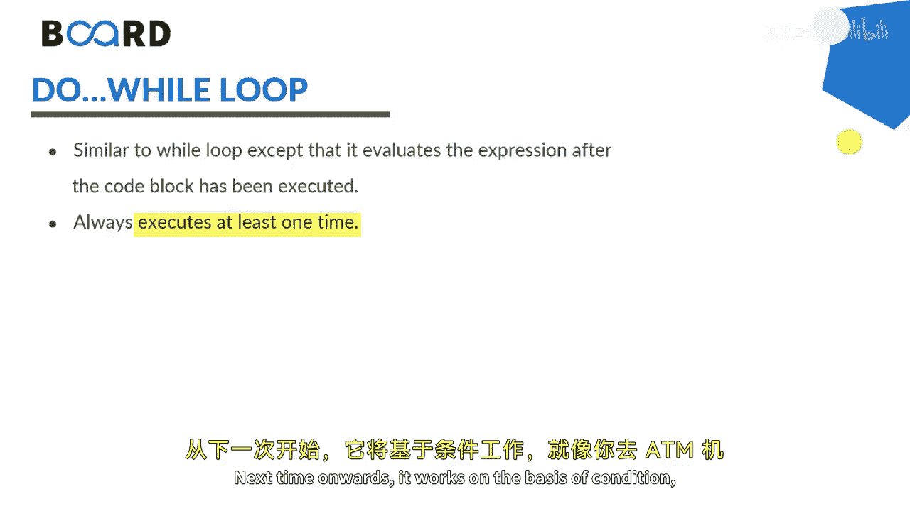

# Java全栈开发：第37讲：Java中的循环结构 🔄

在本节课中，我们将要学习Java编程语言中的核心概念之一：循环结构。循环是一种允许我们重复执行一段代码块直到特定条件不再满足的强大工具。理解循环对于编写高效、简洁的程序至关重要。


## 概述


循环是一种编程特性，它促使一组指令被重复执行，直到某个条件变为假。任何需要被重复执行的代码块，无论需要重复多少次，都可以通过循环来实现。循环语句会持续执行，直到特定的表达式或条件评估为假。

## 循环的类型

在编程中，主要有三种类型的循环：`for`循环、`while`循环和`do-while`循环。此外，`for-each`循环（或称增强型`for`循环）是专门为遍历集合（如数组、列表）而设计的，我们通常将其视为第四种类型。

### 1. For循环

上一节我们介绍了循环的基本概念，本节中我们来看看`for`循环。`for`循环包含三个部分：索引声明、维持布尔表达式的条件以及更新语句。我们可以更清晰地将其理解为三个语句：迭代变量的初始化、对该迭代变量的条件判断，以及对该变量的递增或递减。

任何循环，无论是`for`、`while`还是`do-while`，都包含三个要素：初始化、条件和递增/递减。`for`循环在你确切知道需要重复多少次（例如5次、10次、50次）时非常有用。只要条件满足，`for`循环体就会继续执行，否则循环终止。

以下是`for`循环的基本语法结构：

```java
for (初始化; 条件; 更新) {
    // 要重复执行的代码块
}
```

### 2. While循环

接下来，我们探讨`while`循环。`while`循环也是一种扩展性循环，用于在特定条件下重复执行代码块。它会执行一个语句或语句块，直到指定的表达式评估为假。

与`for`循环类似，`while`循环也包含三个要素：初始化、条件和递增/递减。通常，当你不确定确切的迭代次数时，`while`循环非常有用。

以下是`while`循环的基本语法结构：

```java
初始化;
while (条件) {
    // 要重复执行的代码块
    更新;
}
```

### 3. Do-While循环

现在，我们来看`do-while`循环。`do-while`循环与`while`循环非常相似，但有一个关键区别：无论条件是否为真，`do-while`循环的循环体至少会执行一次。从第二次开始，它才根据条件来决定是否继续执行。

这类似于使用ATM机的过程：第一次你刷卡后可以进行交易，但之后它会询问你是否要继续。如果你选择继续，菜单会再次弹出；否则，你的流程就结束了。因此，当你确定代码至少需要执行一次，而后续执行取决于某个条件时，`do-while`循环就很有用。

以下是`do-while`循环的基本语法结构：

```java
初始化;
do {
    // 要重复执行的代码块
    更新;
} while (条件);
```



### 4. For-Each循环（增强型For循环）


最后，我们介绍`for-each`循环，也称为增强型`for`循环。这种循环专门用于按递增顺序遍历集合（如数组或`ArrayList`）中的元素。它简化了集合遍历的语法，使代码更易读。

以下是`for-each`循环的基本语法结构，用于遍历数组：

```java
for (元素类型 变量名 : 数组或集合) {
    // 使用变量的代码块
}
```

## 总结


本节课中我们一起学习了Java中的四种主要循环结构：`for`循环、`while`循环、`do-while`循环以及`for-each`循环。我们了解了每种循环的适用场景、基本语法和工作原理。`for`循环适用于已知迭代次数的情况；`while`循环适用于条件驱动且迭代次数未知的情况；`do-while`循环确保循环体至少执行一次；而`for-each`循环则简化了集合的遍历操作。掌握这些循环结构是构建逻辑复杂程序的基础。请继续关注后续课程，我们将通过实际代码示例来深入探讨每种循环的具体实现。