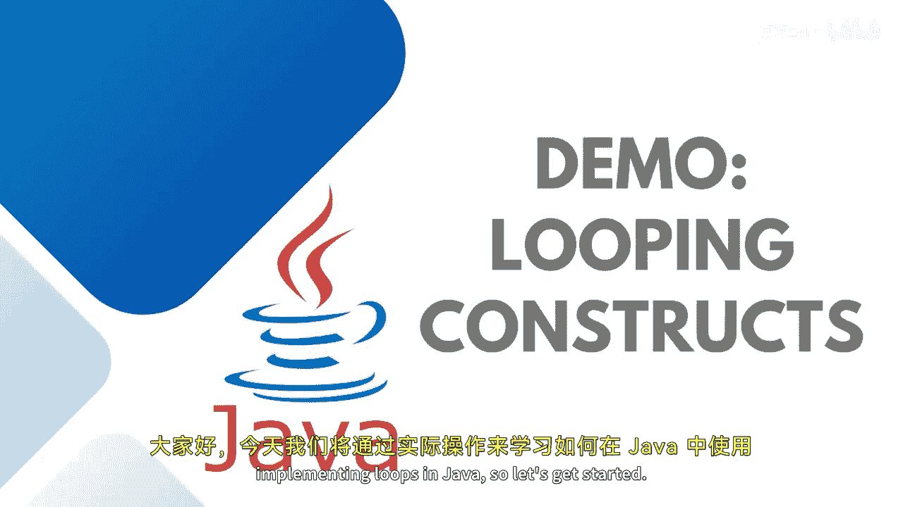

# Java全栈开发：专项课程（上）：第38讲：循环实战演练




在本节课中，我们将通过实际代码演示，学习如何在Java中实现和使用循环结构。

循环是编程中用于重复执行代码块的核心工具。Java提供了几种循环结构，我们将逐一探讨它们的工作原理和适用场景。

---

## 循环结构概述

循环允许我们重复执行一段代码，直到满足特定条件。Java中主要有三种循环：`for`循环、`while`循环和`do-while`循环。每种循环都有其特定的语法和最佳使用场景。

---

## `for`循环详解

上一节我们介绍了循环的基本概念，本节中我们来看看`for`循环的具体实现。

`for`循环通常用于已知循环次数的情况。其语法结构包含三个关键部分：初始化语句、循环条件和迭代语句。

以下是`for`循环的基本语法：
```java
for (初始化; 条件; 迭代) {
    // 循环体
}
```

现在，让我们通过一个例子来打印“Hello World”10次。

```java
for (int i = 1; i <= 10; i++) {
    System.out.println("Hello World " + i);
}
```

在这个例子中：
*   `int i = 1;` 是初始化语句，将循环变量`i`设置为1。
*   `i <= 10;` 是循环条件，只要`i`小于或等于10，循环就会继续。
*   `i++` 是迭代语句，每次循环结束后将`i`的值增加1。
*   `System.out.println("Hello World " + i);` 是循环体，每次循环都会执行。

程序执行流程如下：
1.  首次进入循环时，执行初始化语句 `int i = 1`。
2.  检查条件 `i <= 10`。如果为真，则执行循环体。
3.  循环体执行完毕后，执行迭代语句 `i++`。
4.  再次检查条件，重复步骤2和3，直到条件为假，循环结束。

运行此程序，控制台将依次输出“Hello World 1”到“Hello World 10”。

---

## `while`循环详解

了解了`for`循环后，我们来看看`while`循环。`while`循环更适合在循环次数未知，或循环条件基于复杂逻辑时使用。

以下是`while`循环的基本语法：
```java
while (条件) {
    // 循环体
}
```

首先，我们用`while`循环实现同样的功能：打印“Hello World”10次。

```java
int i = 1;
while (i <= 10) {
    System.out.println("Hello World " + i);
    i++;
}
```

可以看到，`while`循环同样包含三个要素：初始化（`int i = 1`）、条件（`i <= 10`）和迭代（`i++`），但它们被分散在代码的不同位置。对于简单的固定次数循环，使用`for`循环更简洁，出错概率更低。

接下来，我们看一个更典型的`while`循环案例：持续接收用户输入并打印，直到用户输入“quit”。

```java
import java.util.Scanner;

Scanner scanner = new Scanner(System.in);
String input = "";

while (!input.equals("quit")) {
    System.out.print("Enter message: ");
    input = scanner.nextLine().toLowerCase(); // 转换为小写以便比较
    System.out.println(input);
}
```

在这个例子中：
*   循环条件是 `!input.equals("quit")`，即输入不是“quit”时继续循环。
*   程序会不断提示用户输入，并将输入打印出来。
*   一旦用户输入“quit”（不区分大小写），循环条件变为假，循环终止。

---

## `do-while`循环详解

最后，我们来学习`do-while`循环。它与`while`循环的关键区别在于，`do-while`循环会**至少执行一次循环体**，然后再判断条件。

以下是`do-while`循环的基本语法：
```java
do {
    // 循环体
} while (条件);
```

我们使用`do-while`循环改写上面的用户输入案例。

```java
import java.util.Scanner;

Scanner scanner = new Scanner(System.in);
String input;

do {
    System.out.print("Enter message: ");
    input = scanner.nextLine().toLowerCase();
    System.out.println(input);
} while (!input.equals("quit"));
```

程序执行流程如下：
1.  首先，无条件地执行一次`do`块内的代码：提示输入、获取输入并打印。
2.  然后，检查`while`后的条件 `!input.equals("quit")`。
3.  如果条件为真，则跳回`do`块开头继续执行；如果为假，则循环结束。

因此，即使用户第一次就输入“quit”，程序也会先打印出“quit”，然后再结束循环。这是`do-while`与`while`的主要区别。

---

## 总结

本节课中我们一起学习了Java中三种循环结构的实战应用：
1.  **`for`循环**：最适合在**循环次数明确已知**时使用。其初始化、条件和迭代语句集中在一行，结构清晰。
2.  **`while`循环**：适用于**循环次数未知**，或循环条件需要**复杂逻辑判断**的情况。务必注意在循环体内更新条件变量，以防无限循环。
3.  **`do-while`循环**：适用于需要**至少执行一次循环体**的场景。它先执行，后判断，保证了代码块至少运行一次。


在实际项目和案例研究中，你可以根据具体需求选择最合适的循环结构。理解每种循环的特点，是编写高效、正确代码的关键。