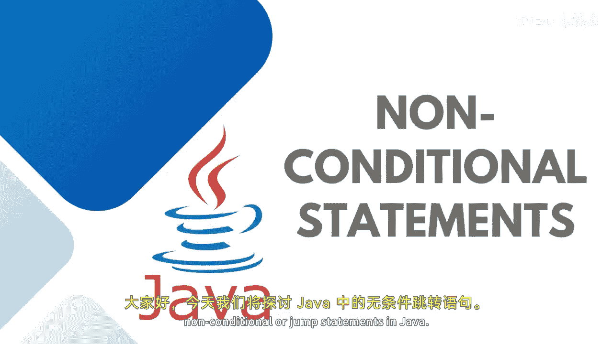

# 【Java全栈开发 专项课程（上）】Board Infinity—中英字幕 p40 p39_08_non-conditional-jump-statements -BV1tAygYoEj5_p40-

Hi there。 Today In this session， I will discuss about nonconal or jump statements in Java。

Basically， there are two jump statements that I'm going to talk about。We do have Go to。

 but Java doesn't support Goow jump statement。Jm statements are keywords that allow you to control the flow of execution in a program。

These are used to transfer program control from one point to another point in the program I hope you have seen in the case of switch case where we can break the case execution with the help of a break keyword and then go out of the switch block。

 so break and continuous statements at the jump statements that are used to skip some statements inside the loop。

Or terminate the loop with the help of a break keyword。

Break statement in Java is used to terminate from the loop immediately based upon the condition。

 When a brake statement is encountered inside a loop。

 the loop penetrationration stops there only and controlled returns from the loop immediately to the first statement after the loop。

Basically， brake statements are used in situations where we are not sure about the actual number of itration。

 That's how it works。 The low body starts conditions to break from low。If the brake keyword is found。

 it will break the execution。 if it is false， it keeps executing the body of the loop。

 But in the case of continue rather than terminating， we skip over the execution part of the loop。

 Only that iteration escape and loop keeps going on。Let's say the loop has started。

 The condition is getting executed if conditions is true and the continue is there。

 it will just skip that iteration and check for another condition rather than exiting the loop itself。

I have a very nice example to demonstrate you guys， so let's get started。

Consider this is the case study we just discussed Use will enter the input as a message。

 and I will keep printing that input message until the user will not enter quit in the message the loop keeps going on。

 So what I can do is just I can check it up before。

Taking a quote and executing stop executing the low penetration。

 I will check if the input entered is equals to。Coect， I need to break the loop。Otherwise。If。

Input dot equals。Is bus。Then， continue。If nothing is to be there， like break， quit or pass。

 just keep printing the input。So in the case of past， that number of execution will be escaped only。

So one second， let me just。Print here the message。I just write to your Ho， This is the message。

 world， This is the message。 If I write past， the input will not be printed because it's continued just that iteration is kept。

 So when it reads the continue， it will go again to the vile condition。

 whatever remaining statements are there。 it will be kept。 But if I write quit， it will be。

Breaking up the execution of the loop itself。 That's how the break and continuous statement works in Java。

 See you in the next session until next time。 Stay tuned。🎼。

