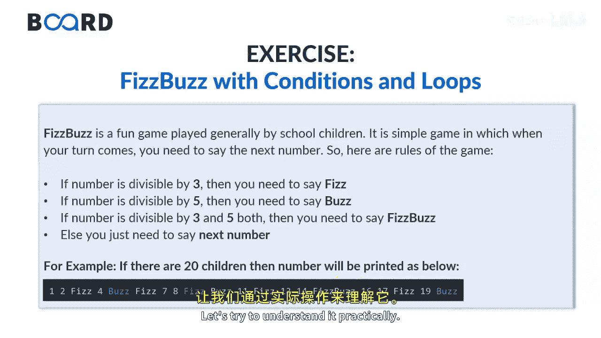

# 【Java全栈开发 专项课程（上）】Board Infinity—中英字幕 p41 p40_09_exercise-fizzbuzz-with-conditions-and-loops -BV1tAygYoEj5_p41-

Hi there。 Today In this session， I will summarize conditions and loops with a Fisbu problem。😊。

In the last session we discussed what all conditions and loops we can use。

And what are the other conditional， nonconal and looping construct we have。

FisB program is just a font play game that is used to print certain output like F bus or FsB based on some conditions。

 Consider we have a set of numbers。 and we are supposed to check if each number between arranged。

 let's say 1 to 20。 If the number is divisible by3。 then you need to say phase。

 if the number is divisible by5， you need to say bus， but if the number is divisible by 3 and 5。

 then it is saying Fbu。 if none of the number gets divided by 3，5 and 3，5 both。

 then you just say the next number。 If the number does not satisfy any of these conditions。

 we will just print the number just like this1，2， not divisible F， which is the third number bus。

 which is the fifth number， wherever the 15 will come because 50。Is divisible by 3 and 5 both。

 So it prints the fisus pool。I hope the requirement is clear to all of you。

 Let's try to understand it， practically。

Firsts of all， I'm going to scan the value。So that I need a scanner object。

Passing the system dot in inside it。Will give a message。Enter number。Scanner dot， next in teacher。

That I would like to assign it into a number。Here， I will execute a loop that will start from。1。

And go till I less than or equals to the number that you enter。 Let's say 1 to 20。In each iteration。

 the number will increase by one。Here， I'm going check if。I is divisible by 5。Equals to 0。And I is。

Divisible by 3 equals to 0。I just wanted to print。Fish。Bus。But。Esive。If I is divisible by 5 only。

This will print。Bus。Else， if。If I is。Dvisible y 3 equals to 0。Then it will just simply print face。

As I said， if number is not divisible by 5 or3， any of them。I just wanted to。Triend the number。

That's what I want。In each iteration， I wanted to give some extra space。

Let's first check this iteration by passing up the number。是。I entered the number 20。

For 20 times the output comes in1，2 F is coming in the place of three biggest number is divisible by3。

5 is divisible by 5。 That's what5 is there。S is divisible by3。 That's what6 is there。 At last。

15 is divisible in between of the range of1 to 20 is divisible by3 and5 port。

 That's what Fisbu is getting printed。😊，I hope the case study is clear to all of you。

 These are the standard case studies that will help you to understand what you have learned and how to put on the logics。

By your arm。 Thank you so much。 Stay tuned to learn more about the practical implementations in Java。

 See you in the next session。😊。

🎼。

