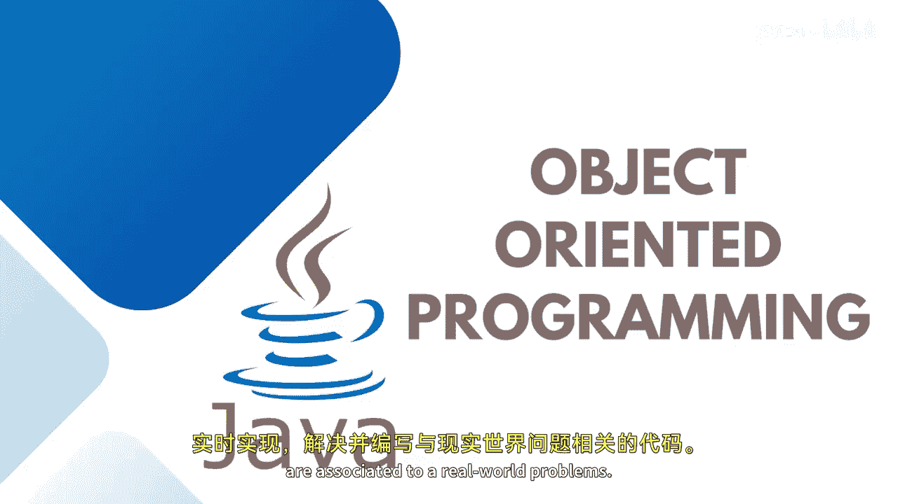
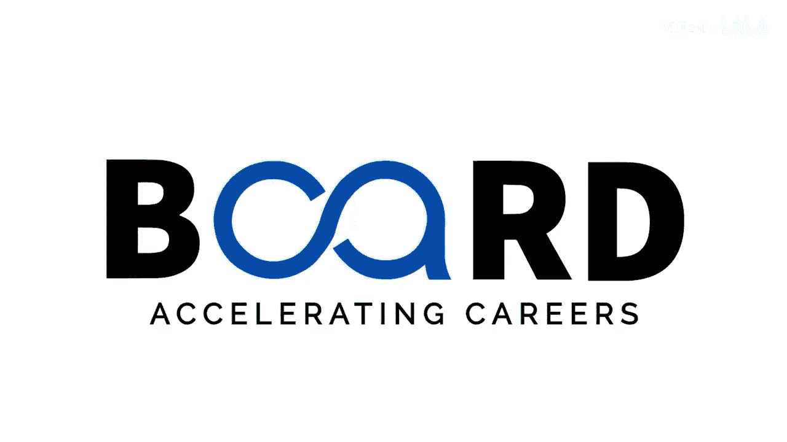

# 【Java全栈开发 专项课程（上）】Board Infinity—中英字幕 p43 p42_02_object-oriented-programming -BV1tAygYoEj5_p43-

Hi there。 Today， in this session， we will discuss about object oriented programming approach。😊。

Which helps in working with a real time implementation to solve and write the code。

 which are associated to a real work problems。

Object oriented programming is a methodology or paradigmic to design a program using the object oriented concepts such as classes。

 objects， encapsulation， inheritance， abstraction and polymermorphism。

It simplifies the software development and maintenance by providing some concepts， As I discussed。

 these are the six major components to be discussed in object oriented programming the main purpose of object oriented programming is to implement ideas in real word problems。

Some of the most popular object oriented programming includes Java dotnet， C++ and Python。

When we have procedural oriented programming， imperative programming。

 then why to talk about object oriented programming。

Object oriented programming concept provides a clear modular structure of program。As a programmer。

 we have to write code that solve your word problem。

 Suppose you have to write a program that revolves around a flight management system。

 If we decide to use procedural programming， which is based on programming with linear steps called procedures。

 you have to write functions like booking boarding aligning， etc cea， which describes of work within。

This becomes a tedious task。 If we want to make changes to it later。

 it becomes difficult to make changes to such a court。Plus。

 reusing the same code will not be possible， but with the help of object oriented programming and the features。

 codes can be reused without any redundancy also。In object oriented programming。

 which aims to mitigate the drawbacks of the procedural way and we focus more on data such as in objects。

Objects are the real world entities which either have a state and behavior。For example。

 in the case of flight management system， passengers booking， department， destination。

 luggage capacity are becoming the objects and these objects represent the real world entities。

 which makes it easier to understand and visualize the real world problem。

There are some benefits to use object oriented programming over the top of other procedural or programming paradigms。

 such as object oriented this fast and easier to execute provides a clear structure for the programme。

Focuss on the principle of don't repeat yourself。 I'm not saying methods do not follow this rule。

 but object oriented program has a great capability to reuse the program and makes the code easier to maintain。

 modify and debug。Object oriented programming makes it possible to create reusable applications that reduces the time and efforts of a programmer。

So these are the points to be discussed over there。

 and I'm super excited to teach you all these things practically implemented。

