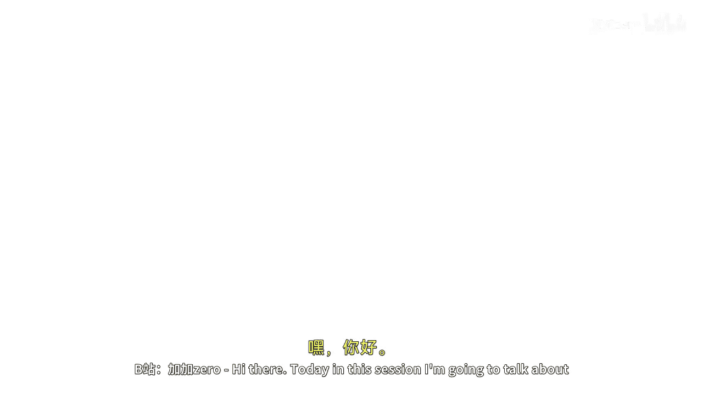
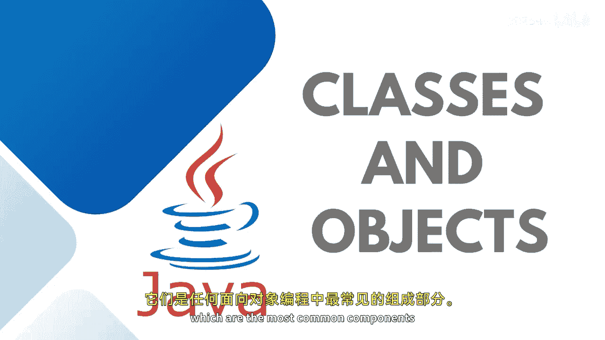

# Java全栈开发：03：类与对象






在本节课中，我们将学习面向对象编程中的核心概念：类与对象。它们是任何面向对象编程语言中最常见的组成部分。

## 🏗️ 什么是类？

类是一个蓝图，它包含了所有数据的定义。蓝图意味着类是一种用户自定义的数据类型，它是相似类型对象的集合。你可以将其视为一个模板，用于描述特定对象的状态和行为。

在Java或任何面向对象编程语言中，类只是一个逻辑实体。例如，你可以将现实世界中的任何实体视为对象。一只具体的猫就是一个对象，那么与“猫”这个实体相关的所有属性、状态和行为，都将在这个类中进行描述。

你可以举任何例子。例如，我们可以创建一个名为 `Plane` 的类。这个类将包含每架飞机的属性和方法。属性可能包括飞机编号、总座位数、航空公司、飞行员姓名等。而方法则可能包括检查座位可用性、选择舱位、预订机票等功能。

定义一个类的基本格式如下：
```java
访问修饰符 class 类名 {
    // 属性（变量）
    // 方法
}
```

## 🧱 什么是对象？

如果你想访问特定类的成员，你需要创建该类的一个实例，这个实例就是对象。对象包含了类的变量和方法。每个对象都有其独特的身份和行为。

例如，一只猫有状态，如颜色、大小、性别和年龄。而它的行为则包括睡觉、觅食或四处奔跑。

在Java中，对象既是物理实体也是逻辑实体，它可以存在于类内部或外部，但始终代表一个特定的类。我们在之前的演示中已经创建了一个名为 `Main` 的类，我们可以用它来创建对象。

## 🔗 类与对象的关系

例如，我们可以将 `Vehicle` 视为一个类。那么，汽车、卡车和自行车就是该类的对象，它们都代表交通工具。汽车将拥有自己的属性和行为，卡车和自行车也是如此。

如果它们有共同的行为，就可以在 `Vehicle` 类中定义。如果它们有自己独特的行为，则可以在它们各自的类（如 `Car`、`Truck`、`Cycle`）中继承 `Vehicle` 类的基本功能，并通过对象来具体表现。

---


在本节课中，我们一起学习了面向对象编程的基础：类与对象。我们了解到，**类**是定义对象属性和行为的蓝图，而**对象**是类的具体实例。下一节课程中，我们将学习类和对象的实际代码实现。