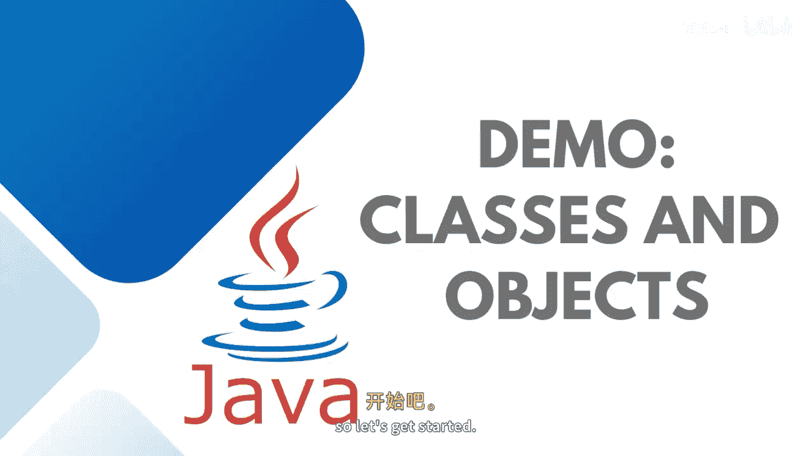

# 【Java全栈开发 专项课程（上）】Board Infinity—中英字幕 p45 p44_04_demo-creating-classes-and-objects -BV1tAygYoEj5_p45-

It is a high time to create the class and instantiate that class is an object to access the members of a particular class。

 so let's get started。

Here， I'm going to create a class student。Students will have some attributes。Such as。Student I D。

Student name。And student age。These are known as data members。Of a particular class。

Then I'm going to have a member function。Let's say， public。Vid。Acept details。And。😊。

Public void display details。I want to take this input from the user。

So what you need to do is you can take a scanner object at the class level。

So that all the methods can use it。Here， I would like to scan the input。 So first of all。

 I'm going to print out the message。Enter student I D。Student I D equals 2。

Scanner dot next in teacherja。Size out。Enter。Student name。Student name equals to scanner dot， next。

Line， I can next。Size out。Enter student age。Student 8 equals 2。Scanner dot next in teacher。

Once the input is being stored。I need to friend them。You can see that I am not passing any parameter。

 All the class level variables I' am able to get it here。😊，Sist out。Student I D is。

Whatever being entered。Size out。Student name is。Whatever。Being entered。And then。

 the same with the age。So， you can see that。There are。F data members and two member functions。

I need to come inside the main method。Need to create。An object of class。Student。

So I will write student， then the reference variable equals to object creation。Guys。

 please understand。 This line has two parts。The left hand side is not an object creation。

 It's just saying student is a reference variable of type student。

This is the object creation new student。 When we write new student。

The student class will have whatever data members they get the memory， as per their type。

But member functions gets the memory if required， when they are in work。

 just like their students taught。Exccept details。Student dot display details。

So this is how a class is defined with five， four data members and two。Member functions。

 And then there is an object creation。 Let me just go to the。Ran and just execute the application。

So you can see that it's taking up the student ID 1001， student name King， and then age is 23。

If in case you require to。Have more than one object of a particular class。

 What you can do is you can create student another reference variable student1 equals to new student。

Student dot。Ex studentdent  one dot， except details。And student one dot display details。

And here each object will have its own memory location you can access with the help of its reference variable。

So here it will take up the values and print it two times。King 23。1，0，2， culture。他地主。

I hope it's clear how to create a class writing the data members and member functions inside the class and accessing by creating the instance or object of a particular class where each object will have its own context。

See you in the next session。Stay tuned to learn more practical implementations in object oriented programming。

。

