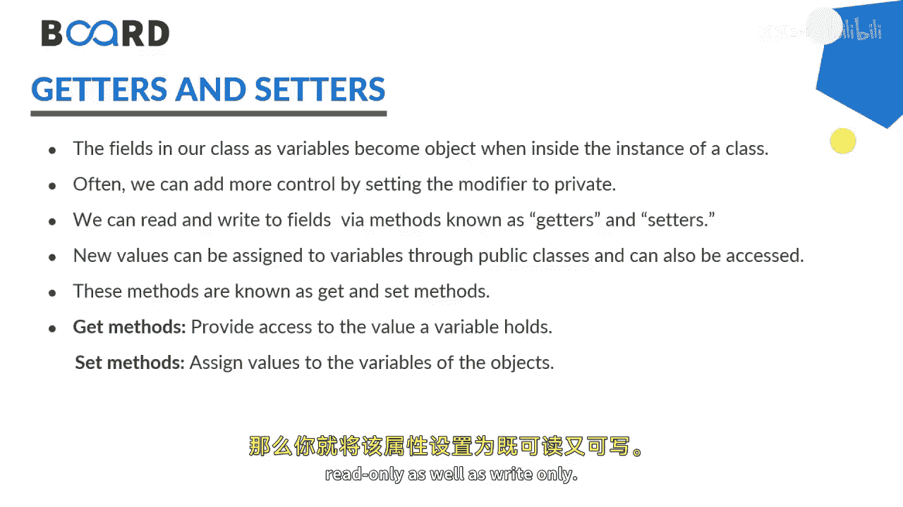
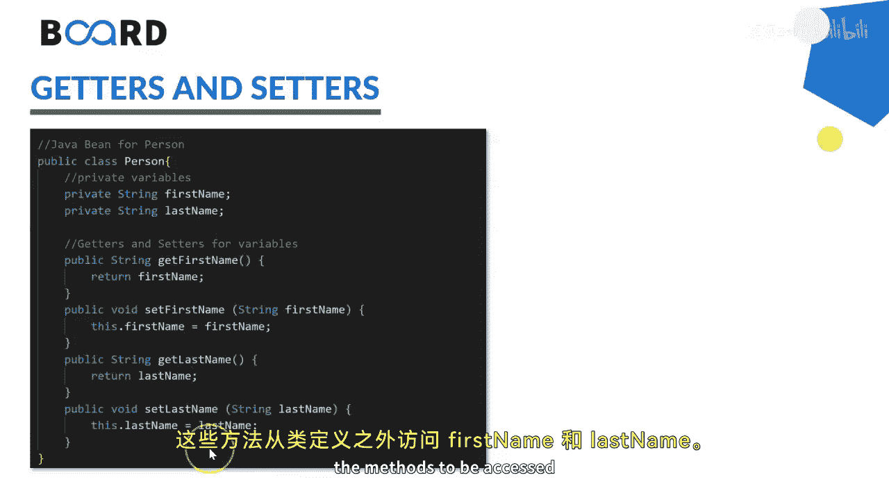

# 【Java全栈开发 专项课程（上）】Board Infinity—中英字幕 p49 p48_08_getters-and-setters -BV1tAygYoEj5_p49-

Hi there。 Today In this session， I will demonstrate you。

The data hiding concept that's incapsulation with the help of getters and setters。

Basically， the fields in our class as variable becomes object when inside the instance of a class and we can add more controls by setting the modifiers to private。

😊，That is the reason we know that the private data member says data hiding cannot be used outside the class definition。

So if you would like to use the private member outside the class definition。

 you need to add the get method that is known as a getter and if you want to add or modify that property from outside the class definition that's known as a setters or set method。

Also， one more thing， getters and setters allow you to make your property read only write only and read write both if you just have a getter of any private member that you are making that property read only。

If you are just adding the setter of that method， then you are making that property right only。

 if you are making the getter and set methods provide for any data member of a particular class。

 you are making the property read only as well as right only。

Here we have a person class for the demonstration which has two private members first name and last name。

 where first name has a getter andter and the last name also has a getter andter so that I can access the first name and last name with the help of their methods to be accessed from the outside the class definition。

 so let's get started。

Consider， I have a person class。😊，Which has a private member。String。Fourth name。And last name。

If you will create an instance of this class。Say person， dot。First name or last name。

 its not accessible。I guess the members are private。So what I can do is， I can。Create the methods。

 Public methods， public。If you would like to set the name。

 the return type would be void set first name。You will get a value of same type。

And here you see that， the first name。Or this start first name。

 this means current class object and what you have in the parameter。

If you want to get this value from outside the class definition return type of this method would be string。

Get first name。And this will return what you have in this do first name。

So you are making the getter and method， getter and ceter of first name。

So that the property will become read and write both。Same thing I need to do for the get last name。

Get last。Same thing I need to。Dufor said last name。And here is the last name。Now。

 I can go to the person。In stands and say person dots set first name。Is king。And sis out。

 you can get the。First name。 Get first name。Here you say person Dot said last name。Let's see。

 It's gorgeous。Size out。Person dot。Get last。Have we go to run our application。

King Coer is getting printed。What next， I can tell you， if you have any property as。Private。

 And you wanted to make a setter and getter of it。 You can also use this getter and setter for the validation purpose。

 Let's say I'm making a property。For age， That is get age。And this start。It gets return。

And here I see。This should be of the integer， as a return type。Set it。In teacherger age。

And here I say this dot age equals to age。 But while setting up a value。

 I can check if the age is greater than or equals to 18。Only said the age， otherwise。Frich。

Invald each。So such kind of validations， you can also try them out。

Going right here and seeing person dot set H。Dll。Sis out。Person do't get age。

And see what gets happen。So you can see that it's invalid age or0。

If you will allow this to enter as 32， which is greater than or equals to 18。

So whatever age you are assigning gets printed。If you don't want to allow this property for read and write both。

You can， if you do want it to allow it for the only read only。

 just add the getter and not set if you want to allow it for right only。

 just allow the setter and not get。And same thing that you can go for the age and last name as well。

I hope the concept is clear to all of you， it's a kind of complete Java photo class or a model class ready to use as an entity。

See in the next session until next time。 Stay tuned。 Thank you。

