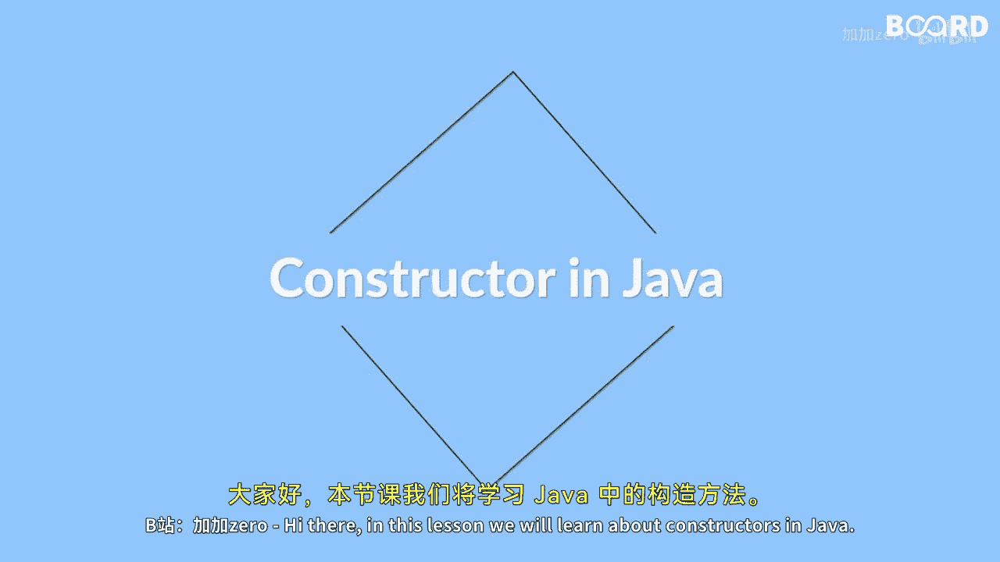

# 【Java全栈开发 专项课程（上）】Board Infinity—中英字幕 p50 p49_01_what-you-will-learn-in-this-lesson -BV1tAygYoEj5_p50-

Hi， there。🎼In this lesson we will learn about constructors in Java。

 a constructor is a special type of method that is used to initialize objects of a class。😊。

🎼It is called automatically when an object is created and it has same name as that of the class name。

😊，🎼In this lesson you will learn about constructors in Java and how to use them to create objects。

🎼We will start with the basics of constructors including the types and syntax。😊。

🎼You will learn about the default constructor and parameterized constructor and how to use them to initialize objects。

😊，🎼We will also cover the concepts of construct chain and how it can be used to simplify Co。

🎼Additionally， you will learn about private constructors and their use in creating singleleton classes which can only have one instance in the program By the end of this lesson you will have a good understanding of constructors and how to use them effectively in Java programming so see you in the next video。

