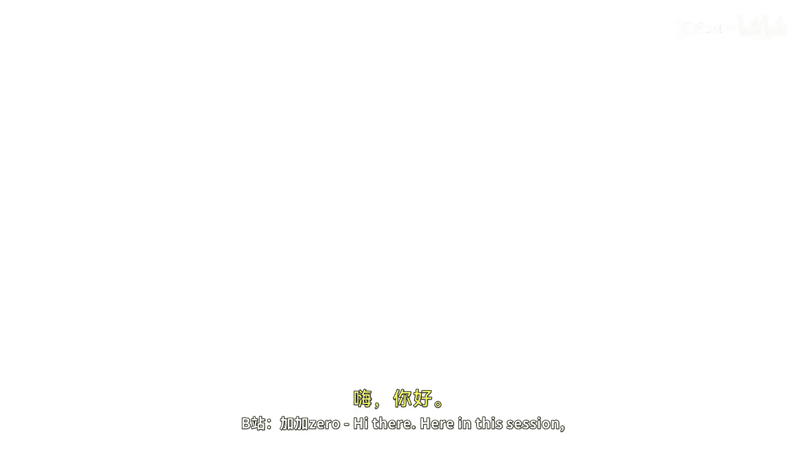
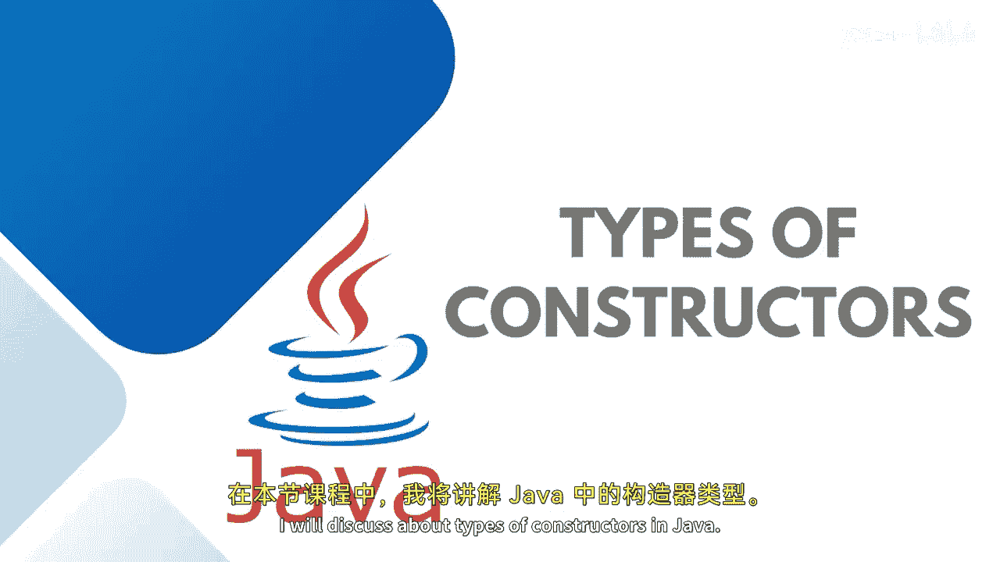
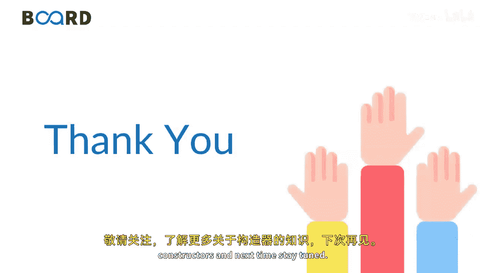
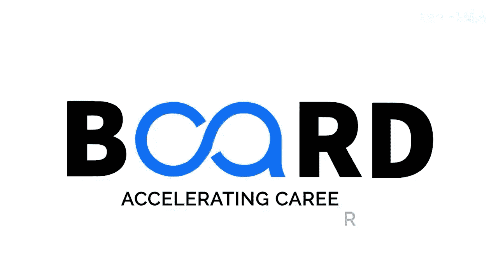

# 【Java全栈开发 专项课程（上）】Board Infinity—中英字幕 p52 p51_03_types-of-constructors -BV1tAygYoEj5_p52-

Hi there。 So here in this session， I will discuss about types of constructors in Java。

Basically， there are two major categories in Java default constructor。

 which is also known as no argument constructor and the parameterized constructor。

 when you will do some self exploration， you might see that people say that we have private construct。

 we have copy constructor and so on。 but all those comes under the default and parameterized constructor when we have parameterized parameter inside the constructor that's known as parameterized otherwise the default the constructor。

 which does not have any parameter， as I said， the name suggests no argument constructor or parameter less constructor。

 you can call it the constructors do not have any arguments and they are just to create by default in Java when no constructors are returned by the programme and the parameterized constructor is where we wanted to pass the parameter As I said that if you do not have any construct by your own the object class。

Constructor invo to initialize your data members with the default values This is how the default constructor you can create。

 as I said， the name of the constructor will be same as that of the class name that you can go up with。

 but in the case of parameters you need to pass the specific number of parameters that you need to pass at the time of creating an instance of a class and based on those arguments。

 the language variable is initialize inside the constructor and this is a syntax that we have a languages in the main method and this la is the parameter that we need to initialize into this languages I will tell you practically how to get this implement it stay tuned to learn more about constructors until next time stay tuned。

