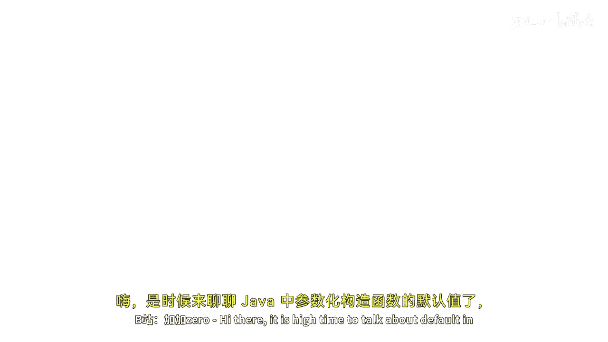
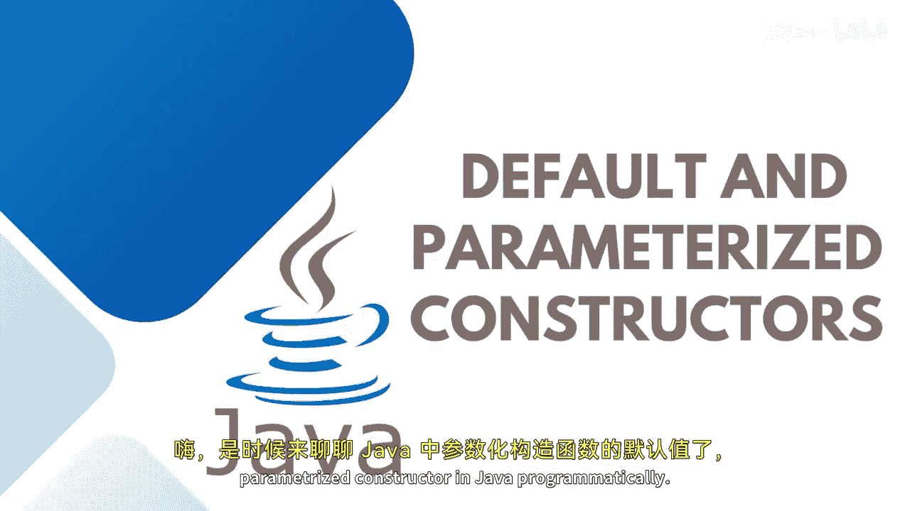
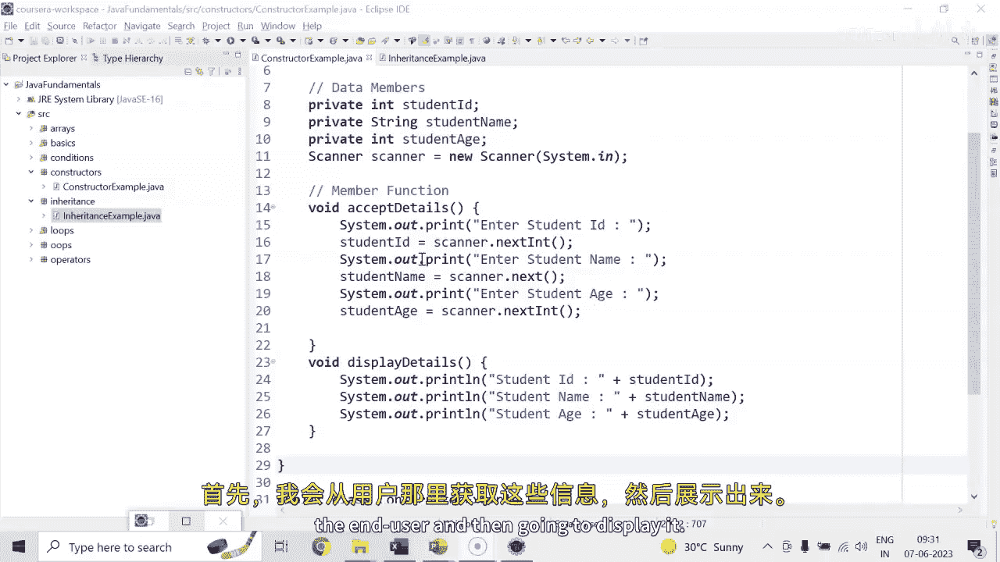
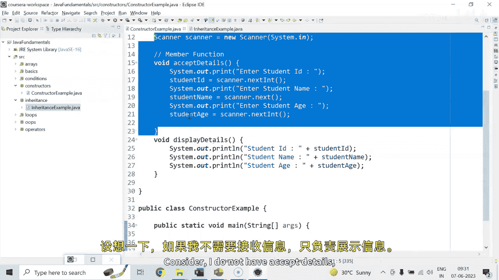
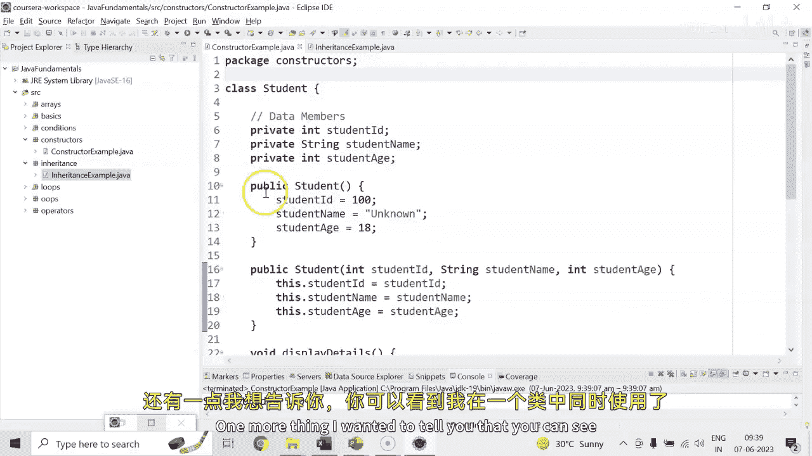
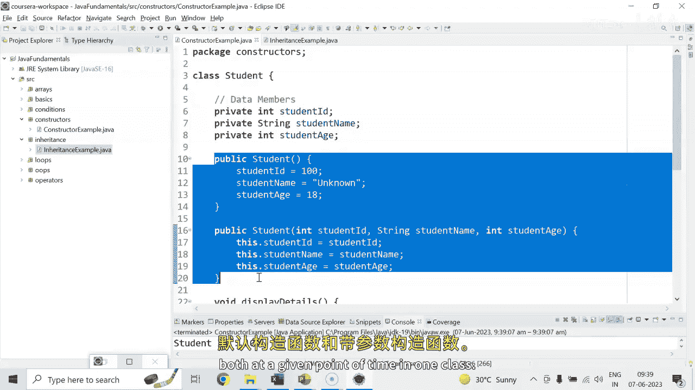

# 【Java全栈开发 专项课程（上）】Board Infinity—中英字幕 p53 p52_04_default-and-parameterized-constructors -BV1tAygYoEj5_p53-

Hi there。 So it is high time to talk about default in parameterized constructors in Java programmatically。

 so let's get started。

In my previous session， I discussed about the student class where I have student I D name and age。

 First of all， I am going to accept these details from the end user and then going to display it。

Consider， I do not have except。

Details。I just have the display details， right， So the moment I will be creating。

The student class instance。And calling my display details method， see what gets printed。

So I am not giving any values to the student ID D name and8。

 but still I'll be able to get the values0， nu and 0。 So what is happening here。

 two things you need to understand， first of all， I am not passing the value。

 but its coming As I said that each and every class is being extending from extending the object class。

 implicitly， whether you write it or not， an object class has a very。

 very special method like a construct that helps in initializing the data members of a class。

 all the child class has run。So the values are being initialized from the object class like integer is 0 string is null If you have float then it would be 0。

0 if you have Booleion then falses and so on。 Now the next is how this constructor default constructor of the object class is getting called up。

 So guys as I told you this statement comes up two things together this highlighted value is actually creating a reference variable of student type。

And this new student is actually the object creation。 And at this point of time。

 the special constructor is being called up。 So if you would like to create the constructor by your on。

 I need to create a student class constructor。As I said。

 it will not be having any return type like void or something。

 and the name of the constructor will same as that of the class name。

 And here I would like to say that this class has a student I D。

 which I really want to initialize as 100。This class has a student's name。That is， as of now。

 let's say anonymous or unknown。And if the class will not be having any defaulted。

 I can keep it like 80。So you can see that I have initialized the values by my own。

 so now when I am saying this object creation is there at this point when the student is automatically or implicitly at the time of creating an object the invocation of the student class constructor will happen and will initialize the values so here you will be able to see that we have the student details like we have hundred unknown entityity I hope the concept is clear to all of you。

This is a default constructor by you can create your own parameterized constructor also public student。

 let's say I wanted to pass on the values S ID in teacher string。S name and in teacher。

 let's say S H and then I wanted to assign it to as student IDD would be initialized with S ID。

Student name would be initialized with。E name。And student age would be initialized with S age。

This is what gets happen Now what next I need to tell you is when you wanted to call this specific parameterized constructor because what is the problem with not having the parameterized constructor is the number of times you are going to create the object of a class this way each and every student will have a same detail because they are calling a default construct。

You can see that。But that's what I don't want。 so I can just pass here my own values。

 let's say King Kocher。And age is 23 so at this point of time it will match any constructor that will have three values Id in name and8 that is in teacher string in teacher and that's what being find it out with this for that particular object student one because this keyword is associated to the current object So this student1 dot Id would be whatever I'm passing student1 dot name and8 and those student1 dot details gets printed let me help you out。

So you can see that for the second parameter， sorry for the second object。

 the initialized parameterized values are getting up。1，0，1， King Coer and23。

So that's how it works so you can pass moreover parameters here like I wanted to initialize 102 and I wanted to say it's sa Sherma and this one is like 32。

I name this as students， too。 I name this as students。

So here the different values gets up every time。Another thing that I wanted to tell you is I kept this SID S name and SH ch writing this keyword is not compulsory nowadays its by default understood by whichever variable reference variable this object is created this keyword is associated or those properties will be associated to that particular reference variable only you can see that I am not having any error but in certain scenarios its mandatory let me help you out with so you can see that as of now the values are getting printed but if you say that here rather than SID student ID rather than S name student name。

Rather than as age， let's say student age。So when you are saying that you wanted to assign SID S name and SH to ID name and H。

 already we do not have SID so I just keep it student ID。Student name。And student age。So here。

 the conflict happens。Because my intention is this that the right inside variables are the parameters and the left inside are the class members。

 but my compiler gets confused which one needs to be assigned into which one。

 So here this keyword is mandatory I need to say that these are the class members and the right and one at the parameter being initialized So how it works So generally we give the same name to the parameters as for the guideline if you do not give that's completely yourized。

 but if you give then this keyword is compulsory So this is how default and parameterized constructor needs to be used in Java One more thing I wanted to tell you that you can see that I have default and parameterized constructor both at a once given point of time in one class。

 So when we have one more than one constructor with a different signature or the parameters in one particular class。

 that concept is not。

On as constructor overloading， I hope it helps。🎼Stay tuned to learn more until next time stay tuned。

 Thank you。

