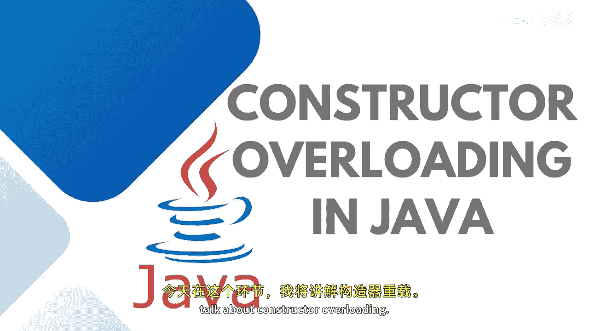
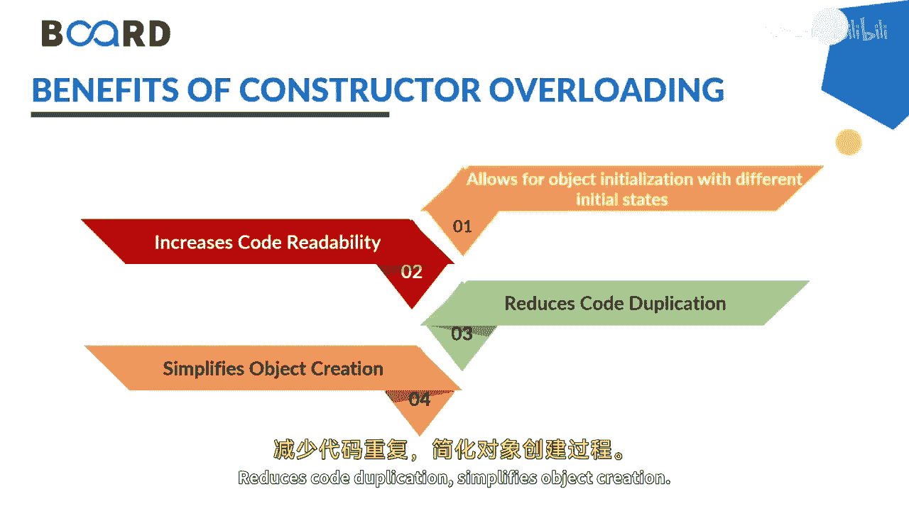
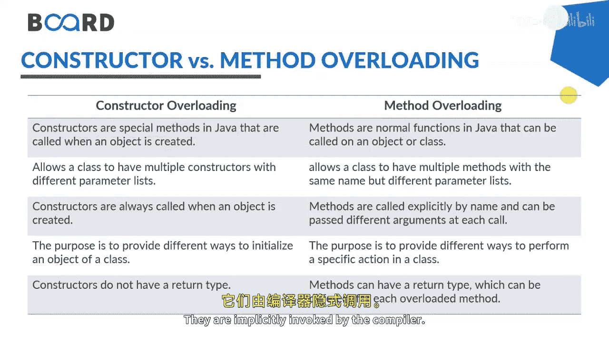
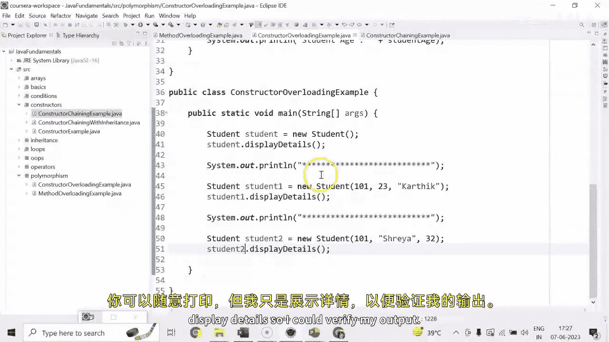

# 【Java全栈开发 专项课程（上）】Board Infinity—中英字幕 p54 p53_05_constructor-overloading-in-java -BV1tAygYoEj5_p54-

Yeah。

Hi there。 Today in this session， I will talk about constructor over loading。😊。

I already discussed constructor overloading in my previous session when I was teaching you constructors。

 This allows the multiple constructors to have in a one particular class with a different parameter list。

 as in the case of method overloading， you do。Constructor overloading is， as I said。

 exactly similar to the method overloading just the differences method needs to be invoked with a specific method name but constructors are not to be invoked manually they implicitly invoked by the compiler just we need to pass on the parameters。

By using constructor overloading developers can create objects with different initial states without having to create separate classes。

😊，And it is achieved by creating constructors with different parameter lists。

 don't forget that constructor name should be seen as that of the class name and the constructor only needs to be used with the initialization purpose。

 not other purpose。Again， parameter list can differ in the number of parameters。

 type of parameters or their orderrous sequence of the parameters when an object is created。

 the constructor with the appropriate parameter list needs to be initialized。

These are the benefits of using the constructor allows for object。

Allows for object initialization the different initial state helps in in the code re reusability。

 you don't need to reassign or write a particular class multiple times， reduces code duplication。

 simplifies object creation。

These are the differences between constructor overloading and method overloading constructors are the special methods that needs not to be invoked manually they are implicitly invoked by the compiler。

 but the methods needs to be invoked as per the requirement for the method name that you mention。

Constructor allows the class to have multiple constructors with different parameter list。

 but method overloading allows the class to have multiple methods with a different parameter list。

 That's what it is called as method overloading。Constructors are always called when an object is created。

 but methods are called explicitly by the name and the arguments。

The purpose of constructor is just to initialize the data members。

But the method overloading can perform a specific calculation comparisons and computations。

Constructors do not have a return type but methods。

Have a return type and which can be different of each overloaded method as well。

Let me show you how the constructor overloading comes into the picture。If you remember。

 we discussed the student class in our previous the sessions that we have three data member student。

😊，I D student name and student H。And here we have three constructors， student。

Default student constructor and to parameterized student。Constructors。

 so what you need to do is you need to create the object of a class。 First。

 I'll create a reference variable and assign with the object creation。 When I do not pass anything。

 the default constructor gets called up and。Assigned with the value so that the moment are called display details gets assigned with the default values。

But if I need to call the parameterized constructor， just。I'm not reassigning the same object。

 I just。Initiallynitially， the new one。So here I can pass on the student ID 101。

Pass on the age 23 and then me。I just put a separator in between of them。Student one。

 dot display details。And student do daughter details。Here， I just need to call the third one。

Which is。Student I D， name and then age 1，0，1。Srere， and then age。

So here I call students to dot display details and Im all set to go with。

I hope the concept is clear to you how we can have more than one constructor within a class and needs to be initialized with the values at the time of creating an object and invoke。

You can print anyhow， but I just have display details so I could verify my output。

See you in the next session until next time， Stay tuned， Thank you。

