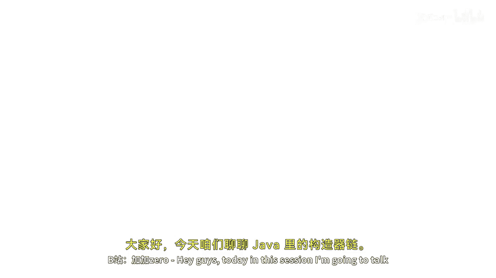
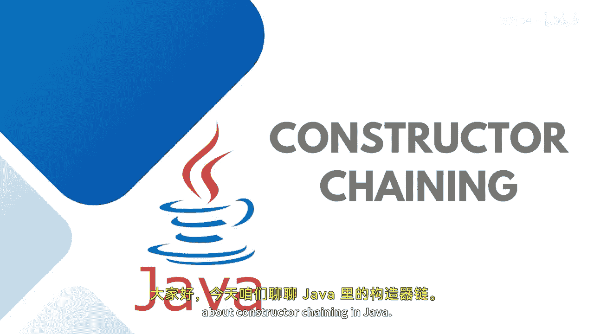

# 【Java全栈开发 专项课程（上）】Board Infinity—中英字幕 p55 p54_06_constructor-chaining-in-java -BV1tAygYoEj5_p55-

Hey guys， today in this session， I'm going to talk about constructor chainning in Java。

Basically。Constructor chainning is the process of calling one constructor from another constructor with respect to the current object。

Constructor training can be achieved within its one single class or with the help of inheritance。

The real purpose is to pass the parameters through the bunch of different constructors from one constructor to the another constructor and initialize should be done in a single place。

 And as I said， constructor chain can occur through inheritance also without inheritance also within the same class with the help of this keyword and within the child and parent class from the base class that's a super keyword。

This one is the constructor chinning that is going to demonstrate that how constructor chinning happens within the one single class。

 This means current class object， for example， in this class。

 we have three constructors college default college with two parameters in college with one parameter。

 So here you can see that I'm calling with the two parameters constructor first。

 So second constructor gets called up from here the third constructor is calling up and from the third one。

 the first one is calling up。 So let's try to understand this practicallyally here we have a student class and here I wanted to create。

The constructor， with a default parameter。And over here， this constructor gets called up。

 but before executing this， I wanted to go and initialize the constructor that is waiting for student I name and it。

 so I will pass the student ID。Name。And H。 So this keyword will look out for the constructor with such parameters within the same class。

 So this constructor gets called up。 And from here。

 I wanted to initialize or call up the constructor。 That is 10，2， maybe。Wden。

But the second parameter is each。So when you are going to initialize your default constructor before executing these three lines。

 it will go to this specific constructor and invoke so this will go and initialize these specific values so first of all Goham 32 and 102 gets initialized then it will be reassigned with whatever you are passing here that is 101 card thickken 23 and then the default one。

Let's try running this up。 What would be the end piece of code。So you can see that at the last。

 the default values are getting printed。So this keyword allows to change the constructors within the same class。

I just wanted to demonstrate you one more construct chinning that is with the help of inheritance。

 so let's get started。So let's say here I have a person class in this person class。

 I have a string knee。And I have a person class constructor inside it that is going to initialize the name。

With default value。And this class is being inherited inside the employ。We haveEmploy designation。

Public employee。And here， this designation needs to be assigned。With， let's see。Manager。So as of now。

 I'm passing the default values。 So when I will say employ。Class object needs to be created。

So at this point of time。I can just simply print。A message， person， class constructor。And here。

 calling the employee class construct。So what gets happen is the moment I will create the employed class object。

Constructor chains from parent to child。 First of all。

 the parent class constructor gets invogue in the child。

So you can see that here right way the parent class constructor invoke and then the child one。

 so when you have to extends or you inherit one class into the another by default when whether you write it or not the super keyword is added supermet is added that calls your superclass key。

But if you have a parameterized construct， then it will not happen automatically。

 Let me help you out。Let's say I have a person。Where I'm taking up the knee。From the。

End user or maybe passing from the main method。And here I wanted to say that this dot name equals to name。

Public。I can also do one thing。 I can just write ending up a message here， Si out。Person class。

Pararameterorized。Constructor in。Here I'm creating the employ parameterized constructor。

That is waiting for a designation to be assigned。This do designation equals to designation。So。

 when I will be。Invoking this employee 1 equals to new employee。

And here I'm passing up the designation。Let's say， senior manager。So at this point of time。

Person class default constructor is invoking， but the employee class parameterized is invoking why。

 because I told you by default the super method is attached that always calls up the parent class if you wanted to call a person class parameterized constructor。

 you need to pass on the message。家的。And that's how your parent class constructor。

 parameterized constructor is getting involved。Just restore it。

I hope the concept is clear how the construct chain happens within the class with the help of this keyword。

Or in case of inheritance with the help of a superki。So see you in the next session until next time。

 stay tuned。 Thank you。

。

