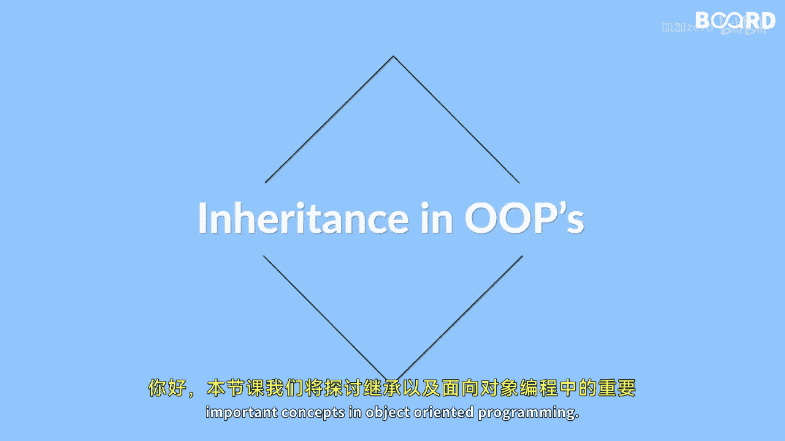

# 【Java全栈开发 专项课程（上）】Board Infinity—中英字幕 p56 p55_01_what-you-will-learn-in-this-lesson -BV1tAygYoEj5_p56-

🎼Hi there。 In this lesson， we will discuss about inheritance and important concepts in object oriented programming。

😊。

🎼Inheritance allows us to create a new class by inheriting the features of an existing class。😊。

🎼Which help in code reusability and promotes the concept of code hierarchy。😊，🎼In this lesson。

 we will learn about the basics of inheritance in Java and the different types of inheritance。😊。

🎼We will start by understanding the concepts of inheritance and the benefits it offers in Java programming。

🎼Then we will explore the different types of inheritance such as single inheritance。

 multiple inheritance， hierarchical inheritance and hybrid inheritance。😊。

🎼We will learn how to implement inheritance between classes and understand the various rules that needs to be followed。

🎼Finally， we will dive deeper into the concepts of upcasting and downcasting which are essential in Java inheritance。

 we will learn how to cast an object from one class to another using upcasting and downcasting。😊。

🎼And see how it affects the object behavior。🎼By the end of this lesson。

 you will have a good understanding of inheritance in Java and how it can be used in your program to write more effective and concise code See you in the next video。

😊。