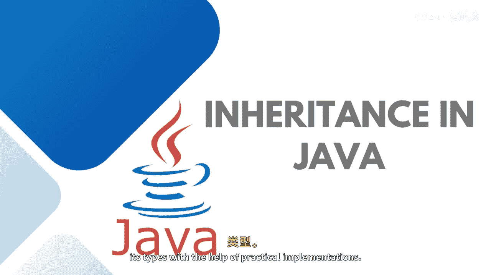
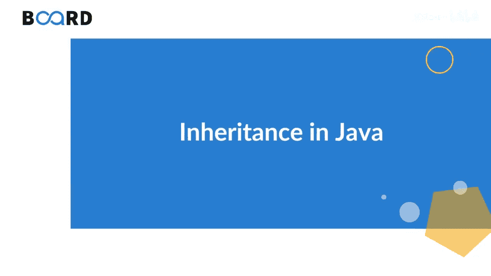

# 【Java全栈开发 专项课程（上）】Board Infinity—中英字幕 p57 p56_02_inheritance-in-java -BV1tAygYoEj5_p57-

Hi there。Today in this session， we will learn about Java inheritance and its types with the help of practical implementations。

 So let's get started。

Inheritance is one of the key feature of object oriented programming that allows us to create a new class from an existing class。

Basically， inheritance， hason reusability。Of the court。

 where the parent class code can be used in the child class itself。

Inheritance re represents the is a relationship which is also known as a parent child relationship as well。

As I said， in the case of inheritance， multiple classes comes into the picture。

 One is the parent class， which is also known as a super class。

And then we create a new class that is created as subclass。

And the existing class super class needs to be derived inside it。

When you inherit from an existing class， you can reuse the methods and fields of the parent class inside the child class。

Moreover， you can add new methods and fields in the。Current child class， as well。

The most important use of inheritance in Java is a code reusibility， and also。

 it has in reducing the time and efforts of a programmer。Hence。

 we can achieve polymermorphface in Java with the help of inheritance。

 because in the case of overriding。Multiple classes comes into the picture with the help of inheritance。

I just wanted to give an example here， imagine you have built a standard calculator application and your application does addition。

 attractiontract， multiplication， division and square root。Now。

 you ask to build a scientific calculator which does require the basic functionalities that you added into the standard calculator。

 But moreover， you need to add power logarithmics， trignometric operations and all。

 So how would you go about writing this new scientific calculator application。

Would you write the code for all the standard operations again， No。

 you have already returned that code， right， So you would want to use it in this application without writing it all over again。

 using inheritance in this case， you can achieve this objective。

This is another example that you can consider that we have a vehicle。

 We can keep some basic functionalities of the vehicle inside the vehicle class， but bikes。

 car buses and trucks have their different properties and behaviors。

 so you can inherit some basic properties from the vehicle class， and you can add on the。😊。

Remaining properties and behaviors of a specific vehicle type inside the child class。

 So in this case， the vehicle would be the parent class。 bikes， cars。

 buses and trucks would be the child classes。When we implement the inheritance。

There is is a relationship and has a relationship。Basically。

When we talk about is a relationship that is also known as a parent child relationship where the parent class。

Needs to be extended into the child class with the help of the extend keyword。

So Xs is basically a keyword that is used to perform inheritance。

This used to indicate that a new class or a child class is derived from the base class that is a parent class using inheritance。

So basically extends keywords just to inherit guys。

 it's really important to remember extends need to be used when your parent class is class parent entities is class and the child one is also class but if you are going to inherit and interface into the child class then it needs to be implements because implementation is just for the contract and interface is a kind of contract。

So this is how we implement the。Inheritance， we have created a parent class added the properties and behaviors of the parent class。

 extended the parent class inside the child class。 Whatever properties we have in the parent class we can use here。

 As per the access modifiers given。 And along with that。

 I can do add on the more functionalities inside it。😊，I hope the fundamental is clear to you。

 As I said， stay tuned to learn more about inheritance。 See you in the next session。

