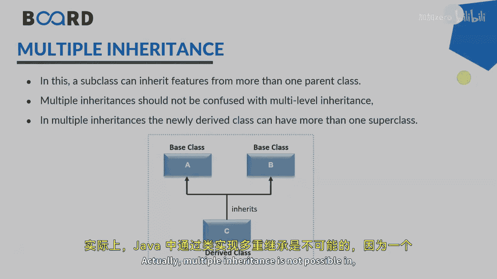
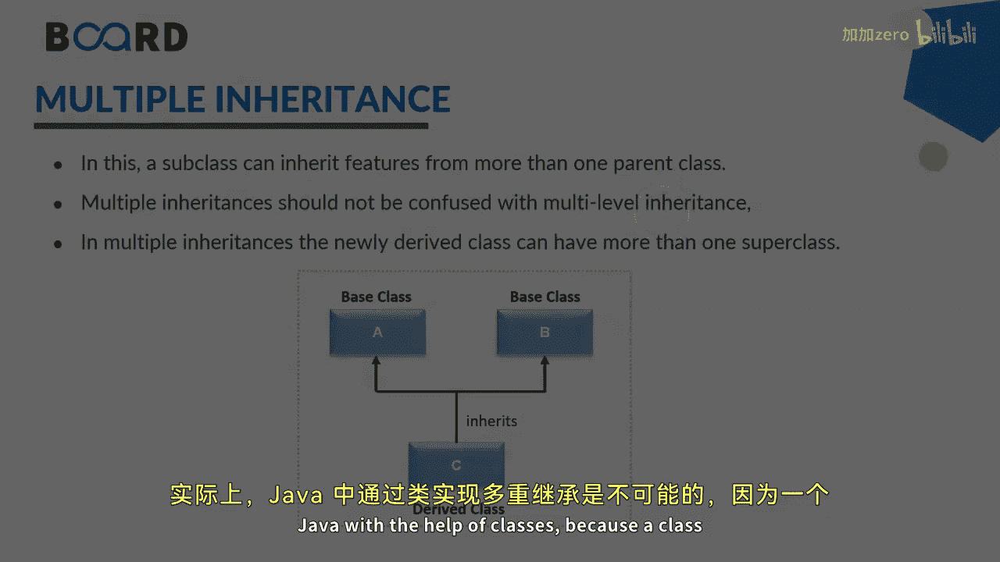

# Java全栈开发：03：继承的类型 🧬

在本节课中，我们将学习Java中继承的不同类型。继承是面向对象编程的核心概念之一，它允许一个类获取另一个类的属性和方法。我们将探讨五种主要的继承类型，并理解它们之间的区别。

## 概述 📋

继承是代码复用和建立类之间关系的重要机制。Java支持多种继承形式，但每种形式都有其特定的规则和适用场景。理解这些类型有助于我们设计出更清晰、更高效的类结构。

## 继承的类型

以下是Java中五种主要的继承类型。

### 1. 单继承

单继承是最简单的继承形式。在这种类型中，一个子类只从一个父类继承属性和方法。

**公式**：`class B extends A`

在单继承中，类B（子类）从类A（父类）派生。类B可以访问和使用类A中所有根据访问权限允许的属性和行为。这种关系是直接的“一对一”继承。

### 2. 多级继承

多级继承是单继承的扩展。在这种类型中，一个类继承自另一个类，而它自身又可以被其他类继承，从而形成多个层级。

**公式**：`class C extends B` 且 `class B extends A`

在多级继承中，类C继承类B，而类B继承类A。虽然类C不直接继承类A，但它间接获得了类A的属性和方法。这实际上是多个单继承的组合。

### 3. 层次继承

层次继承具有树状结构。在这种类型中，一个父类被多个子类继承。

**公式**：
```
class B extends A
class C extends A
class D extends A
```

层次继承创建了一种“一对多”的关系。例如，一个“员工”父类可以被“小时工”和“月薪工”等多个子类继承。方法重写是层次继承中的一个典型应用，子类可以重新定义从父类继承的方法以实现特定功能。

### 4. 多重继承



在Java中，**类不支持多重继承**。这意味着一个类不能同时继承多个类。



**限制**：`class C extends A, B` // 这在Java中是不允许的

这是因为多重继承可能引发歧义，例如当两个父类有同名方法时（“菱形问题”）。如果需要在Java中实现类似多重继承的功能，必须借助接口。一个类可以实现多个接口，从而获得多种行为约定。

### 5. 混合继承

混合继承是两种或多种继承类型的组合。

**概念**：混合继承 = 类型A + 类型B + ...

例如，它可以是多级继承和层次继承的组合。然而，在Java中，如果组合中包含了通过类实现的多重继承，那么这种混合继承同样是不可能的，因为Java类始终只能直接继承一个父类。

## 总结 🎯

本节课我们一起学习了Java中五种主要的继承类型：
1.  **单继承**：一个子类继承一个父类。
2.  **多级继承**：形成链式继承关系。
3.  **层次继承**：一个父类被多个子类继承，形成树状结构。
4.  **多重继承**：Java类本身不支持，需通过接口实现。
5.  **混合继承**：多种继承类型的组合。


理解这些类型是掌握Java面向对象设计的关键。在下一节课中，我们将继续深入探讨继承的其他特性和应用。