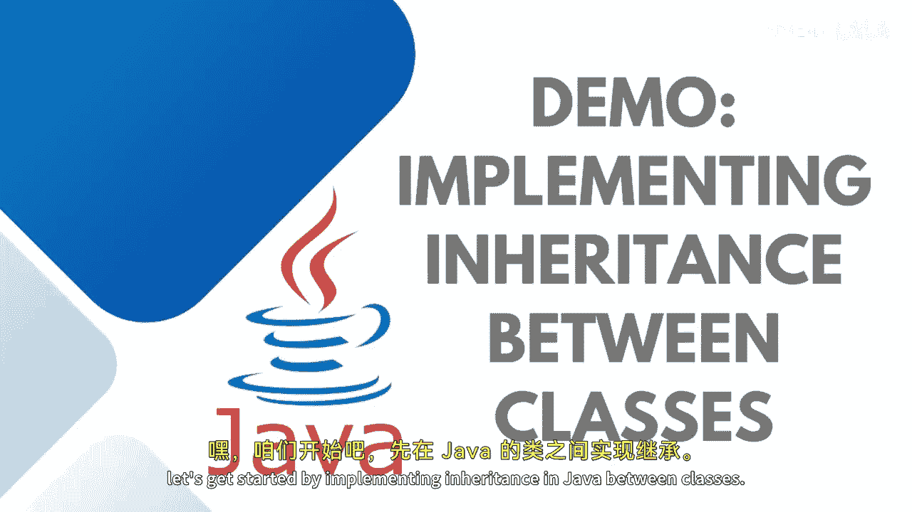
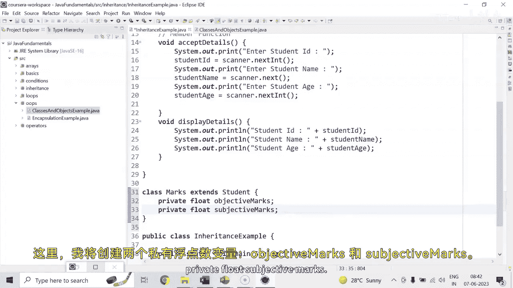
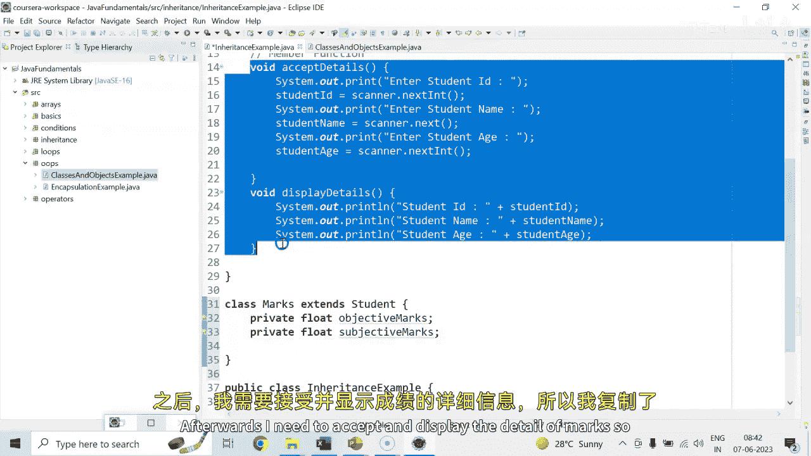
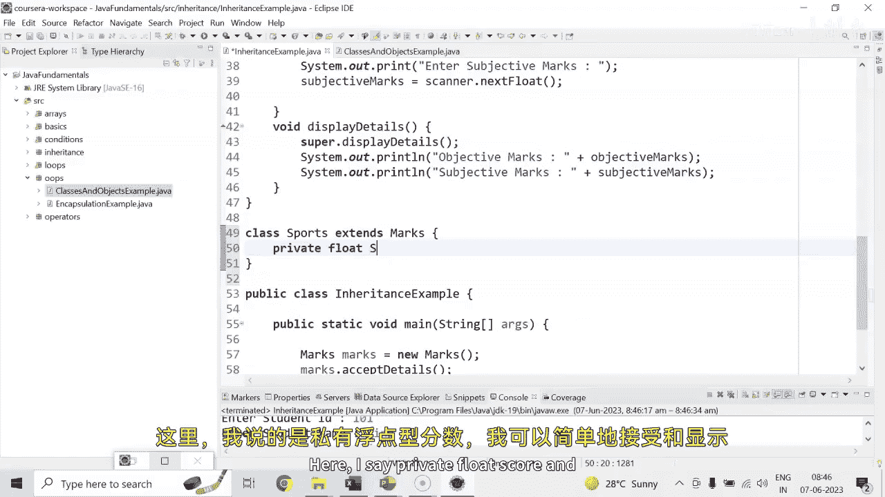
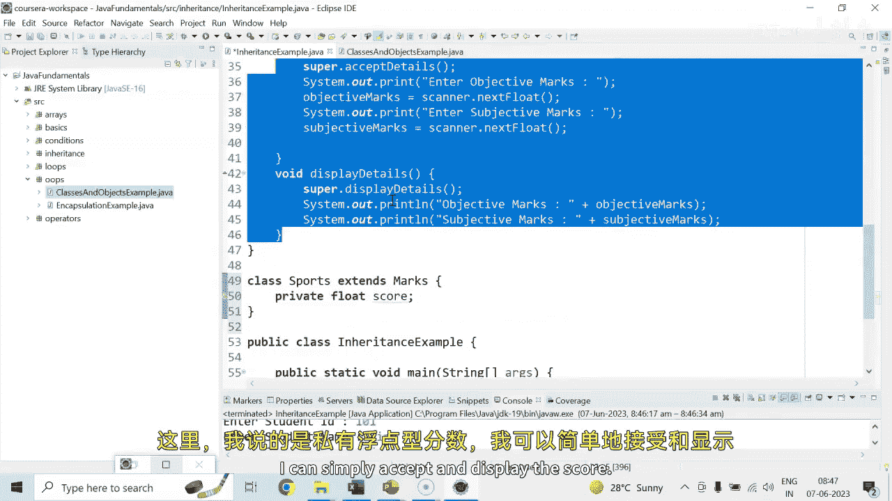

# 【Java全栈开发 专项课程（上）】Board Infinity—中英字幕 p59 p58_04_demo-implementing-inheritance-between-classes -BV1tAygYoEj5_p59-

Hi there， so let's get started by implementing inheritance in Java between classes。

Considering as I discussed in my previous session， I have a student class with few of the data members and member functions that is except and details。

 but moreover， I would like to add on some more functionality I want to store the marks of a particular student as subjective and objective marks so I will not make a change to this class because my this class is been reusing at another places also so I will be creating one class marks。

😊，I will be extending the student class， inside it。

Here I'm going to create private flow objective marks。Private float。Subjective marks。

Afterwards， I need to accept and display the detail of marks so I just copy the accept and display detail。

And I will just change the message。 So here I'm going to write here。Objective marks。

Equals to scanner。Dot， next float。And here I'm going to change the message。Objective marks。

Same thing I'll do for the subjective marks。And stored it inside it。

Here I need to display the detail。Of objective marks。And subjective monks。Now。

 whenever I will be creating。The object of。Child class。

The memory gates are allocated to the data member of parent class as well as child class。

Let me change the methods name to accept detail 1 and display detail2。1。

The moment I will run this application， I will be able to initialize the memory to the data members of the parent class that is student and marks as well now I can access the accept detail of the parent class and marks taughtt except detail one of the child class。

Mark taught display detail of the parent class， mark taught display detail one of the child class。

 this is how things gets happen。Let me run this up and make a try。So here you can see that， I can。

Just run the program here。And need to restore my console。1，0，1。Pink。54。89，98。

So we can see that all the details are getting printed， let me just change their messages。

One thing I wanted to tell you here。You can see that my both classes have accepted and display detail。

Now， what I can do is I can give them the same name。Accept details and accept details。

 which my child class is also having。 So the question is。

 if I will call the accept and display detail， which one will be called up。

Marks class1 or student class one。 So obviously every child。

 every class give the priority to its own so we can see that marks class except and display details are getting printed。

😊，So what you can do is guys， you can actually。When it will call the marks class except detail。

 you can actually add on one statement before calling this except detail that is super super means parent。

Parent accept details needs to be called。 So when you are going to call accept detail of marks class。

 it will first go to call the super class except detail execute and then remaining piece of code needs to be executed。

Same thing you can go for the display detail just when you are calling the display detail。

 call your display detail of the parent class and get steady。So by this way。

 before executing the acceptance and display detail of the maxs class。

 the super acceptance super display， respectively into each method gets called it up。 So this is how。

Things get work，1，0，1。King。54。9889。 this is how it works。

I hope the concept is pretty clear to all of you as of now， Let me extend it by one more class。 Here。

 Im going to say I have a sports class extends。Marks class。

 and then this is a multi level inheritance， here I say。Rivate float score。

And I can simply accept and display the score。

School is。Float value so I can just change the message。Enter sports score。

And here I would like to store the details into the score variable。And here， go with printing。Next。

And rather than creating the object of marks， you can create the sports class object。

So I can just name this as OVJ。Herey go。So it's a kind of multi level inheritance。1，0，1。King。😊，32，78。

87 and 89。Now let's do the last itration。 Now I wanted to calculate the result and I wanted to calculate the total n total marks and average mark。

 So what I'll do is I'll create the result class。I will extend the sports class。

 so you can see that student class needs to be extended into marks。

 marks needs to be extended into these sports。Sports needs to be extended with the result。

 Indirectly result is extending all the upper classes here。 I would like to create private。Floute。

Doer。Marks and average marks。I will be creating here a method， void。Calculate。And here。

 I would like to say。Bpen marks。Equals to objective marks plus subjective marks plus score。

 so you can see that Im not able to access y because I kept them private。

 So by this way it's clear to you。If I will keep it public， I can access it anywhere。

 So what I can do is I can say it's protected。Protected means these members can only be accessible into the child class。

 not even in the main class main method class。 So now I can say。

Objective marks plus subjective marks plus。Score， and then average mark equals to total marks。

Divided by3。 And then I'm supposed to print it。Total marks。Is whatever being calculated。And then。

The average marks。What being calculated。So this is how it works。

Now I can create the final class object that is a result class。Except display， and then calculate。

 calculate。Let me just run this last for you。1，0，1。Ging。43。89， it is 9， and。97。So total max is 273。

 and the average is 91。I hope this concept is pretty clear to all of you。

 This is a demonstration I have taken it up with the help of a multi level neriance。

See in the next session until next time stay tuned。

