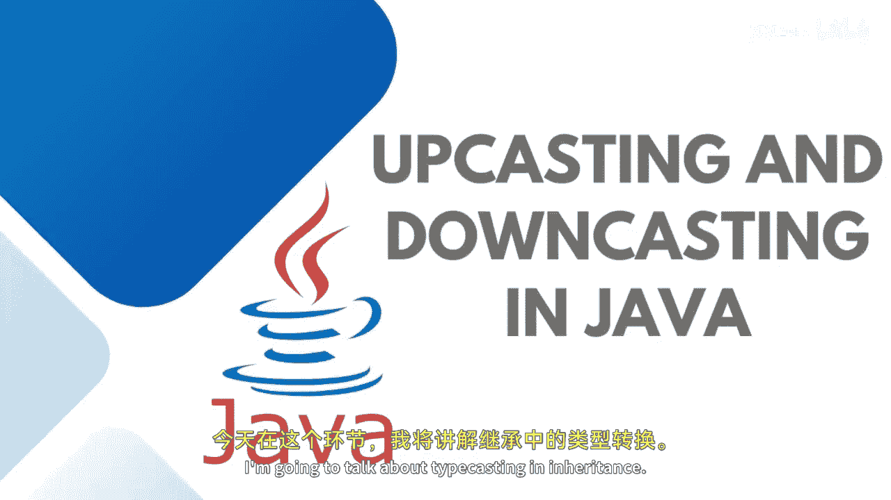

# 【Java全栈开发 专项课程（上）】Board Infinity—中英字幕 p60 p59_05_upcasting-and-downcasting-in-java -BV1tAygYoEj5_p60-

Hi there。 Today In this session， I'm going to talk about type casting in inheritance。

Basically， as we know， typecasting is the concept of converting one data type into the another one。

 and it is one of the most important concepts in Java because it deals with converting one data type into the another data type implicitly or explicitly that is alternate known as narrowing and whitening。

There are two types of object type casting that are available in Java that you can achieve with。

 One is upcasting and one is downcasting。Upcasting means converting the type from child to parent and downcasting is from the parent to child。

As I said， in upcasting。We are typecasting a child object to a parent object。

 and it is done implicitly。 There is no need to explicitly refer to the parent class。 automatically。

 it happens。 Upcasting gives us the benefit of accessing all the members and variables of the parent class。

 but in upcasting， we can cannot access all the variables and methods of the child class because it gives a more priority to the parent class。

But in the case of downcasting。Another form of object oriented typecasting is downcasting where the parent class refers the object to the given child class。

And。It is not possible to give a parent class reference object to a child class in Java。

 If downcasting is used， there wouldn't be any compile time error That is class cast exception。

 otherwise， because you need to cast or explicitly cast your。Prient and child class。

 as per your requirement， and the master class in the class refers to the subclass。

 So stay tuned to learn more practical implementations of upcasting and downcasting in Java。

