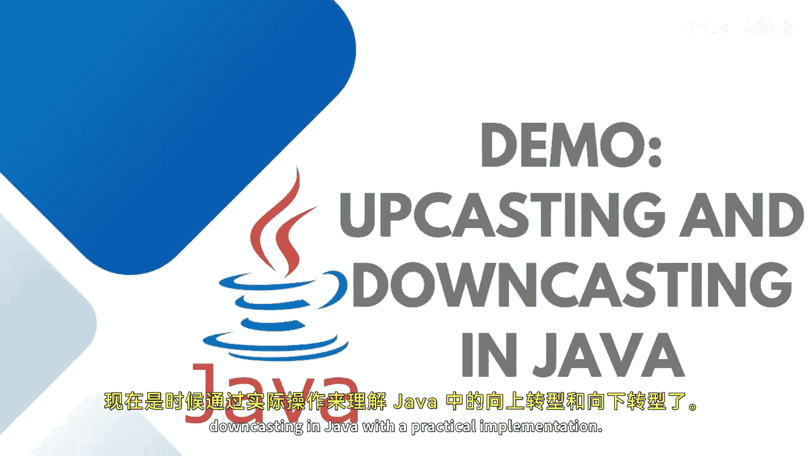

# 【Java全栈开发 专项课程（上）】Board Infinity—中英字幕 p61 p60_06_demo-upcasting-and-downcasting-in-java -BV1tAygYoEj5_p61-

Had there， so it's a high time to understand upcasting and downcasting in Java with the practical implementation。

 so let's get started。

Considering， I have a vital class。😊，Did I have a me drive。Which prints a message。

 driving the vehicle。What's that。I have a car class， extending the vehicle class。😊。

Into the car class， where we have drive method。There sit out。Driving a car。

We do have one more method， say speed up。Speeding up a car。Now。Here， in the main method。

Instaniating a vehicle。Gasss。But。Iitializing the carla。Dociss。Downcasting， okay。So， I will see God。

Equals 2。Initializing the vehicle inside the car。So you can see that it's not getting happen。

I need to down。Cast my vehicle instance， which is apparent into the child。So， I can see。

Car dot drive。And car， dot speed。Becauseis。Vicle class is not having speed up now。

 so you cannot pass the reference of vehicle to the car。

 if you need to downcast your vehicle to the class。That's how it looks like。

Driving a car and speeding up the car。But the same iteration， if you do with upcasting。

What you need to do is。Just create。Vel class instance。Alloccate a memory to the child class。

And access the derive method of the vital class。 So whichever method you are calling it up。

 whichever class you are referring it up。That last drive method gets called。

 So here I'm just giving this name as a vital one。This is upcasting。

I hope the concept is clear to all of you how downcasting and upcasting works。

So these are very essential components， as they are used in inheritance and polymorphism amongst。

Upcasting and downcasting is secure and can be done implicitly while downcasting is not properly secured。

 so it always has to do explicitly。Jin。

