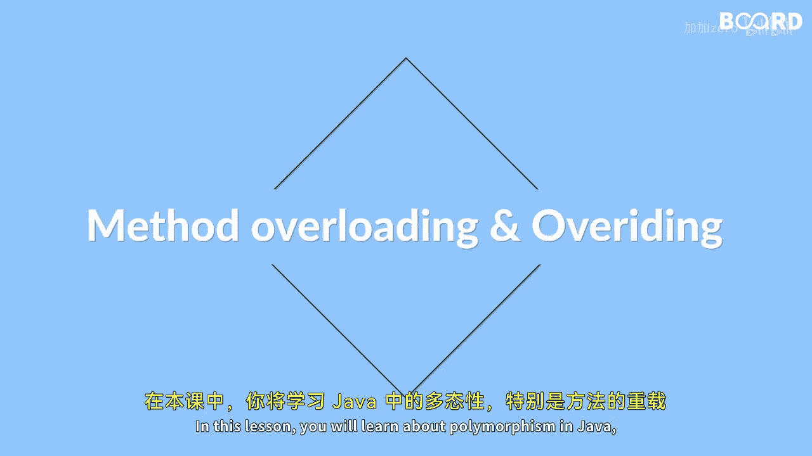

# 【Java全栈开发 专项课程（上）】Board Infinity—中英字幕 p62 p61_01_what-you-will-learn-in-this-lesson -BV1tAygYoEj5_p62-

🎼Hi there In this lesson you will learn about polymer fist in Java。😊。

🎼Especially overloading and overriding methods， you will discover how to overload constructors and methods and understand the differences between them。

😊，🎼Additionally， you will explore method over writing and its implementation and how it differs from method overloading。

😊，🎼Polymorphphys is an essential feature of object oriented programming。😊。

🎼Allowing developers to write code that can handle different data types。😊。

🎼Overloading allows you to use the same method name with different parameter types。

 while overriding allows derived classes to redefine the base class methods。

🎼By the end of this lesson， you will have a solid understanding of how to use these techniques effectively in your Java programming projects see you in the next video。

😊。