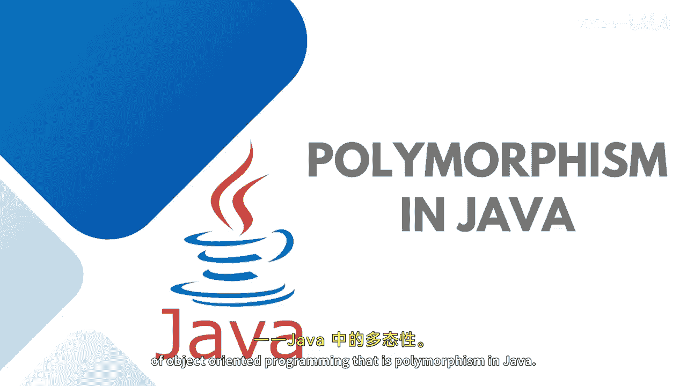
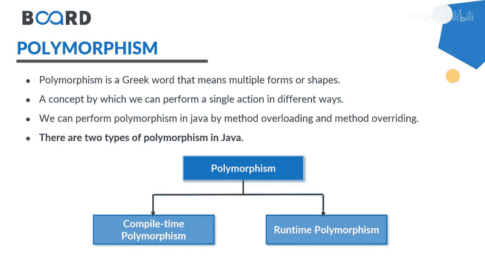
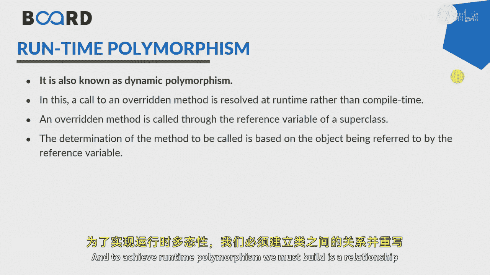
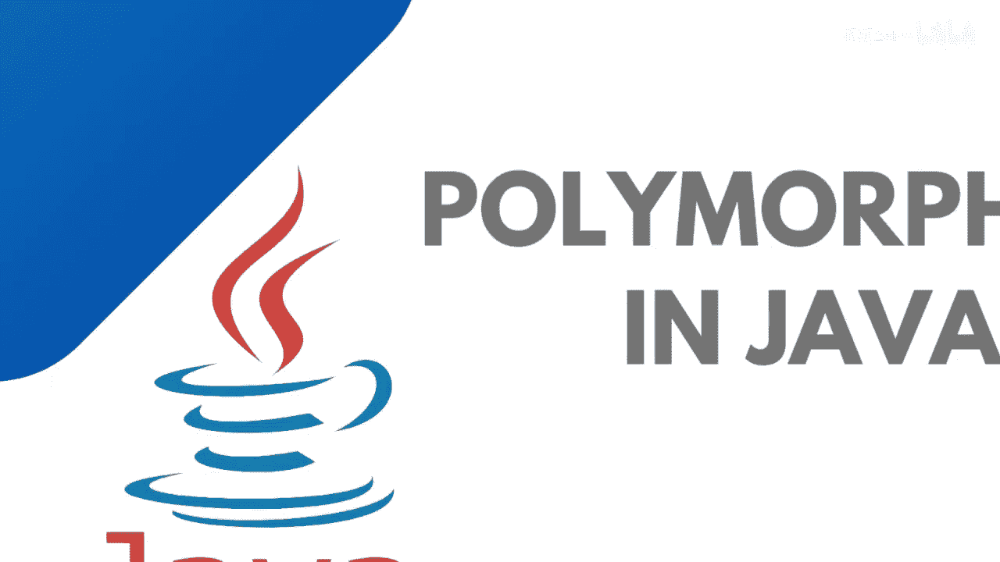

# Java全栈开发：第63课：Java中的多态性 🎭

在本节课中，我们将要学习面向对象编程的核心概念之一：**多态性**。我们将探讨多态性的含义、类型以及如何在Java中实现它。

---

## 概述

多态性（Polymorphism）一词源自希腊语，由“poly”（意为“多”）和“morph”（意为“形态”）组成。简单来说，它意味着“一个接口，多种功能”。在编程中，这表示一个实体可以以多种形式存在。

## 多态性的含义

一个实体可以呈现多种形态。以人类为例，一个人在生活中扮演着多种角色：女儿、姐妹、母亲等。但在任何特定时刻，只扮演其中一种角色。因此，一个实体以多种形式存在。

在Java中，我们可以通过**方法重载**和**方法重写**来实现多态性。

另一个例子是碳元素。碳可以以多种形式存在，如钻石、石墨和煤炭。我们可以说，碳根据情况同时展现出不同的特性。

## 多态性的类型

为了实现多态性，存在两种主要类型：**编译时多态性**和**运行时多态性**。

编译时多态性可以通过**方法重载**实现，而运行时多态性可以通过**方法重写**实现。我将在后续课程中详细讨论这些概念。

## 多态性的实例

另一个例子是人的身份。一个人可以是学生、雇员或百万富翁。学生和百万富翁都需要支付账单，但学生支付的是教育账单，而百万富翁支付的是信用卡账单。他们的实现、需求、属性和行为可能不同。

因此，一个人具有`Person`类中的共同特征，而作为`Student`和`Millionaire`的子类可以重写它们的行为。

## 多态性的现实类比

多态性的一个现实类比是人体。人体有不同的器官，每个器官执行不同的功能。心脏负责血液流动，肺负责呼吸，大脑负责认知活动，肾脏负责排泄。

我们必须理解，方法或功能根据身体器官的不同而执行不同的操作。

## 编译时多态性

编译时多态性也称为**静态多态性**或**静态方法分派**。它可以通过**方法重载**实现。在这个过程中，重载的方法在编译时解析，而不是在运行时解析。

Java不支持运算符重载，但在C++中，运算符重载也可以实现多态性。

## 运行时多态性

运行时多态性也称为**动态多态性**或**动态方法分派**。它不是编译时解析重写的方法，而是在运行时解析。通过父类引用调用子类重写的方法，然后根据对象的类型调用相应的方法。

我已经演示了为此进行的向下转型和向上转型。JVM会识别对象类型以及你创建的引用变量所属的方法。

在Java中，当存在两个或更多通过继承相互关联的类时，就会发生运行时多态性。为了实现运行时多态性，我们必须在类之间建立“is-a”关系并重写一个方法。

---

## 总结

本节课中，我们一起学习了Java中的多态性。我们探讨了多态性的基本概念、两种主要类型（编译时多态性和运行时多态性）以及它们的实现方式。我们还通过现实世界的例子加深了对多态性的理解。

在接下来的课程中，我将通过实际演示详细介绍方法重载和方法重写。敬请关注，我们下节课再见！