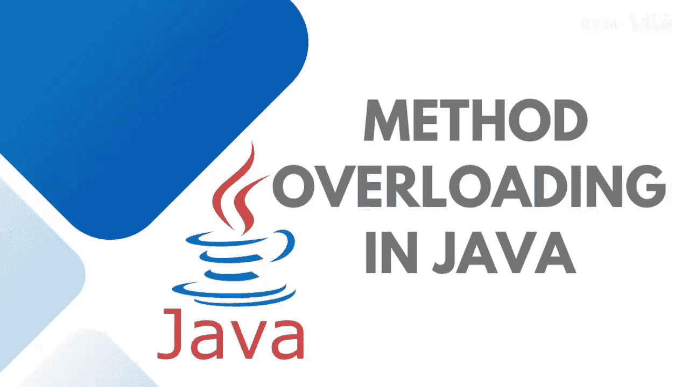
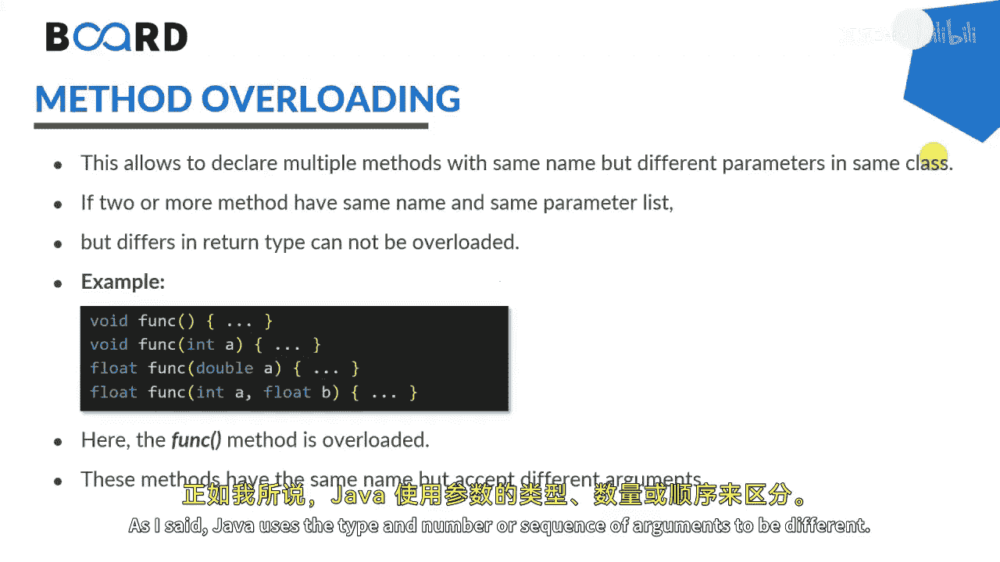

# Java全栈开发：03：方法重载详解 🧩



在本节课中，我们将要学习Java中一个非常重要的概念——方法重载。这是多态性的核心组成部分之一。我们将探讨如何创建同名但参数列表和定义不同的方法，以及如何在实际编程中应用这一特性。

## 概述

方法重载允许在同一个类中声明多个同名但参数不同的方法。当调用一个被重载的方法时，Java会根据传入参数的类型、数量或顺序来决定具体执行哪个版本的方法定义。

## 什么是方法重载？



上一节我们介绍了方法的基本概念，本节中我们来看看如何让方法“一名多用”。

方法重载是指在同一个类中，可以定义多个**方法名相同**，但**参数列表不同**的方法。这里的“不同”可以体现在参数的数量、类型或顺序上。

以下是方法重载的核心规则：
*   方法名必须相同。
*   参数列表必须不同（数量、类型或顺序）。
*   方法的返回类型、访问修饰符可以不同，但这些**不构成**方法签名的一部分，因此不能仅凭它们来区分重载方法。

## 方法重载的原理与应用场景

当不同的对象需要执行一组相似的任务，但处理不同的输入参数时，就需要使用方法重载。

例如，在一个电子商务平台中，支付功能可能有多种模式，如信用卡支付、UPI支付或银行转账。我们可以为`processPayment`方法创建多个重载版本，每个版本处理一种特定的支付参数。

当调用重载方法时，Java首先匹配方法名，然后根据调用时提供的参数数量和类型，精确匹配到对应的定义并执行。

以下是实现方法重载的几种方式：
*   **改变参数数量**：例如，`add(int a, int b)` 和 `add(int a, int b, int c)`。
*   **改变参数类型**：例如，`add(int a, int b)` 和 `add(double a, double b)`。
*   **改变参数顺序**：当参数数量和类型都相同时，可以改变参数的顺序来区分。例如，`add(int a, float b)` 和 `add(float a, int b)`。

## 方法重载的优势

在实时项目或应用程序中使用方法重载概念，具有以下优势：
*   **提高代码可读性**：使用直观、统一的方法名执行相关操作。
*   **保持应用一致性**：相似功能使用相同入口，逻辑清晰。
*   **促进代码复用**：核心逻辑可以封装，通过不同参数适配多种情况。
*   **提供向后兼容性和灵活性**：添加新功能时，可以创建新的重载方法而不影响旧代码。

## 实战：在Java中实现方法重载

理解了理论之后，让我们通过一个具体的例子来实践方法重载。

假设我们有一个`Calculation`类，其中包含多个执行加法操作的`addition`方法。

```java
class Calculation {
    // 版本1：两个整数相加
    public static int addition(int number1, int number2) {
        return number1 + number2;
    }

    // 版本2：三个整数相加（改变参数数量）
    public static int addition(int number1, int number2, int number3) {
        return number1 + number2 + number3;
    }

    // 版本3：两个浮点数相加（改变参数类型）
    public static float addition(float number1, float number2) {
        return number1 + number2;
    }

    // 版本4：一个整数和一个浮点数相加
    public static float addition(int number1, float number2) {
        return number1 + number2;
    }

    // 版本5：一个浮点数和一个整数相加（改变参数顺序）
    public static float addition(float number1, int number2) {
        return number1 + number2;
    }
}
```

现在，我们来调用这些重载的方法：

```java
public class Main {
    public static void main(String[] args) {
        // 调用两个整数相加的版本
        System.out.println(Calculation.addition(100, 200));

        // 调用三个整数相加的版本
        System.out.println(Calculation.addition(100, 200, 300));

        // 调用两个浮点数相加的版本
        System.out.println(Calculation.addition(100.50f, 200.30f));

        // 调用（整数，浮点数）顺序的版本
        System.out.println(Calculation.addition(100, 200.54f));

        // 调用（浮点数，整数）顺序的版本
        System.out.println(Calculation.addition(200.54f, 100));
    }
}
```

运行此程序，控制台将依次输出各个重载方法的计算结果，清晰地展示了Java如何根据我们传入的参数来选择合适的`addition`方法执行。

## 总结


本节课中我们一起学习了Java中的方法重载。我们了解到，方法重载是实现编译时多态的一种方式，它允许我们使用同一个方法名来执行操作相似但输入参数不同的任务。关键在于保持方法名相同，而通过参数列表（数量、类型、顺序）的差异来区分不同的方法实现。正确使用方法重载可以极大地提升代码的清晰度、灵活性和可维护性。