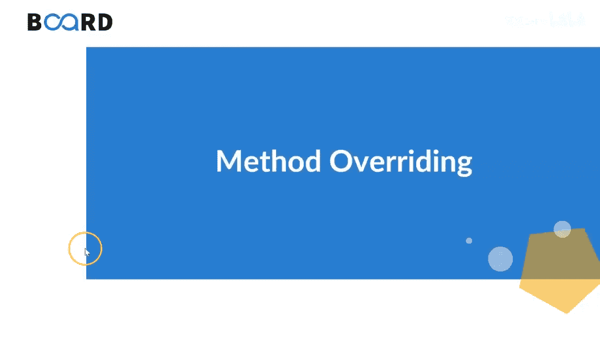
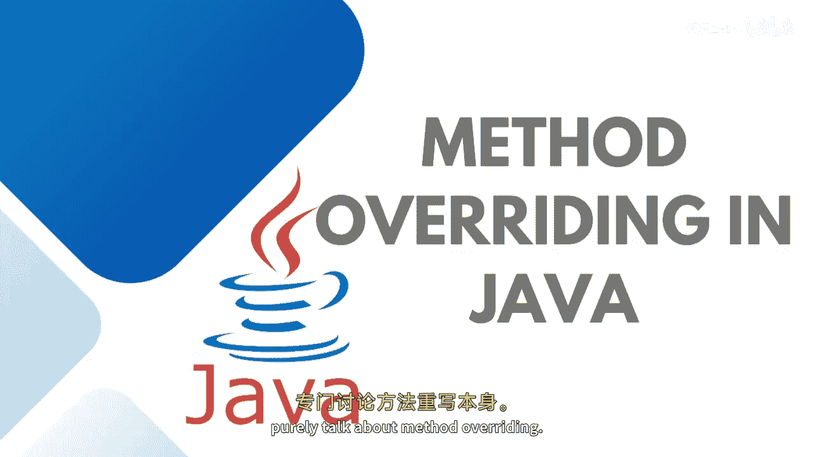
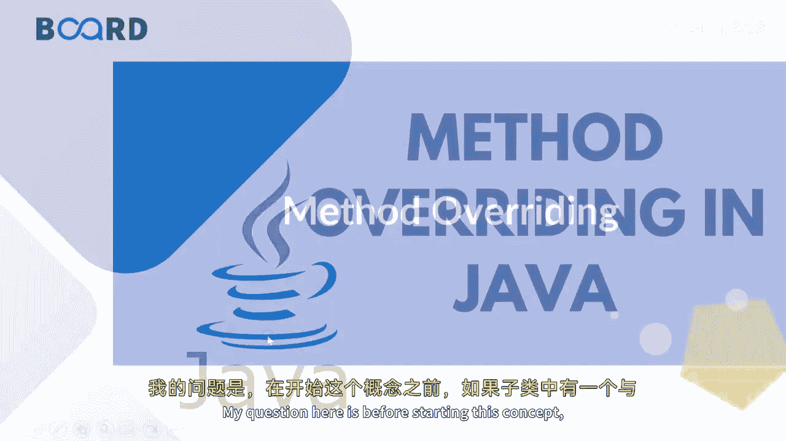
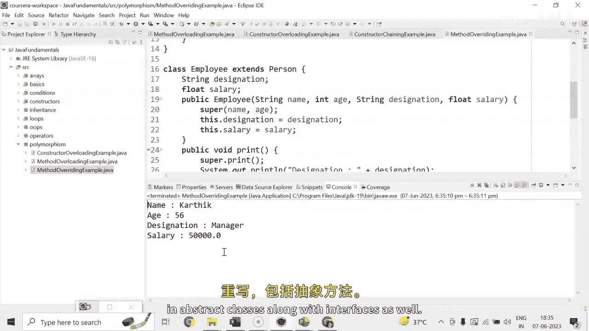

# 【Java全栈开发 专项课程（上）】Board Infinity—中英字幕 p65 p64_04_method-overriding-in-java -BV1tAygYoEj5_p65-

Hey， guys， today in this session， we will discuss about。Dynamic polymermorph fist。

 And that is method over ridingiding。Although method over riding can be achieved with the help of abstract classes and interfaces as well。

 but today I will purely talk about method over riding。

So my question here is before starting this concept。

 what would happen if the child class has the same method as declared in the parent class？

So in this case， the subclass will have the same method as declared in the parent class。

 and that concept is known as the overriding when the subclass has the same method signature as the parent class。

😊，The method to be invoked。By the Java virtual machine based on the runtime object and that process is known as method overriding。

Both super class and subclass must have the same method name， return type and the parameter list。

Overloading is completely opposite of overriding overloading is to be achieved in the same class。

 but method overriding to be achieved in the case of inheritance。In the method。

 overloading two methods which are needs to be overloaded should not be same。

But here methods that needs to be overridone their name。

 return type and the parameter list should be seen。

It offers the option to define a specific behaviour of this to the subclass type based on its requirement。

 It is a kind of， you know， redefining any particular functionality。

So this is how overriding is different from overloading in case of overloading functions should have a different functions method signature。

 but in the case of method overriding we should have same signature in the trial class as to be defined in the base class。

 let me help you out with example so let's get started。Here， I'm going to create a person class。

With person name and person H。Then I am going to have a constructor。I'm keeping it as a。

Parameterterized constructor that will take the person name and person age。This do name equals 2。

The parameter and this start age equals to parameter。

Then I only have a display details or show method。Print method。This is the method。

 so we should have a return type。Size out。Name is whatsoever whoever is getting printed。D doney。

Sis on。Each。Now， I am having a class employ。That is going to extend the person class because every employee will have at least name and age printed。

 but the employee class will have。Moreover， details such as designation and sal。Public employee。

String designation。And sad。Here， I would like to initialize the designation。Andally。

Then I will be having the print method， which will be overriding the behavior。So before that。

 I need to add a super keyword here where I will。What I will do is basically I will take a four parameters here。

 name and age also。Name and age I will pass into the parent class constructor and designation and salary Ill use it in this own constructor that is known as constructor training。

So in this print method， I'm going to override the behavior。 Let's say this out。

 And here I say I need to print the designation。And I need to print。Thesity。As the moment。

 I will call the print method with the help of employee class object， it will。

Call its own print method， but I first want to print the parent class method。

 and then I would like to overefine redefine the functionalities。

Now what I will do is I will simply come here， will create the object of parent child class that is employed。

Henll passed the name， cardic。When Ill pass designation。And here is the salary。Employee dot print。

Here first， it will execute the super class print method then its own executions。

It's time to restore and check the output。 So this is how extendability works when we talk about method over riding。

That helps in extending the functionality。Having the implementation with specialization。

 you can also implement method over riding with abstract methods in abstract classes along with interfaces as well。

I will talk about that， in my upcoming session。

Until next time， stay tuned， Thank you。

