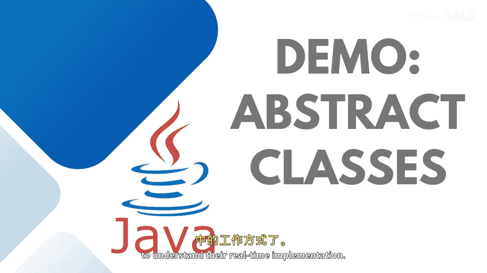
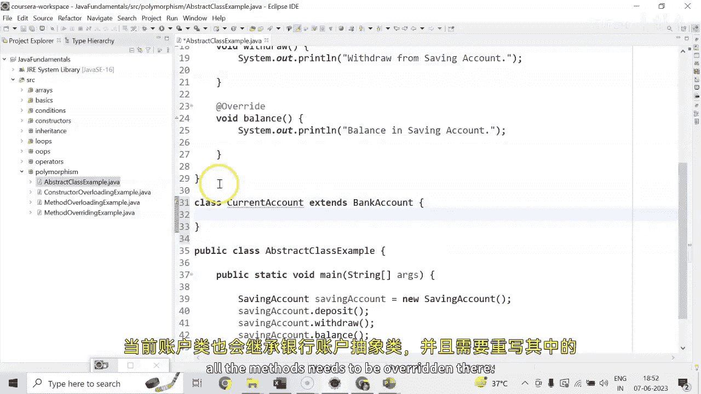
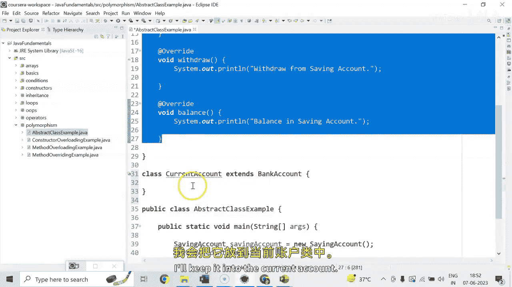
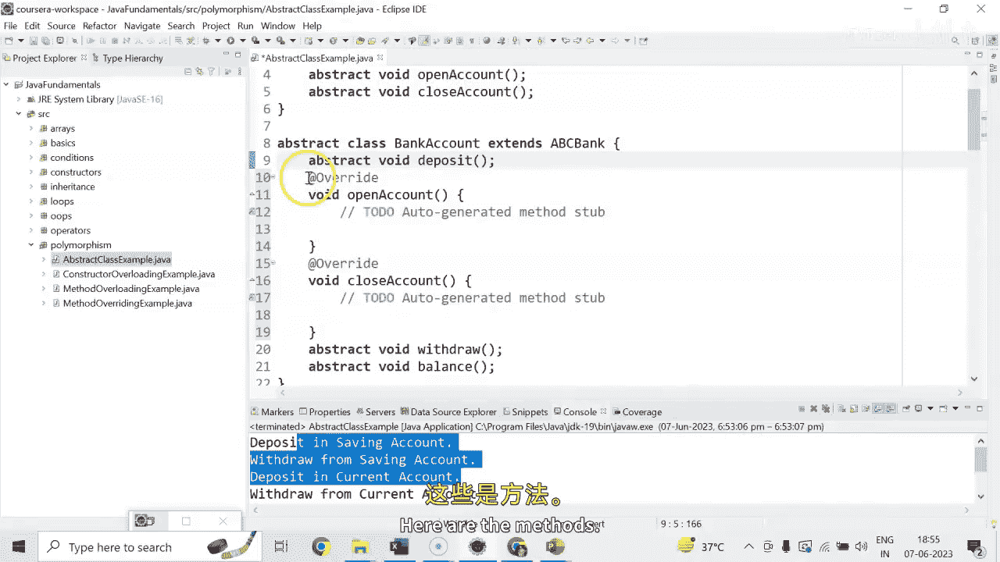
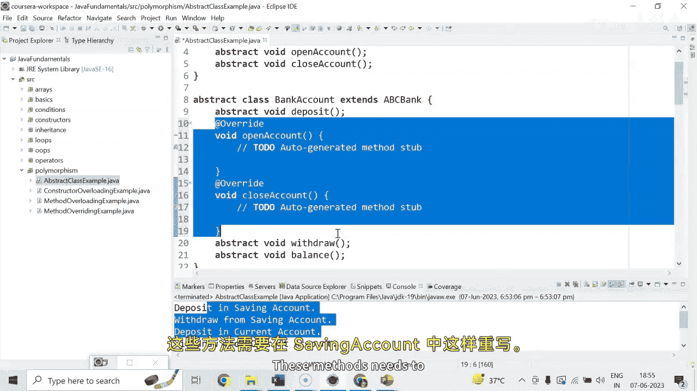

# Java全栈开发 专项课程（上）：03：抽象类实战演示 🏦


在本节课中，我们将通过一个银行账户的实例，学习抽象类和抽象方法的实际应用。我们将创建一个抽象类作为基础模板，并让具体的子类来实现其定义的功能。



---

## 概述

抽象类用于定义一种通用的结构或契约，它包含抽象方法（只有声明，没有实现）和具体方法（有实现）。任何继承抽象类的具体类都必须实现其所有的抽象方法。本节我们将创建一个银行账户系统来演示这一概念。

---

## 创建抽象基类

首先，我们创建一个名为 `BankAccount` 的抽象类。这个类将定义所有银行账户都应具备的共同操作，但具体的实现细节将留给子类。

```java
public abstract class BankAccount {
    // 抽象方法：存款
    public abstract void deposit();
    // 抽象方法：取款
    public abstract void withdraw();
    // 抽象方法：获取余额
    public abstract void getBalance();
}
```

请注意，如果一个类包含一个或多个抽象方法，那么这个类本身必须声明为 `abstract`。

---

## 实现具体子类：储蓄账户

上一节我们介绍了抽象基类的结构，本节中我们来看看如何创建一个具体的子类。我们将创建一个 `SavingAccount` 类来继承 `BankAccount` 抽象类。

当一个具体类继承一个抽象类时，它必须实现该抽象类中定义的所有抽象方法。

以下是创建 `SavingAccount` 类的步骤：

1.  创建类并继承 `BankAccount`。
2.  使用IDE（如Eclipse或IntelliJ IDEA）的快捷功能自动生成需要实现的方法框架。
3.  在这些方法框架内添加具体的实现代码。





```java
public class SavingAccount extends BankAccount {
    @Override
    public void deposit() {
        System.out.println("Deposit in Saving Account.");
    }

    @Override
    public void withdraw() {
        System.out.println("Withdraw from Saving Account.");
    }

    @Override
    public void getBalance() {
        System.out.println("Balance in Saving Account.");
    }
}
```

现在，我们可以创建 `SavingAccount` 的对象并调用其方法：

```java
SavingAccount sa = new SavingAccount();
sa.deposit();
sa.withdraw();
sa.getBalance();
```

---

## 实现更多具体子类：活期账户

同样地，我们可以创建另一个具体类，例如 `CurrentAccount`。这展示了抽象类如何作为多个不同但相关的类的蓝图。

以下是 `CurrentAccount` 类的实现：

```java
public class CurrentAccount extends BankAccount {
    @Override
    public void deposit() {
        System.out.println("Deposit in Current Account.");
    }

    @Override
    public void withdraw() {
        System.out.println("Withdraw from Current Account.");
    }

    @Override
    public void getBalance() {
        System.out.println("Balance in Current Account.");
    }
}
```

运行程序后，我们将看到来自储蓄账户和活期账户的不同输出信息。

---

## 抽象类的继承链

抽象类本身也可以继承另一个抽象类。这允许我们构建更复杂的层次结构。让我们创建一个更顶层的抽象类 `ABCBank`。

```java
public abstract class ABCBank {
    // 新的抽象方法
    public abstract void openAccount();
    public abstract void closeAccount();

    // 具体方法
    public void message() {
        System.out.println("Welcome to ABC Bank.");
    }
}
```

然后，我们让 `BankAccount` 类继承 `ABCBank`。由于Java不支持多继承，一个类只能直接继承一个父类，所以我们建立这样的链：`SavingAccount` -> `BankAccount` -> `ABCBank`。



修改后的 `BankAccount` 类：



```java
public abstract class BankAccount extends ABCBank {
    // ... 原有的 deposit, withdraw, getBalance 抽象方法 ...
}
```

现在，`SavingAccount` 类不仅需要实现 `BankAccount` 的抽象方法，还需要实现从 `ABCBank` 继承来的 `openAccount()` 和 `closeAccount()` 方法。

以下是更新后的 `SavingAccount` 类部分代码：

```java
public class SavingAccount extends BankAccount {
    // ... 原有的 deposit, withdraw, getBalance 实现 ...

    @Override
    public void openAccount() {
        System.out.println("Open Account in Saving Account.");
    }

    @Override
    public void closeAccount() {
        System.out.println("Close Account in Saving Account.");
    }
}
```

我们可以通过子类对象调用所有方法，包括来自顶层抽象类的具体方法：

```java
SavingAccount sa = new SavingAccount();
sa.message(); // 调用继承自 ABCBank 的具体方法
sa.openAccount();
sa.closeAccount();
```

另外，如果我们将 `ABCBank` 中的 `message()` 方法声明为 `static`，则可以直接通过类名调用，无需创建对象：`ABCBank.message();`。

---

## 抽象类中的具体方法

重要的一点是，抽象类并非只能包含抽象方法。它可以包含带有完整实现的具体方法。正如我们在 `ABCBank` 类中看到的 `message()` 方法。这些具体方法可以被所有子类继承和使用，为代码复用提供了便利。

然而，**我们不能直接实例化一个抽象类**。例如，`ABCBank abc = new ABCBank();` 这样的代码是错误的。我们只能通过创建其具体子类的对象来访问这些方法。

---

## 总结

本节课中我们一起学习了抽象类的核心概念和实战应用。我们了解到：
1.  抽象类使用 `abstract` 关键字定义，可以包含抽象方法和具体方法。
2.  抽象方法只有声明，没有实现，格式为：`public abstract void methodName();`。
3.  任何继承抽象类的具体类**必须实现**其所有的抽象方法。
4.  抽象类不能被直接实例化。
5.  抽象类之间可以形成继承关系，构建出清晰的类层次结构。
6.  抽象类中的具体方法提供了代码复用的能力。


通过银行账户的例子，我们看到了抽象类如何作为一种“契约”或“模板”，强制不同的具体类（如储蓄账户、活期账户）实现一组共同的核心功能，同时允许它们拥有各自独特的行为细节。这是面向对象编程中实现多态和代码规范化的强大工具。