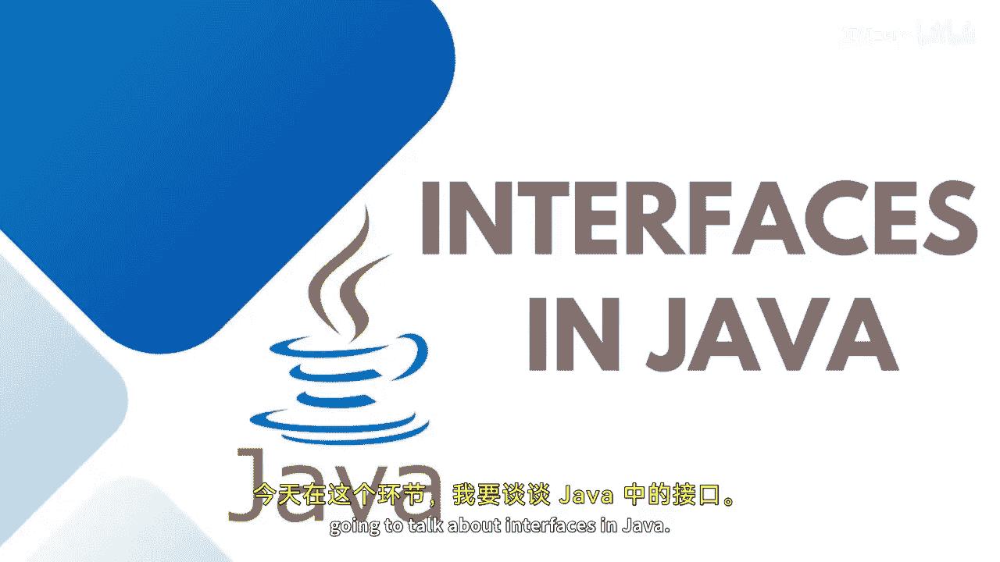
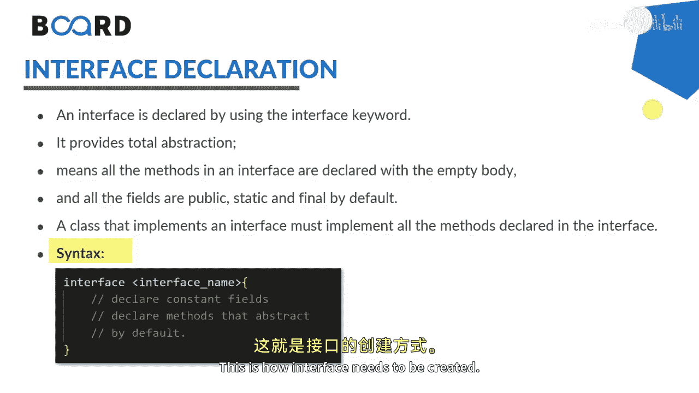

# Java全栈开发 专项课程（上）：04：Java中的接口 🧩




在本节课中，我们将要学习Java中一个非常重要的概念——接口。接口是定义类行为的一种方式，它规定了类必须实现哪些方法，但不提供这些方法的具体实现。通过接口，我们可以实现更灵活、更松耦合的程序设计。

## 什么是接口？

上一节我们介绍了抽象类，本节中我们来看看接口。接口本质上是一组我们希望类去实现的**抽象**和**公共**方法。它是一个类的蓝图，其中包含静态常量、抽象方法以及默认方法。

接口也包含变量和方法，但默认情况下，接口中的所有方法都是**公共**和**抽象**的。这意味着接口中只包含抽象方法的声明。

## 接口与抽象类的区别

如果你将接口与抽象类进行比较，接口是一个更严格的契约，每一个具体的类都必须遵循这个契约。接口有助于实现松耦合的架构或设计模式。

此外，通过接口，我们可以支持**多重继承**的功能。正如我在之前的课程中提到的，一个类在某一时刻只能继承一个类，但可以同时实现多个接口。接口也代表了一种“是一种”的关系。

## 接口的声明与语法

以下是使用接口时需要注意的一些声明和语法规则。

接口使用 `interface` 关键字声明。它提供了抽象性，意味着接口中的所有方法都只声明了空的方法体，并且默认是抽象的，你不需要额外写上 `abstract` 关键字。

接口中的所有字段默认都是 `public`、`static` 和 `final` 的。一个类要实现一个接口，必须实现该接口中声明的所有方法。这意味着在继承时，我们使用 `implements` 关键字，而不是 `extends`。

这就是创建接口的基本方式：
```java
public interface MyInterface {
    // 常量（默认 public static final）
    int CONSTANT_VALUE = 10;

    // 抽象方法（默认 public abstract）
    void myMethod();
}
```

## 为什么使用接口？



那么，我们为什么要使用接口呢？

首先，接口有助于封装不受限制的数据，并抽象出受限制的数据。它帮助我们实现方法重写，提供了多态性的灵活性，便于测试和未来扩展。还有一个这里没有明确提到但非常重要的原因，那就是实现**多重继承**。

## 总结

本节课中我们一起学习了Java接口的核心概念。我们了解到接口是一种定义类行为的契约，它只包含抽象方法的声明，并且支持多重继承。接口是实现松耦合设计和程序灵活性的关键工具。在接下来的课程中，我们将通过实际代码来深入理解接口的应用。

敬请期待，学习更多关于接口的实践应用。


我们下节课再见。 👋